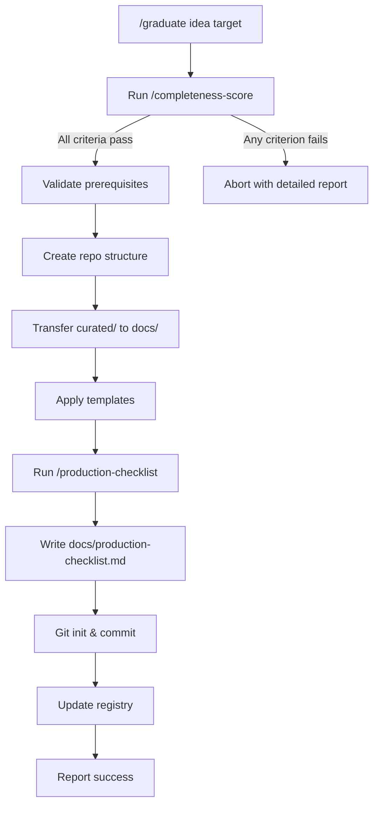

# Graduate Skill

Creates a new project repository from a curated idea with all design documentation properly organized.

## Usage

```bash
/graduate <idea-name> <target-path>
```

Example:
```bash
/graduate task-manager ~/projects/task-manager
```

## Prerequisites

- Idea must have `curated/` folder (run `/curating-artifacts` first)
- Curation must be complete (no TBDs, all files present)
- All completeness criteria must pass (checked automatically)

## Process

### 1. Run Completeness Check

**This step blocks graduation if any criteria fail.**

Run `/completeness-score` against the curated artifacts:

```bash
# Invoke completeness-score skill
/completeness-score <idea-name>
```

See [completeness-score/SKILL.md](./completeness-score/SKILL.md) for criteria details.

**On failure:** Abort immediately with detailed report showing what's missing.

**On success:** Continue to step 2.

### 2. Validate Prerequisites

```bash
# Check curated folder exists
ls ideas/<idea-name>/curated/

# Verify completeness
cat ideas/<idea-name>/curated/status.md
```

- Verify idea exists in registry
- Verify `curated/` folder exists and is complete
- Verify target path doesn't already exist
- Confirm with user before proceeding

### 3. Create Repository Structure

```bash
mkdir -p <target-path>/{docs,src,tests}
cd <target-path>
git init
```

### 4. Transfer Curated Artifacts

Map curated structure to new repo:

| Source (curated/) | Target (new repo) |
|-------------------|-------------------|
| overview.md | docs/overview.md |
| requirements.md | docs/requirements.md |
| architecture/ | docs/architecture/ |
| decisions/ | docs/decisions/ |
| edge-cases/ | docs/edge-cases/ |
| security/ | docs/security/ |
| operations/ | docs/operations/ |
| performance.md | docs/performance.md |
| trade-offs.md | docs/trade-offs.md |

### 5. Apply Templates

Copy from `templates/`:
- README.md (customize with project name)
- CLAUDE.md (customize with project context)
- .gitignore

### 6. Create CLAUDE.md

Generate project-specific CLAUDE.md:

```markdown
# <Project Name>

[From overview.md - one paragraph summary]

## Architecture

See `docs/architecture/overview.md` for full details.

Key components:
- [List from architecture/components/]

## Key Decisions

See `docs/decisions/` for ADRs. Key choices:
- [Top 3-5 decisions from ADR index]

## Development

[Standard sections from template]
```

### 7. Generate Production Checklist

Run `/production-checklist` to extract actionable items from curated docs:

```bash
# Invoke production-checklist skill
/production-checklist <idea-name>
```

This creates `docs/production-checklist.md` with:
- Infrastructure setup items
- Security requirements
- Integration setup
- Monitoring configuration
- Test scenarios from edge cases
- Compliance requirements

See [production-checklist/SKILL.md](./production-checklist/SKILL.md) for extraction rules.

### 8. Create Initial Commit

```bash
git add .
git commit -m "Initial commit from ai-baseline graduation

Graduated from idea: <idea-name>
Refinement completed: <date>

Co-Authored-By: Claude <noreply@anthropic.com>"
```

### 9. Update Registry

```json
{
  "graduatedAt": "<ISO date>",
  "targetPath": "<target-path>",
  "status": "graduated"
}
```

### 10. Report Success

```
Graduated: <idea-name> → <target-path>

docs/
├── overview.md
├── requirements.md
├── architecture/
│   ├── overview.md
│   ├── data-model.md
│   ├── api-contracts.md
│   └── components/
├── decisions/
├── edge-cases/
├── security/
├── operations/
├── performance.md
├── trade-offs.md
└── production-checklist.md    ← NEW

Next steps:
1. cd <target-path>
2. Review docs/overview.md
3. Work through docs/production-checklist.md
4. Start building!
```

## Flow Diagram



## Output Structure

```
<target-path>/
├── README.md              (from template, customized)
├── CLAUDE.md              (generated from curated docs)
├── .gitignore             (from template)
├── docs/
│   ├── overview.md
│   ├── requirements.md
│   ├── architecture/
│   │   ├── overview.md
│   │   ├── data-model.md
│   │   ├── api-contracts.md
│   │   └── components/
│   │       └── *.md
│   ├── decisions/
│   │   ├── index.md
│   │   └── ADR-*.md
│   ├── edge-cases/
│   │   └── *.md
│   ├── security/
│   │   ├── threat-model.md
│   │   └── compliance/
│   ├── operations/
│   │   └── *.md
│   ├── performance.md
│   ├── trade-offs.md
│   └── production-checklist.md   ← Generated checklist
├── src/                   (empty, ready for code)
└── tests/                 (empty, ready for tests)
```

## Error Handling

| Error | Resolution |
|-------|------------|
| Completeness check fails | Fix issues listed in report, retry |
| No curated/ folder | Run `/curating-artifacts <idea-name>` first |
| Incomplete curation | Check `curated/status.md`, complete missing items |
| Target path exists | Choose different path or remove existing |
| Idea not in registry | Check idea name, run `/list-ideas` |

## Customization

Ask user:

```
Project type?
1. Web application (frontend + backend)
2. Library/Package
3. CLI tool
4. API service

Primary language?
1. TypeScript
2. Python
3. Ruby
4. Go
5. Other
```

Adjust folder structure and templates based on answers.
