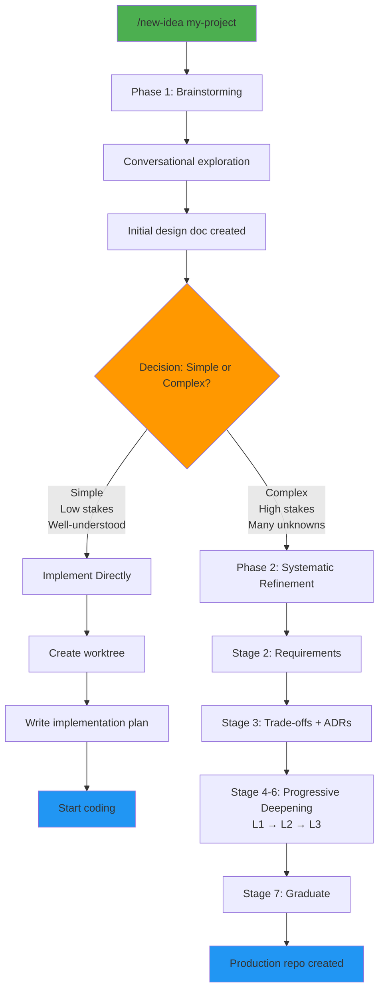

# AI Baseline - Meta-Repository

Refine project ideas through progressive stages, then graduate them to production-ready repos with enforced standards.

## Quick Start

**Start a new idea:**
```
/new-idea my-project
# Automatically triggers: brainstorming → systematic refinement (if needed)
```

**Advance through stages:**
```
/advance-stage my-project
# Complete checklist in status.md, repeat until graduation
```

**Create production repo:**
```
/graduate my-project ~/code/my-project
# New repo ready with design docs, templates, standards
```

## How It Works

Ideas progress through numbered stages. See `ideas/<name>/` folder for stage directories. Each stage has a checklist in `status.md` - complete it to advance.

Refinement stages cover the same aspects (architecture, components, data flows, errors, testing, edge cases) but go progressively deeper with each pass.

When you graduate, you get a new repo with design docs and standards applied. Implementation planning happens there, not here.

---

## Skills

See `skills/` for all available skills and detailed usage. Common workflows:
- `/new-idea` - **Start here!** Hybrid workflow (brainstorm → systematic refinement)
- `/systematic-refinement` - Design thinking coach (or use directly if you know you need rigor upfront)
- `/advance-stage` - Progress to next refinement stage
- `/list-ideas` - View all ideas and stages
- `/graduate` - Create production repository
- `/compound` - Document solved problems

### Default Workflow: Hybrid Approach

**All new ideas automatically follow the hybrid brainstorm → systematic refinement workflow:**

1. **Phase 1: Rapid Exploration** (automatic)
   - `/new-idea my-project` triggers `/superpowers:brainstorming`
   - Conversational idea exploration
   - Quick design document created
   - Fast validation of concept viability

2. **Phase 2: Deep Refinement** (automatic transition)
   - If idea is worthy, automatically transitions to `/systematic-refinement`
   - Applies all frameworks systematically (Requirements, Trade-offs, ADRs, Edge Cases)
   - Progressive deepening through stages (L1 → L2 → L3)
   - Enforced red flag checks
   - 95%+ confidence before graduation

3. **Graduation**
   - `/graduate my-idea ~/code/my-project`
   - Production-ready repo with curated design docs

**Why hybrid?**
- **Prevent over-engineering simple ideas**: Brainstorming filters out ideas that don't need deep refinement
- **Prevent under-engineering complex ones**: Systematic refinement ensures production readiness
- **Choose based on stakes, not preference**: The workflow adapts to project complexity

**Manual override**: You can still use `/systematic-refinement` directly if you know upfront you need exhaustive design.

**Workflow diagram:**



---

## Architecture Details

<details>
<summary>Folder Structure</summary>

Key areas:
- `ideas/` - Refinement pipeline with registry and stage folders
- `templates/` - Files copied to new projects
- `docs/` - Standards and guides
- `skills/` - Claude Code skills
- `tools/` - Helper scripts

Explore actual folders to see current files.
</details>

<details>
<summary>Ideas Registry</summary>

`ideas/ideas-registry.json` tracks all ideas programmatically. See file for current schema.

Managed by registry tool in `tools/`. Do not edit manually.
</details>

<details>
<summary>Stage Gate Validation</summary>

`/advance-stage` validates checklist completion in `status.md`:
- All checklist items must be checked
- Fails if unchecked items exist
- Advances stage and updates registry when complete

Checklist criteria defined in `docs/` standards.
</details>

<details>
<summary>Graduation Process</summary>

`/graduate` creates production repo:
1. Validates idea is at final stage
2. Creates new repo at target path
3. Copies templates
4. Merges curated design docs from final stage folder
5. Initializes git repository
6. Returns ready-to-implement project

Graduated repos receive design documents (what/how/why) but NOT implementation plans. Implementation planning happens in the new repo.
</details>

<details>
<summary>Compound Knowledge System</summary>

`/compound` documents solved problems to build institutional knowledge in `docs/solutions/`.

**The principle:** Knowledge compounds. Document problems once, solve them instantly in the future.

**Usage:** After solving a non-trivial problem, run `/compound` to document it.

See `docs/solutions/` for current categories and `docs/compound-guide.md` for complete guide.
</details>

---

## Documentation Standards

**Diagrams**: Use Mermaid format for all flow diagrams, sequence diagrams, and visualizations. Mermaid renders natively in GitHub and most markdown viewers.

---

<details>
<summary>Philosophy</summary>

**Separation of Concerns**: Ideas refined here, implementation happens in graduated repos.

**Iterative Deepening**: Multiple refinement passes ensure thorough design without premature detail.

**Standards Enforcement**: Every graduated project follows the same high-quality patterns defined in `docs/`.

**Programmatic Tracking**: JSON registry enables automation and tooling.

**Curated Transfer**: New repos get clean designs, not messy exploration history.

</details>
