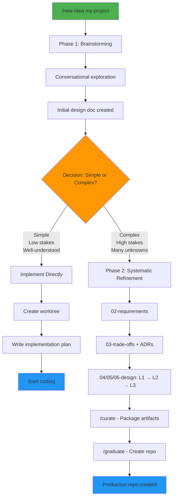

# AI Baseline - Meta-Repository

Refine project ideas through progressive stages, then graduate them to production-ready repos with enforced standards.

## Quick Start

**Start a new idea:**
```
/new-idea my-project
# Automatically triggers: brainstorming → systematic refinement (if needed)
```

**Advance through stages:**
```
/advance-stage my-project
# Complete checklist in status.md, repeat until graduation
```

**Package and graduate:**
```
/curate my-project
# Organizes artifacts into curated/ folder (parallel execution)

/graduate my-project path/to/my-project
# Creates production repo with all design docs
```

## How It Works

Ideas progress through numbered stages. See `ideas/<name>/` folder for stage directories. Each stage has a checklist in `status.md` - complete it to advance.

Refinement stages cover the same aspects (architecture, components, data flows, errors, testing, edge cases) but go progressively deeper with each pass.

When you graduate, you get a new repo with design docs and standards applied. Implementation planning happens there, not here.

---

## Skills

See `.claude/skills/` for all available skills and detailed usage.

| Command | Purpose |
|---------|---------|
| `/new-idea` | **Start here!** Hybrid brainstorm → refinement |
| `/systematic-refinement` | Direct deep refinement (skip brainstorm) |
| `/advance-stage` | Progress to next stage |
| `/list-ideas` | View all ideas and stages |
| `/curate` | Package artifacts (after 06-design-l3) |
| `/graduate` | Create production repo (after curate) |
| `/compound` | Document solved problems |

### Default Workflow: Hybrid Approach

**Why hybrid?**
- Prevents over-engineering simple ideas (brainstorming filters them)
- Prevents under-engineering complex ones (systematic refinement ensures readiness)
- Adapts based on stakes, not preference

**Manual override**: Use `/systematic-refinement` directly if you know upfront you need exhaustive design.

**Workflow diagram:**



---

## Architecture Details

<details>
<summary>Folder Structure</summary>

Key areas:
- `ideas/` - Refinement pipeline with registry and stage folders
- `templates/` - Files copied to new projects
- `docs/` - Standards and guides
- `.claude/skills/` - Claude Code skills
- `tools/` - Helper scripts

Explore actual folders to see current files.
</details>

<details>
<summary>Ideas Registry</summary>

`ideas/ideas-registry.json` tracks all ideas programmatically. See file for current schema.

Managed by registry tool in `tools/`. Do not edit manually.
</details>

<details>
<summary>Stage Gate Validation</summary>

`/advance-stage` validates checklist completion in `status.md`:
- All checklist items must be checked
- Fails if unchecked items exist
- Advances stage and updates registry when complete

Checklist criteria defined in `docs/` standards.
</details>

<details>
<summary>Curation & Graduation Process</summary>

**Step 1: `/curate <idea-name>`** (after 06-design-l3 complete)
- Scans all 01-brainstorm through 06-design-l3 artifacts
- Dispatches parallel agents to create organized `curated/` folder
- Merges L1+L2+L3 progressive deepening into coherent component docs
- Splits edge cases by category
- Creates ADR index
- Keeps all files under 300 lines for parallel processing

**Step 2: `/graduate <idea-name> <target-path>`**
- Reads from `curated/` folder
- Creates new repo at target path
- Transfers all docs to `docs/` folder
- Applies templates (README.md, CLAUDE.md, .gitignore)
- Initializes git repository

Graduated repos receive design documents (what/how/why) but NOT implementation plans. Implementation planning happens in the new repo.
</details>

<details>
<summary>Compound Knowledge System</summary>

`/compound` documents solved problems to build institutional knowledge in `docs/solutions/`.

**The principle:** Knowledge compounds. Document problems once, solve them instantly in the future.

**Usage:** After solving a non-trivial problem, run `/compound` to document it.

See `docs/solutions/` for current categories and `docs/compound-guide.md` for complete guide.
</details>

---

## Documentation Standards

**Diagrams**: Use Mermaid format for all flow diagrams, sequence diagrams, and visualizations. Mermaid renders natively in GitHub and most markdown viewers.

**Artifact Locality**: All artifacts for an idea MUST reside in that idea's folder (`ideas/<name>/`). Never scatter idea-related files across `docs/`, `templates/`, or other locations. This enables focused context and parallel processing.

**File Size Limits**: Keep individual .md files under 300 lines to enable efficient parallel agent processing. If a document exceeds this:
- Split into focused sub-documents by topic/component
- Use clear naming: `component-name.md`, `architecture-overview.md`, `edge-cases.md`
- Link between documents rather than creating monoliths
- Example: Split `design.md` (600 lines) → `architecture.md` (200), `components.md` (200), `data-flows.md` (200)

---

## Git Conventions

**Branch Creation**: When making any code changes, ALWAYS create a new branch first using this naming convention:

```
feature/<session-id>/<task-description>
```

- `<session-id>`: Use the current Claude session identifier (short, kebab-case)
- `<task-description>`: Brief kebab-case description of the task

**Examples:**
- `feature/abc123/add-user-auth`
- `feature/xyz789/fix-registry-validation`
- `feature/def456/update-graduation-flow`

**Workflow:**
1. Before making changes, create and checkout a new branch
2. Make changes on the feature branch
3. Commit with meaningful messages
4. User decides when to merge/PR

---

<details>
<summary>Philosophy</summary>

**Separation of Concerns**: Ideas refined here, implementation happens in graduated repos.

**Iterative Deepening**: Multiple refinement passes ensure thorough design without premature detail.

**Standards Enforcement**: Every graduated project follows the same high-quality patterns defined in `docs/`.

**Programmatic Tracking**: JSON registry enables automation and tooling.

**Curated Transfer**: New repos get clean designs, not messy exploration history.

</details>
