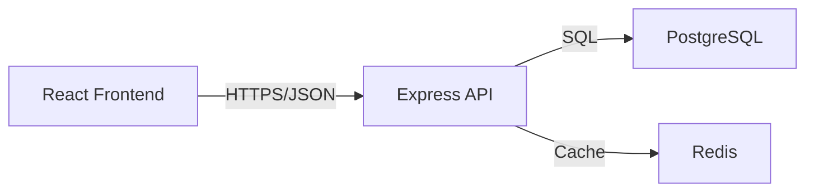

# Architecture Documentation Guide

## Purpose

Architecture documentation explains the structural decisions of your system: how components fit together, why they're organized this way, and what patterns you follow.

## When to Write Architecture Docs

- Projects with multiple interconnected components
- Systems with non-obvious design decisions
- When onboarding new developers
- When architectural changes are proposed

Simple scripts or single-purpose tools usually don't need formal architecture docs.

## What to Document

### 1. System Overview
- What are the major components/modules?
- How do they interact?
- What's the data flow through the system?

### 2. Architectural Decisions (ADRs)
- What significant decisions were made?
- What alternatives were considered?
- Why was this approach chosen?
- What are the trade-offs?

### 3. Patterns and Conventions
- What architectural patterns are used? (MVC, event-driven, microservices, etc.)
- What conventions should developers follow?
- What's the intended structure for new features?

### 4. Dependencies and Integration Points
- External services/APIs
- Third-party libraries with architectural impact
- Database schema overview
- Message queues, caching layers, etc.

## Diagrams vs. Prose

### Use Diagrams When:
- Showing component relationships
- Illustrating data flow
- Explaining system topology
- Clarifying complex interactions

### Use Prose When:
- Explaining "why" behind decisions
- Documenting trade-offs
- Describing patterns and conventions
- Providing context and rationale

**Best approach**: Combine both. Diagram the structure, then explain it in words.

## Diagram Tools

Simple is better:
- Mermaid (text-based, version-controllable)
- Draw.io / Excalidraw (for more complex diagrams)
- Even ASCII art for very simple cases

Avoid:
- Complex UML unless your team actively uses it
- Tools that produce images not easily updated
- Over-detailed diagrams that become outdated quickly

## Architecture Decision Records (ADRs)

For significant decisions, use this format:

```markdown
# ADR-001: Use PostgreSQL for Primary Database

## Status
Accepted

## Context
We need a database for storing user data, tasks, and relationships. Requirements:
- ACID transactions
- Complex queries with joins
- Scalable to millions of records

## Decision
Use PostgreSQL as the primary database.

## Consequences
**Positive:**
- Strong ACID guarantees
- Excellent query capabilities
- Mature tooling and community
- JSON support for flexible fields

**Negative:**
- More complex to scale horizontally than NoSQL
- Requires schema migrations for changes
- Learning curve for team members new to SQL

## Alternatives Considered
- MongoDB: Better horizontal scaling but weaker consistency guarantees
- MySQL: Similar capabilities but less advanced JSON support
```

## Examples

### Good Architecture Doc

```markdown
# Task Manager Architecture

## Overview

Three-tier architecture:
- **Frontend**: React SPA (single-page app)
- **API**: Node.js/Express REST API
- **Database**: PostgreSQL



## Component Organization

### Frontend (`/client`)
- React components in `/src/components`
- Global state in Redux (`/src/store`)
- API calls centralized in `/src/api`

Pattern: Container/Presentational component split

### API (`/server`)
- Routes define HTTP endpoints (`/src/routes`)
- Services contain business logic (`/src/services`)
- Models define data schema (`/src/models`)

Pattern: Thin controllers, fat services

### Database
- Migrations in `/migrations` (Sequelize)
- One model per table
- Foreign keys enforce referential integrity

## Key Architectural Decisions

### ADR-001: REST API over GraphQL
**Why**: Simpler for our use case, team has more REST experience
**Trade-off**: More endpoints but easier to understand and debug

### ADR-002: Redis for Session Storage
**Why**: Fast, simple, proven for sessions
**Trade-off**: Additional service to run, but worth it for performance

## Data Flow

1. User action in React → Redux action
2. Redux thunk makes API call
3. API route validates request → calls service
4. Service executes business logic → updates database
5. Response flows back to frontend
6. Redux updates state → React re-renders
```

### Bad Architecture Doc

```markdown
# Architecture

This project uses a modern, scalable, enterprise-grade architecture with best practices from industry leaders!

We use React because it's the best framework. We use Node.js because it's fast. We use PostgreSQL because it's reliable.

The system has a frontend and a backend. The frontend talks to the backend. The backend talks to the database.

[No diagrams, no specific details, no rationale for decisions]
```

## Tips

1. **Keep it updated**: Outdated architecture docs are worse than none
2. **Be specific**: "We use Redis" is less helpful than "We use Redis for session storage because..."
3. **Explain trade-offs**: Every decision has pros and cons
4. **Think "why", not just "what"**: What you built is in the code; why you built it that way goes in docs
5. **Start simple**: You can always add more detail later

## Length

Varies by project complexity:
- Small projects: 100-300 lines
- Medium projects: 300-800 lines
- Large projects: Consider splitting into multiple docs (one per major component)

## Where to Put It

- Small projects: Include in README or dedicated `ARCHITECTURE.md`
- Medium/large projects: `/docs/architecture/` folder with multiple documents
- Consider including high-level overview in `claude.md`
