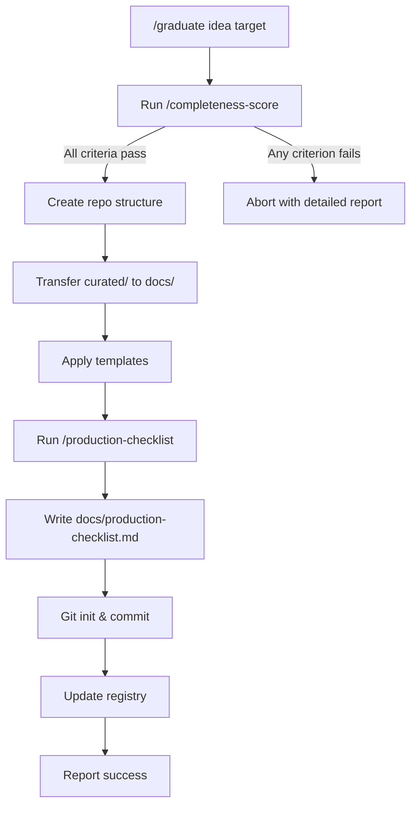

# Graduation Enhancements Design

> Add completeness scoring and production checklist generation to the graduation workflow.

**Status:** Approved
**Date:** 2026-01-26

---

## Overview

Two enhancements to `/graduate`:

1. **Completeness Score** - Hard gate that blocks graduation if curated artifacts don't meet quality criteria
2. **Production Checklist Generator** - Auto-extracts actionable deployment items from design docs

Both enforce quality standards and bridge the gap between "refined design" and "actual implementation."

---

## Feature 1: Completeness Score

### Behavior

- Runs as first step of `/graduate`
- Binary pass/fail per criterion, 100% threshold required
- On failure: abort with detailed report showing exactly what's missing
- Can also run standalone via `/completeness-score <idea-name>`

### Criteria

#### Components (for each `curated/architecture/components/*.md`)

| Criterion | Detection |
|-----------|-----------|
| Has overview | Heading `## Overview` exists |
| Has data flow diagram | Mermaid block with `sequenceDiagram` or `graph` |
| Has edge cases | Heading `## Edge Cases` with content |
| Has failure modes | Heading `## Failure Modes` with content |

#### ADRs (for each `curated/decisions/ADR-*.md`)

| Criterion | Detection |
|-----------|-----------|
| Has context | Heading `## Context` or `## Problem` |
| Has decision | Heading `## Decision` |
| Has consequences | Heading `## Consequences` or `## Trade-offs` |
| Has alternatives | Heading `## Alternatives` or text mentioning rejected options |

#### Edge Cases (in `curated/edge-cases/`)

| Criterion | Detection |
|-----------|-----------|
| Timing category | File `timing.md` or section in index |
| Data boundaries | File `data-boundaries.md` or section |
| Integration cases | File `integration.md` or section |
| State transitions | File `state-transitions.md` or section |

#### Required Documents

| Document | Path | Detection |
|----------|------|-----------|
| Security threat model | `security/threat-model.md` | File exists, non-empty |
| Operations runbooks | `operations/runbooks.md` | File exists, non-empty |
| Performance targets | `performance.md` | File exists, has metrics table |

### Output on Failure

```
Graduation blocked: 3 criteria not met

Components:
  ✗ inventory-reservation: missing failure modes section
  ✗ discount-code: missing data flow diagram

ADRs:
  ✗ ADR-003: missing "alternatives considered"

Score: 85% (17/20 criteria)
Required: 100%

Fix these issues in curated/ and retry.
```

---

## Feature 2: Production Checklist Generator

### Behavior

- Runs after repo creation, before final commit
- Parses curated docs and extracts actionable items
- Writes `docs/production-checklist.md` in graduated repo
- Can also run standalone via `/production-checklist <idea-name>`

### Extraction by Category

| Category | Source Files | What to Extract |
|----------|--------------|-----------------|
| Infrastructure | `architecture/overview.md` | Services, deployment targets, databases |
| Security | `security/threat-model.md` | Mitigations, auth requirements, rate limits |
| Integrations | `architecture/components/*.md` | External services (Stripe, email, storage) |
| Monitoring | `operations/runbooks.md`, `performance.md` | Alerts, metrics, logging requirements |
| Testing | `edge-cases/*.md` | Each edge case becomes test scenario |
| Compliance | `security/compliance/*.md` | GDPR, PCI, accessibility requirements |

### Extraction Logic

Items extracted by identifying:
- Technology/service names (Cloud Run, Firestore, Stripe, etc.)
- Action phrases (deploy, configure, set up, implement, enable)
- Requirements language (must, required, needs)
- Metrics and targets (P95 < 200ms becomes monitoring item)

### Output Format

```markdown
# Production Readiness Checklist

Generated from design docs on YYYY-MM-DD.
Check off items as you implement.

## Infrastructure
- [ ] Deploy Go API to Cloud Run
- [ ] Deploy Next.js frontend to Cloud Run
- [ ] Provision Firestore database
- [ ] Configure Cloud Storage bucket for images

## Security
- [ ] Implement rate limiting (100 req/min per IP)
- [ ] Configure CORS for production domain
- [ ] Set up JWT token rotation (24h expiry)
- [ ] Enable HTTPS-only cookies

## Integrations
- [ ] Connect Stripe payment processing
- [ ] Configure SendGrid for transactional email
- [ ] Set up Cloud Storage SDK

## Monitoring
- [ ] Set up error alerting (5xx > 1% triggers page)
- [ ] Configure P95 latency dashboards
- [ ] Enable structured logging to Cloud Logging
- [ ] Create order creation success rate alert

## Testing
- [ ] Test: reservation expires during checkout
- [ ] Test: promo code expires during payment
- [ ] Test: payment succeeds but order creation fails
- [ ] Test: concurrent inventory reservations

## Compliance
- [ ] Implement GDPR data export endpoint
- [ ] Add cookie consent banner
- [ ] Verify PCI SAQ-A compliance (Stripe handles card data)
- [ ] Test WCAG 2.1 AA accessibility
```

---

## Integration into Graduate Skill

### Modified Flow

```
/graduate <idea-name> <target-path>

Step 1: Completeness Score (NEW)
  └─ Scan curated/ folder
  └─ Evaluate all criteria
  └─ If any fails → abort with report
  └─ If all pass → continue

Step 2: Create Repository (existing)
  └─ Create folder structure
  └─ Transfer curated artifacts
  └─ Apply templates

Step 3: Generate Production Checklist (NEW)
  └─ Parse curated docs
  └─ Extract items by category
  └─ Write docs/production-checklist.md

Step 4: Create Initial Commit (existing)
  └─ Commit all files
  └─ Update registry
  └─ Report success
```

### Flow Diagram



---

## File Structure

### New Skill Files

```
.claude/skills/
├── graduate.md                      # Modified - add completeness check
├── completeness-score/
│   ├── SKILL.md                     # Main skill definition
│   ├── CRITERIA.md                  # Criteria definitions
│   └── REPORT-FORMAT.md             # Output format spec
└── production-checklist/
    ├── SKILL.md                     # Main skill definition
    ├── EXTRACTORS.md                # Extraction rules per category
    └── OUTPUT-FORMAT.md             # Checklist template
```

### Standalone Usage

```bash
# Check completeness without graduating
/completeness-score manik-golden-honey-co

# Generate checklist preview (writes to curated/production-checklist.md)
/production-checklist manik-golden-honey-co
```

---

## Implementation Tasks

1. Create `completeness-score/SKILL.md` - main orchestration logic
2. Create `completeness-score/CRITERIA.md` - detailed criteria definitions
3. Create `completeness-score/REPORT-FORMAT.md` - output formatting
4. Create `production-checklist/SKILL.md` - main extraction logic
5. Create `production-checklist/EXTRACTORS.md` - per-category extraction rules
6. Create `production-checklist/OUTPUT-FORMAT.md` - checklist template
7. Modify `graduate.md` - integrate both features into flow
8. Test against `manik-golden-honey-co` curated artifacts

---

## Success Criteria

- [ ] `/completeness-score` correctly identifies missing sections in test artifacts
- [ ] `/graduate` blocks when completeness < 100%
- [ ] `/production-checklist` extracts relevant items from all six categories
- [ ] Generated checklist is actionable (specific, not vague)
- [ ] Both skills work standalone and integrated
