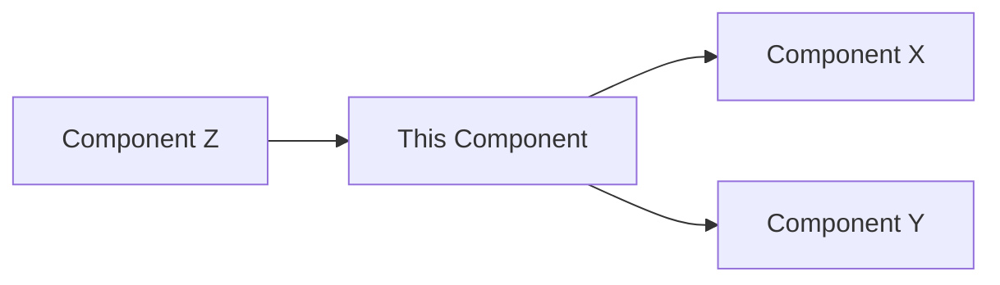

# Progressive Deepening: [Component/Flow/Decision Name]

This template helps you refine a design aspect across multiple stages, ensuring each pass builds on the previous one.

---

## L1 Pass: Surface Level (Stage 4: Refine L1)

### What
[Basic description - what is this component/flow/decision?]

### Why
[High-level motivation - why does this exist?]

### Key Insight
[The main point someone should understand about this]

### Initial Questions Raised
-
-

---

## L2 Pass: Detailed Level (Stage 5: Refine L2)

### How
[Approach/mechanism - how does this work?]

### Interactions
[How it connects to other components/systems]

### Alternatives Considered
- **Option 1**: [Why rejected or deprioritized]
- **Option 2**: [Why rejected or deprioritized]

### Edge Cases (Initial List)
1.
2.
3.

### Risks Identified
- **Risk 1**: [Description] - Mitigation: [Approach]
- **Risk 2**: [Description] - Mitigation: [Approach]

### Open Questions
-
-

---

## L3 Pass: Exhaustive Level (Stage 6: Refine L3)

### Complete Scenario Coverage

#### Happy Path
[Primary flow when everything works]

#### Variant A: [Condition]
[How behavior changes under this condition]

#### Variant B: [Condition]
[How behavior changes under this condition]

#### Variant C: [Rare but possible]
[Edge case handling]

### Complete Failure Mode Analysis

| Failure Mode | Cause | Impact | Detection | Recovery | Prevention |
|--------------|-------|---------|-----------|----------|------------|
| [Mode 1] | | | | | |
| [Mode 2] | | | | | |
| [Mode 3] | | | | | |

### Performance Implications

**Scalability:**
- At 10X load: [behavior]
- At 100X load: [behavior]
- Bottleneck: [identified constraint]

**Optimization opportunities:**
-
-

### Security Implications

**Threat model:**
- **Threat 1**: [Description] - Mitigation: [Control]
- **Threat 2**: [Description] - Mitigation: [Control]

**Data sensitivity:**
- [What sensitive data flows through this component?]

### Dependencies & Assumptions

**External dependencies:**
- [System/service 1]: [What we depend on]
- [System/service 2]: [What we depend on]

**Assumptions:**
- [ ] Assumption 1 - Validated: [How/when]
- [ ] Assumption 2 - Validated: [How/when]

### Complete Edge Case Catalog

#### Data Boundaries
- [ ] Empty input
- [ ] Null/undefined
- [ ] Maximum size/value
- [ ] Special characters
- [ ] Invalid format

#### State Transitions
- [ ] Concurrent operations
- [ ] Retry after failure
- [ ] Out-of-order events
- [ ] Partial completion

#### Timing
- [ ] Timeout scenarios
- [ ] Race conditions
- [ ] Long-running operations

#### Integration
- [ ] Dependency unavailable
- [ ] Slow dependency
- [ ] Invalid responses
- [ ] Auth/permission failures

### Unknowns Resolved

**Questions from L2 now answered:**
1. [Question] → [Answer with rationale]
2. [Question] → [Answer with rationale]

**No remaining TBDs**: ✓ | ✗

---

## Cross-Stage Verification

### L1 → L2 Changes
[What did we discover in L2 that modified our L1 understanding?]

### L2 → L3 Changes
[What did we discover in L3 that modified our L2 understanding?]

### Stability Check
- [ ] Core concepts stable across all levels
- [ ] No fundamental pivot needed
- [ ] Refinements were additive, not corrective

---

**Last Updated:** YYYY-MM-DD
**Stage:** L1 | L2 | L3
