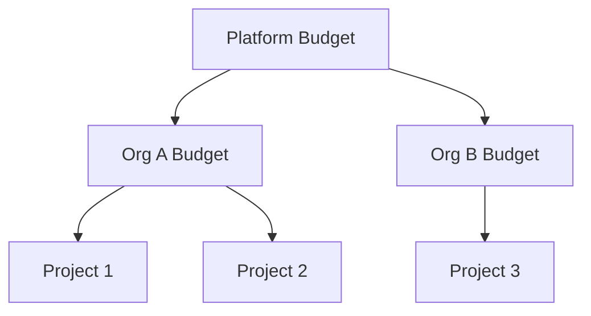

# Cost Management

## Overview

AgentForge uses external LLM providers with per-token pricing. This document defines cost controls, budget management, and usage tracking to prevent unexpected charges and enable fair resource allocation.

---

## Cost Model

### LLM Costs

| Provider | Model | Input (per 1M) | Output (per 1M) |
|----------|-------|----------------|-----------------|
| Anthropic | Claude Sonnet | $3 | $15 |
| Anthropic | Claude Haiku | $0.25 | $1.25 |

### Estimated Task Costs

| Task Type | Avg Input | Avg Output | Est. Cost |
|-----------|-----------|------------|-----------|
| Requirements gathering | 10K | 5K | ~$0.11 |
| Architecture design | 20K | 10K | ~$0.21 |
| Code generation | 30K | 20K | ~$0.39 |
| Security review | 25K | 5K | ~$0.15 |
| **Full project** | - | - | **~$0.86** |

---

## Budget Hierarchy



### Budget Levels

| Level | Default | Configurable By | Period |
|-------|---------|-----------------|--------|
| Platform | Unlimited | Platform Admin | N/A |
| Organization | $100 | Org Admin | Monthly |
| Project | No limit | Project Owner | Monthly |
| User | No limit | Org Admin | Daily |

---

## Usage Tracking

### Token Counter

```go
type UsageTracker struct {
    store UsageStore
}

type UsageRecord struct {
    OrgID       string    `firestore:"orgId"`
    ProjectID   string    `firestore:"projectId"`
    UserID      string    `firestore:"userId"`
    Model       string    `firestore:"model"`
    InputTokens int64     `firestore:"inputTokens"`
    OutputTokens int64    `firestore:"outputTokens"`
    Cost        float64   `firestore:"cost"` // In dollars
    TaskType    string    `firestore:"taskType"`
    Timestamp   time.Time `firestore:"timestamp"`
}

func (ut *UsageTracker) RecordUsage(ctx context.Context, record UsageRecord) error {
    // Calculate cost
    record.Cost = calculateCost(record.Model, record.InputTokens, record.OutputTokens)

    // Store individual record
    if err := ut.store.SaveRecord(ctx, record); err != nil {
        return err
    }

    // Update aggregates
    return ut.store.IncrementAggregates(ctx, record)
}
```

### Aggregate Storage

```go
type UsageAggregate struct {
    OrgID        string  `firestore:"orgId"`
    Period       string  `firestore:"period"` // "2026-01" for monthly
    TotalCost    float64 `firestore:"totalCost"`
    InputTokens  int64   `firestore:"inputTokens"`
    OutputTokens int64   `firestore:"outputTokens"`
    RequestCount int64   `firestore:"requestCount"`
}

func (s *firestoreUsageStore) IncrementAggregates(ctx context.Context, record UsageRecord) error {
    period := record.Timestamp.Format("2006-01")

    return s.client.RunTransaction(ctx, func(ctx context.Context, tx *firestore.Transaction) error {
        ref := s.client.Collection("usage_aggregates").Doc(fmt.Sprintf("%s_%s", record.OrgID, period))

        doc, err := tx.Get(ref)
        if err != nil && status.Code(err) != codes.NotFound {
            return err
        }

        var agg UsageAggregate
        if doc.Exists() {
            doc.DataTo(&agg)
        } else {
            agg = UsageAggregate{OrgID: record.OrgID, Period: period}
        }

        agg.TotalCost += record.Cost
        agg.InputTokens += record.InputTokens
        agg.OutputTokens += record.OutputTokens
        agg.RequestCount++

        return tx.Set(ref, agg)
    })
}
```

---

## Budget Enforcement

### Pre-Request Check

```go
type BudgetEnforcer struct {
    usageStore UsageStore
    configStore ConfigStore
}

func (be *BudgetEnforcer) CheckBudget(ctx context.Context, orgID string, estimatedCost float64) error {
    // Get current usage
    usage, err := be.usageStore.GetCurrentPeriodUsage(ctx, orgID)
    if err != nil {
        return err
    }

    // Get budget
    budget, err := be.configStore.GetOrgBudget(ctx, orgID)
    if err != nil {
        return err
    }

    // Check if request would exceed budget
    if usage.TotalCost + estimatedCost > budget.MonthlyLimit {
        return &BudgetExceededError{
            Current: usage.TotalCost,
            Limit:   budget.MonthlyLimit,
            Requested: estimatedCost,
        }
    }

    // Warn if approaching limit
    if usage.TotalCost + estimatedCost > budget.MonthlyLimit * 0.9 {
        be.notifyApproachingLimit(ctx, orgID, usage.TotalCost, budget.MonthlyLimit)
    }

    return nil
}
```

### Cost Estimation

```go
func EstimateRequestCost(req *LLMRequest) float64 {
    // Estimate input tokens (actual content + overhead)
    inputTokens := estimateTokens(req.Messages) + estimateToolTokens(req.Tools)

    // Estimate output tokens (based on task type)
    outputTokens := estimateOutputTokens(req.TaskType)

    return calculateCost(req.Model, inputTokens, outputTokens)
}

func estimateOutputTokens(taskType string) int64 {
    // Conservative estimates
    switch taskType {
    case "requirements":
        return 5000
    case "architecture":
        return 10000
    case "code":
        return 20000
    case "security":
        return 5000
    default:
        return 5000
    }
}
```

---

## Alerting

### Alert Thresholds

| Threshold | Action |
|-----------|--------|
| 50% of budget | Info notification to admin |
| 80% of budget | Warning email to admin |
| 90% of budget | Warning to all org users |
| 100% of budget | Block new requests |

### Alert Implementation

```go
type CostAlerter struct {
    notifier Notifier
    store    UsageStore
}

func (ca *CostAlerter) CheckAndAlert(ctx context.Context, orgID string) error {
    usage, _ := ca.store.GetCurrentPeriodUsage(ctx, orgID)
    config, _ := ca.store.GetOrgConfig(ctx, orgID)

    percentage := usage.TotalCost / config.MonthlyBudget * 100

    switch {
    case percentage >= 100:
        return ca.notifier.Send(ctx, orgID, AlertCritical, "Budget exceeded - new requests blocked")
    case percentage >= 90:
        return ca.notifier.Send(ctx, orgID, AlertWarning, fmt.Sprintf("Budget at %.0f%% - approaching limit", percentage))
    case percentage >= 80:
        return ca.notifier.SendToAdmins(ctx, orgID, AlertWarning, fmt.Sprintf("Budget at %.0f%%", percentage))
    case percentage >= 50:
        return ca.notifier.SendToAdmins(ctx, orgID, AlertInfo, fmt.Sprintf("Budget at %.0f%%", percentage))
    }
    return nil
}
```

---

## Cost Optimization

### Model Selection

```go
func SelectModel(task TaskType, quality QualityPreference) string {
    // Use cheaper models for simpler tasks
    switch task {
    case TaskSimpleQuery:
        return "claude-haiku-3"
    case TaskCodeReview:
        if quality == QualityFast {
            return "claude-haiku-3"
        }
        return "claude-sonnet-4"
    case TaskCodeGeneration:
        return "claude-sonnet-4" // Always use best for code
    default:
        return "claude-sonnet-4"
    }
}
```

### Token Optimization

| Technique | Savings | Implementation |
|-----------|---------|----------------|
| Prompt caching | 20-30% | Reuse system prompts |
| Context pruning | 10-20% | Remove irrelevant history |
| Output constraints | 5-10% | Limit response length |
| Batch similar requests | 10-15% | Combine validation checks |

---

## Usage Dashboard

### Org Admin View

```
┌─────────────────────────────────────────────────────────────┐
│ Usage Dashboard - January 2026                               │
├─────────────────────────────────────────────────────────────┤
│ Budget: $100.00                Used: $67.50 (67.5%)          │
│ ████████████████████░░░░░░░░░░                              │
│                                                              │
│ Breakdown by Project:                                        │
│ ┌──────────────────┬─────────┬──────────┐                   │
│ │ Project          │ Cost    │ Requests │                   │
│ ├──────────────────┼─────────┼──────────┤                   │
│ │ E-commerce App   │ $35.20  │ 142      │                   │
│ │ Mobile Backend   │ $22.10  │ 89       │                   │
│ │ Data Pipeline    │ $10.20  │ 45       │                   │
│ └──────────────────┴─────────┴──────────┘                   │
│                                                              │
│ Breakdown by User:                                           │
│ ┌──────────────────┬─────────┬──────────┐                   │
│ │ User             │ Cost    │ Requests │                   │
│ ├──────────────────┼─────────┼──────────┤                   │
│ │ alice@example    │ $28.40  │ 112      │                   │
│ │ bob@example      │ $24.30  │ 98       │                   │
│ │ carol@example    │ $14.80  │ 66       │                   │
│ └──────────────────┴─────────┴──────────┘                   │
└─────────────────────────────────────────────────────────────┘
```

### API Endpoints

```go
// GET /api/orgs/{orgId}/usage
type UsageSummary struct {
    Period       string             `json:"period"`
    TotalCost    float64            `json:"totalCost"`
    BudgetLimit  float64            `json:"budgetLimit"`
    UsagePercent float64            `json:"usagePercent"`
    ByProject    []ProjectUsage     `json:"byProject"`
    ByUser       []UserUsage        `json:"byUser"`
    ByDay        []DailyUsage       `json:"byDay"`
}

// GET /api/orgs/{orgId}/usage/export
// Returns CSV of all usage records for billing reconciliation
```

---

## Related Documents

- [ADR-022: Cost Controls](../decisions/ADR-022-cost-controls.md)
- [LLM Resilience](./llm-resilience.md)
- [Architecture Overview](./overview.md)
