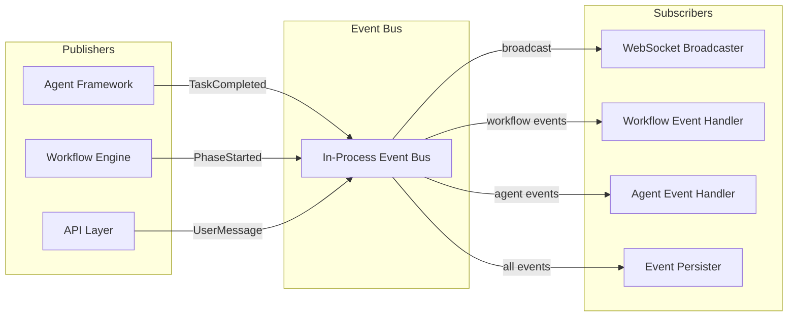

# Event Bus Architecture

## Overview

The Event Bus decouples the Agent Framework from the Workflow Engine, breaking the circular dependency where agents need to report progress to workflows, and workflows need to dispatch tasks to agents. Events flow through the bus asynchronously, enabling loose coupling and better testability.

---

## Problem

The original design had a circular dependency:

```
Agent Framework ←→ Workflow Engine
     ↑                    ↓
     └────────────────────┘
```

- Workflow dispatches tasks to agents
- Agents report completion/failure to workflow
- Both components tightly coupled

---

## Solution

Introduce an Event Bus as an intermediary:



---

## Event Types

### Agent Events

| Event | Payload | Publisher | Subscribers |
|-------|---------|-----------|-------------|
| `AgentTaskStarted` | taskId, agentType, projectId | Agent Executor | Workflow, WebSocket |
| `AgentTaskProgress` | taskId, state, message | Agent Executor | WebSocket |
| `AgentTaskCompleted` | taskId, artifacts[], usage | Agent Executor | Workflow, WebSocket, Persist |
| `AgentTaskFailed` | taskId, error, retryable | Agent Executor | Workflow, WebSocket |
| `AgentToolCalled` | taskId, toolName, args | Agent Executor | WebSocket |

### Workflow Events

| Event | Payload | Publisher | Subscribers |
|-------|---------|-----------|-------------|
| `PhaseStarted` | workflowId, phase, projectId | Workflow Engine | WebSocket, Persist |
| `PhaseCompleted` | workflowId, phase, artifacts[] | Workflow Engine | WebSocket, Persist |
| `EscalationCreated` | escalationId, constraintId | Workflow Engine | WebSocket, Persist |
| `EscalationResolved` | escalationId, resolution | Workflow Engine | WebSocket, Agent, Persist |
| `WorkflowCompleted` | workflowId, projectId | Workflow Engine | WebSocket, Persist |

### User Events

| Event | Payload | Publisher | Subscribers |
|-------|---------|-----------|-------------|
| `UserMessageSent` | projectId, userId, content | API | Agent Executor |
| `ArtifactApproved` | artifactId, userId | API | Workflow, Persist |
| `ArtifactRejected` | artifactId, userId, feedback | API | Workflow, Agent, Persist |

---

## Implementation

### Event Interface

```go
type Event interface {
    Type() string
    Timestamp() time.Time
    ProjectID() string
}

type BaseEvent struct {
    EventType   string    `json:"type"`
    EventTime   time.Time `json:"timestamp"`
    Project     string    `json:"projectId"`
}

func (e BaseEvent) Type() string       { return e.EventType }
func (e BaseEvent) Timestamp() time.Time { return e.EventTime }
func (e BaseEvent) ProjectID() string  { return e.Project }
```

### Event Bus Interface

```go
type EventBus interface {
    // Publish sends an event to all subscribers
    Publish(ctx context.Context, event Event) error

    // Subscribe registers a handler for specific event types
    Subscribe(eventTypes []string, handler EventHandler) Subscription

    // SubscribeAll registers a handler for all events
    SubscribeAll(handler EventHandler) Subscription
}

type EventHandler func(ctx context.Context, event Event) error

type Subscription interface {
    Unsubscribe()
}
```

### In-Process Implementation

```go
type InProcessEventBus struct {
    mu          sync.RWMutex
    subscribers map[string][]subscriberEntry
    allHandlers []subscriberEntry
}

func (bus *InProcessEventBus) Publish(ctx context.Context, event Event) error {
    bus.mu.RLock()
    defer bus.mu.RUnlock()

    // Notify type-specific subscribers
    for _, sub := range bus.subscribers[event.Type()] {
        if err := sub.handler(ctx, event); err != nil {
            log.Error("event handler error",
                "type", event.Type(),
                "handler", sub.name,
                "error", err)
        }
    }

    // Notify all-event subscribers
    for _, sub := range bus.allHandlers {
        if err := sub.handler(ctx, event); err != nil {
            log.Error("event handler error",
                "type", event.Type(),
                "handler", sub.name,
                "error", err)
        }
    }

    return nil
}
```

---

## Subscriber Examples

### Workflow Event Handler

```go
func NewWorkflowEventHandler(workflowSvc *WorkflowService) EventHandler {
    return func(ctx context.Context, event Event) error {
        switch e := event.(type) {
        case *AgentTaskCompletedEvent:
            return workflowSvc.HandleTaskCompletion(ctx, e.TaskID, e.Artifacts)
        case *AgentTaskFailedEvent:
            return workflowSvc.HandleTaskFailure(ctx, e.TaskID, e.Error)
        case *ArtifactApprovedEvent:
            return workflowSvc.HandleArtifactApproval(ctx, e.ArtifactID)
        }
        return nil
    }
}
```

### WebSocket Broadcaster

```go
func NewWebSocketBroadcaster(hub *WebSocketHub) EventHandler {
    return func(ctx context.Context, event Event) error {
        // Only broadcast events that should reach clients
        if !shouldBroadcast(event) {
            return nil
        }

        msg := WebSocketMessage{
            Type:    event.Type(),
            Payload: event,
        }

        // Broadcast to all connections for this project
        hub.BroadcastToProject(event.ProjectID(), msg)
        return nil
    }
}
```

---

## Event Persistence

All events are persisted for audit and event sourcing:

```go
func NewEventPersister(repo EventRepository) EventHandler {
    return func(ctx context.Context, event Event) error {
        record := &EventRecord{
            ID:        uuid.New().String(),
            Type:      event.Type(),
            ProjectID: event.ProjectID(),
            Payload:   event,
            Timestamp: event.Timestamp(),
        }
        return repo.Save(ctx, record)
    }
}
```

---

## Error Handling

| Scenario | Behavior |
|----------|----------|
| Handler returns error | Log error, continue to other handlers |
| Handler panics | Recover, log, continue to other handlers |
| Slow handler | Timeout after 5s, log warning |
| Handler blocks | Run handlers concurrently with bounded pool |

---

## Future: Distributed Event Bus

For multi-instance deployment, the event bus can be backed by:
- Google Cloud Pub/Sub
- Redis Streams
- NATS

The interface remains the same; only the implementation changes.

---

## Related Documents

- [ADR-020: Event-Driven Decoupling](../decisions/ADR-020-event-driven-decoupling.md)
- [ADR-009: Event Sourcing](../decisions/ADR-009-event-sourcing.md)
- [Architecture Overview](./overview.md)
