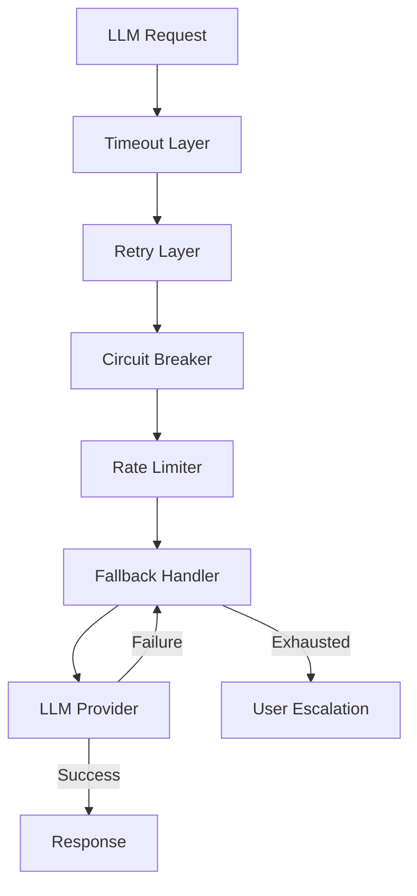
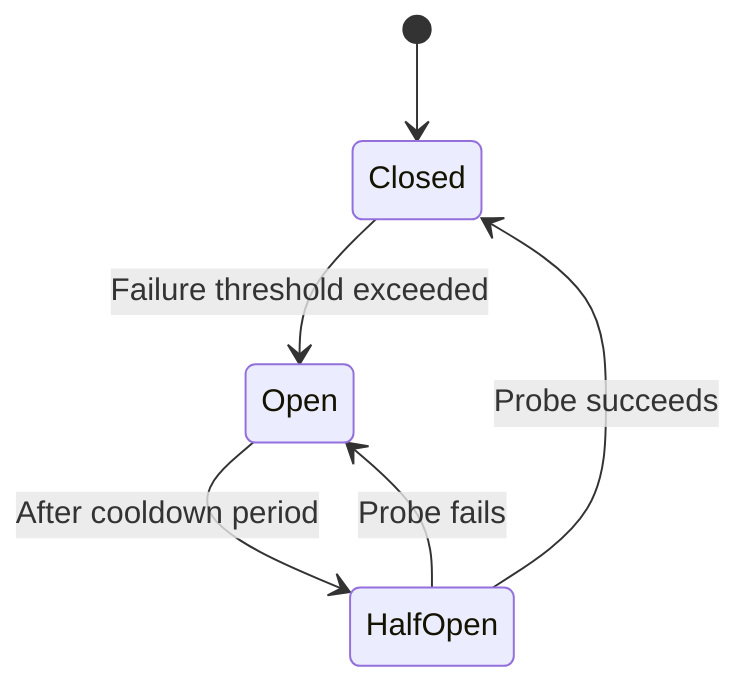

# LLM Provider Resilience

## Overview

AgentForge depends on external LLM providers (primarily Anthropic Claude) for agent reasoning. This document defines resilience patterns to handle provider failures, rate limits, and degraded performance while maintaining system reliability.

---

## Failure Modes

| Failure | Likelihood | Impact | Detection |
|---------|------------|--------|-----------|
| Timeout (>30s) | Medium | Task delayed | Request timeout |
| Rate limit (429) | Medium | Temporary block | HTTP status |
| Server error (5xx) | Low | Task failed | HTTP status |
| Malformed response | Low | Cannot parse | JSON decode error |
| Provider outage | Very Low | Complete stop | Multiple failures |
| Partial response | Low | Incomplete output | Truncated content |

---

## Resilience Layers



---

## Timeout Configuration

| Operation | Timeout | Rationale |
|-----------|---------|-----------|
| Simple query | 30s | Most responses complete quickly |
| Code generation | 60s | Longer outputs need more time |
| Tool-heavy task | 120s | Multiple tool calls in sequence |
| Overall request | 180s | Absolute limit for any request |

### Implementation

```go
func (p *ClaudeProvider) Complete(ctx context.Context, req *Request) (*Response, error) {
    // Apply timeout based on request type
    timeout := p.calculateTimeout(req)
    ctx, cancel := context.WithTimeout(ctx, timeout)
    defer cancel()

    resp, err := p.client.Messages.New(ctx, params)
    if err != nil {
        if errors.Is(err, context.DeadlineExceeded) {
            return nil, &TimeoutError{
                Duration: timeout,
                Request:  req,
            }
        }
        return nil, err
    }

    return resp, nil
}
```

---

## Retry Strategy

### Exponential Backoff

| Attempt | Delay | Total Wait |
|---------|-------|------------|
| 1 | 0s | 0s |
| 2 | 1s | 1s |
| 3 | 2s | 3s |
| 4 | 4s | 7s |
| Max | - | ~7s |

### Retry Conditions

| Error Type | Retry? | Max Attempts |
|------------|--------|--------------|
| Timeout | Yes | 3 |
| Rate limit (429) | Yes | 4 (with longer backoff) |
| Server error (5xx) | Yes | 3 |
| Client error (4xx) | No | - |
| Malformed response | Yes | 2 |
| Network error | Yes | 3 |

### Implementation

```go
func (p *ResilientProvider) Complete(ctx context.Context, req *Request) (*Response, error) {
    var lastErr error

    for attempt := 0; attempt < p.maxRetries; attempt++ {
        if attempt > 0 {
            delay := p.calculateBackoff(attempt, lastErr)
            select {
            case <-time.After(delay):
            case <-ctx.Done():
                return nil, ctx.Err()
            }
        }

        resp, err := p.provider.Complete(ctx, req)
        if err == nil {
            return resp, nil
        }

        lastErr = err
        if !p.isRetryable(err) {
            return nil, err
        }

        p.metrics.RetryAttempt(attempt, err)
    }

    return nil, fmt.Errorf("max retries exceeded: %w", lastErr)
}
```

---

## Circuit Breaker

Prevents cascading failures when provider is experiencing issues.

### States



### Configuration

| Parameter | Value | Description |
|-----------|-------|-------------|
| Failure threshold | 5 | Failures to open circuit |
| Success threshold | 3 | Successes to close circuit |
| Timeout | 30s | Time to wait before probe |
| Window | 60s | Rolling window for counting |

### Implementation

```go
type CircuitBreaker struct {
    state          atomic.Value // closed, open, half-open
    failures       atomic.Int32
    successes      atomic.Int32
    lastFailure    atomic.Value
    config         CircuitConfig
}

func (cb *CircuitBreaker) Allow() bool {
    state := cb.state.Load().(string)

    switch state {
    case "closed":
        return true
    case "open":
        if time.Since(cb.lastFailure.Load().(time.Time)) > cb.config.Timeout {
            cb.state.Store("half-open")
            return true
        }
        return false
    case "half-open":
        return true // Allow probe requests
    }
    return false
}

func (cb *CircuitBreaker) RecordSuccess() {
    if cb.state.Load().(string) == "half-open" {
        if cb.successes.Add(1) >= cb.config.SuccessThreshold {
            cb.state.Store("closed")
            cb.failures.Store(0)
            cb.successes.Store(0)
        }
    }
}

func (cb *CircuitBreaker) RecordFailure() {
    cb.lastFailure.Store(time.Now())

    if cb.state.Load().(string) == "half-open" {
        cb.state.Store("open")
        return
    }

    if cb.failures.Add(1) >= cb.config.FailureThreshold {
        cb.state.Store("open")
    }
}
```

---

## Rate Limiting (Provider-Side)

### Token Budget

Track token usage to stay within provider limits:

```go
type TokenBudget struct {
    mu           sync.Mutex
    windowStart  time.Time
    windowTokens int64
    maxTokens    int64  // Per minute limit
}

func (tb *TokenBudget) Reserve(tokens int64) error {
    tb.mu.Lock()
    defer tb.mu.Unlock()

    // Reset window if expired
    if time.Since(tb.windowStart) > time.Minute {
        tb.windowStart = time.Now()
        tb.windowTokens = 0
    }

    if tb.windowTokens + tokens > tb.maxTokens {
        return ErrTokenBudgetExhausted
    }

    tb.windowTokens += tokens
    return nil
}
```

### Request Queuing

When approaching limits, queue requests:

```go
type RequestQueue struct {
    queue    chan *queuedRequest
    workers  int
    provider Provider
}

func (rq *RequestQueue) Submit(ctx context.Context, req *Request) (*Response, error) {
    result := make(chan *queueResult, 1)

    select {
    case rq.queue <- &queuedRequest{ctx: ctx, req: req, result: result}:
    case <-ctx.Done():
        return nil, ctx.Err()
    }

    select {
    case r := <-result:
        return r.resp, r.err
    case <-ctx.Done():
        return nil, ctx.Err()
    }
}
```

---

## Fallback Strategies

### Graceful Degradation

When LLM is unavailable:

| Strategy | When | User Experience |
|----------|------|-----------------|
| Cached response | Similar query exists | Fast, may be stale |
| Simplified task | Complex task fails | Partial capability |
| Queue for later | Non-urgent task | Delayed completion |
| User notification | All retries fail | Manual intervention |

### Escalation to User

```go
func (e *AgentExecutor) handleLLMFailure(ctx context.Context, task *Task, err error) error {
    // Check if we should escalate
    if e.shouldEscalate(err) {
        return e.bus.Publish(ctx, &LLMUnavailableEvent{
            TaskID:  task.ID,
            Error:   err.Error(),
            Message: "The AI service is temporarily unavailable. Your request has been queued and will be processed when service resumes.",
        })
    }

    // Otherwise, retry later
    return e.scheduler.ScheduleRetry(ctx, task, 5*time.Minute)
}
```

---

## SLA Targets

### LLM Request SLAs

| Metric | Target | Measurement |
|--------|--------|-------------|
| Request success rate | 99.5% | After retries |
| P50 latency | <5s | End-to-end |
| P95 latency | <30s | End-to-end |
| P99 latency | <60s | End-to-end |
| Circuit breaker opens | <1/day | Production |

### Agent Execution SLAs (User-Facing)

Users need predictable expectations for agent execution time. These SLAs are communicated in the UI:

| Task Type | Expected Duration | Max Duration | User Communication |
|-----------|-------------------|--------------|-------------------|
| Simple query | 5-15 seconds | 30 seconds | "Usually completes in under 15 seconds" |
| Artifact generation | 30-90 seconds | 3 minutes | "Typically takes 1-2 minutes" |
| Code generation | 1-3 minutes | 5 minutes | "Complex tasks may take up to 5 minutes" |
| Full phase execution | 5-15 minutes | 30 minutes | "Phase completion: ~10 minutes" |

### Duration Estimation

```go
type DurationEstimator struct {
    historical *HistoricalMetrics
}

type DurationEstimate struct {
    Expected   time.Duration `json:"expected"`
    P50        time.Duration `json:"p50"`
    P95        time.Duration `json:"p95"`
    MaxTimeout time.Duration `json:"maxTimeout"`
    Message    string        `json:"message"`
}

func (e *DurationEstimator) EstimateTaskDuration(task *AgentTask) DurationEstimate {
    // Get historical data for this task type
    hist := e.historical.GetForTaskType(task.Type)

    // Adjust based on complexity indicators
    multiplier := 1.0
    if task.ContextSize > 50000 {
        multiplier *= 1.5 // Large context = slower
    }
    if task.ToolCalls > 5 {
        multiplier *= 1.3 // More tool calls = slower
    }

    return DurationEstimate{
        Expected:   time.Duration(float64(hist.Median) * multiplier),
        P50:        time.Duration(float64(hist.P50) * multiplier),
        P95:        time.Duration(float64(hist.P95) * multiplier),
        MaxTimeout: time.Duration(float64(hist.P99) * multiplier * 1.5),
        Message:    formatUserMessage(task.Type, hist.Median * multiplier),
    }
}

func formatUserMessage(taskType string, expectedDuration time.Duration) string {
    switch {
    case expectedDuration < 30*time.Second:
        return "This should complete in under a minute"
    case expectedDuration < 2*time.Minute:
        return "This typically takes 1-2 minutes"
    case expectedDuration < 5*time.Minute:
        return "This may take a few minutes"
    default:
        return fmt.Sprintf("Expected completion: ~%d minutes", int(expectedDuration.Minutes()))
    }
}
```

### Progress Indicators

```go
type TaskProgress struct {
    TaskID        string        `json:"taskId"`
    Status        string        `json:"status"`
    StartedAt     time.Time     `json:"startedAt"`
    ElapsedTime   time.Duration `json:"elapsedTime"`
    EstimatedLeft time.Duration `json:"estimatedLeft"`
    PercentDone   int           `json:"percentDone"`
    CurrentStep   string        `json:"currentStep"`
    StepsTotal    int           `json:"stepsTotal"`
    StepsDone     int           `json:"stepsDone"`
}

func (e *AgentExecutor) ReportProgress(ctx context.Context, task *AgentTask, step string) {
    elapsed := time.Since(task.StartedAt)
    estimate := e.estimator.EstimateTaskDuration(task)

    progress := &TaskProgress{
        TaskID:        task.ID,
        Status:        "in_progress",
        StartedAt:     task.StartedAt,
        ElapsedTime:   elapsed,
        EstimatedLeft: max(0, estimate.Expected - elapsed),
        PercentDone:   min(95, int((float64(elapsed) / float64(estimate.Expected)) * 100)),
        CurrentStep:   step,
        StepsTotal:    task.TotalSteps,
        StepsDone:     task.CompletedSteps,
    }

    // Broadcast to WebSocket for real-time UI update
    e.eventBus.Publish(ctx, &TaskProgressEvent{Progress: progress})
}
```

### User Communication

```typescript
// UI component for task progress
function TaskProgressIndicator({ task }: { task: TaskProgress }) {
  return (
    <div className="task-progress">
      <ProgressBar value={task.percentDone} />
      <div className="progress-text">
        <span>{task.currentStep}</span>
        <span className="time-remaining">
          {task.estimatedLeft > 0
            ? `~${formatDuration(task.estimatedLeft)} remaining`
            : "Almost done..."}
        </span>
      </div>
    </div>
  );
}

// Show if task exceeds expected duration
function TaskDelayWarning({ task }: { task: TaskProgress }) {
  if (task.elapsedTime <= task.estimatedLeft * 2) return null;

  return (
    <div className="delay-warning">
      <span>Taking longer than expected</span>
      <p>
        This task is taking longer than usual. The agent is still working.
        You'll be notified when it completes.
      </p>
    </div>
  );
}
```

### Timeout Escalation

When tasks exceed SLA, proactively communicate:

```go
func (e *AgentExecutor) monitorSLA(ctx context.Context, task *AgentTask) {
    estimate := e.estimator.EstimateTaskDuration(task)

    // Warning at P95
    select {
    case <-time.After(estimate.P95):
        e.eventBus.Publish(ctx, &SLAWarningEvent{
            TaskID:  task.ID,
            Message: "This task is taking longer than 95% of similar tasks",
        })
    case <-ctx.Done():
        return
    }

    // Critical at max timeout
    select {
    case <-time.After(estimate.MaxTimeout - estimate.P95):
        e.eventBus.Publish(ctx, &SLACriticalEvent{
            TaskID:  task.ID,
            Message: "Task approaching timeout - will be cancelled if not completed soon",
            Action:  "escalate_or_cancel",
        })
    case <-ctx.Done():
        return
    }
}
```

---

## Monitoring

### Key Metrics

```go
var (
    llmRequestDuration = prometheus.NewHistogramVec(
        prometheus.HistogramOpts{
            Name:    "llm_request_duration_seconds",
            Buckets: []float64{1, 5, 10, 30, 60, 120},
        },
        []string{"provider", "status"},
    )

    llmRequestTotal = prometheus.NewCounterVec(
        prometheus.CounterOpts{
            Name: "llm_request_total",
        },
        []string{"provider", "status", "retry_count"},
    )

    llmCircuitState = prometheus.NewGaugeVec(
        prometheus.GaugeOpts{
            Name: "llm_circuit_breaker_state",
        },
        []string{"provider"},
    )

    llmTokensUsed = prometheus.NewCounterVec(
        prometheus.CounterOpts{
            Name: "llm_tokens_total",
        },
        []string{"provider", "direction"}, // input, output
    )
)
```

### Alerting

| Alert | Condition | Severity |
|-------|-----------|----------|
| High error rate | >5% failures in 5 min | Warning |
| Circuit open | Any circuit open >5 min | Critical |
| High latency | P95 >60s | Warning |
| Token budget exhausted | Budget at 90% | Warning |

---

## Related Documents

- [ADR-021: LLM Provider Resilience](../decisions/ADR-021-llm-provider-resilience.md)
- [Agent Framework Component](./components/agent-framework.md)
- [Edge Cases: Agent Execution](../edge-cases/agent-execution.md)
