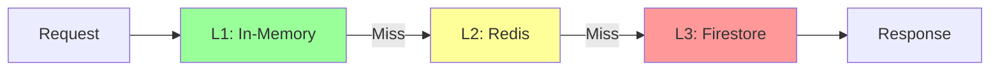

# Performance Architecture

## Overview

This document defines performance patterns for AgentForge, addressing query optimization, caching strategies, bounded resource usage, and WebSocket efficiency.

---

## N+1 Query Prevention

### Problem

Loading a list of projects with their members causes N+1 queries:
```
1 query for projects
+ N queries for members (one per project)
= N+1 total queries
```

### Solution: Batch Loading

```go
// DataLoader pattern for batch loading
type ProjectMemberLoader struct {
    batcher *dataloader.Loader[string, []ProjectMembership]
}

func NewProjectMemberLoader(repo ProjectRepository) *ProjectMemberLoader {
    return &ProjectMemberLoader{
        batcher: dataloader.NewBatchedLoader(
            func(ctx context.Context, projectIDs []string) []*dataloader.Result[[]ProjectMembership] {
                // Single query for all projects
                membersByProject, err := repo.GetMembersByProjects(ctx, projectIDs)
                if err != nil {
                    // Return error for all
                    results := make([]*dataloader.Result[[]ProjectMembership], len(projectIDs))
                    for i := range results {
                        results[i] = &dataloader.Result[[]ProjectMembership]{Error: err}
                    }
                    return results
                }

                // Map results to order of input IDs
                results := make([]*dataloader.Result[[]ProjectMembership], len(projectIDs))
                for i, id := range projectIDs {
                    results[i] = &dataloader.Result[[]ProjectMembership]{
                        Data: membersByProject[id],
                    }
                }
                return results
            },
            dataloader.WithWait(2*time.Millisecond),
            dataloader.WithBatchCapacity(100),
        ),
    }
}
```

### Repository Pattern

```go
// Batch-aware repository methods
type ProjectRepository interface {
    // Single item
    GetProject(ctx context.Context, id string) (*Project, error)

    // Batch loading
    GetProjects(ctx context.Context, ids []string) (map[string]*Project, error)
    GetMembersByProjects(ctx context.Context, projectIDs []string) (map[string][]ProjectMembership, error)
}
```

### Firestore Implementation

```go
func (r *firestoreProjectRepo) GetMembersByProjects(ctx context.Context, projectIDs []string) (map[string][]ProjectMembership, error) {
    // Firestore allows up to 30 values in 'in' clause
    // For larger batches, use multiple queries in parallel
    result := make(map[string][]ProjectMembership)

    for _, batch := range chunkSlice(projectIDs, 30) {
        query := r.client.CollectionGroup("memberships").
            Where("projectId", "in", batch)

        docs, err := query.Documents(ctx).GetAll()
        if err != nil {
            return nil, err
        }

        for _, doc := range docs {
            var m ProjectMembership
            doc.DataTo(&m)
            result[m.ProjectID] = append(result[m.ProjectID], m)
        }
    }

    return result, nil
}
```

---

## Conversation History Management

### Problem

Unbounded conversation history:
- Exceeds LLM context window
- Increases token costs
- Slows processing

### Solution: Bounded History with Summarization

```go
type ConversationMemory struct {
    maxTurns        int      // Max recent turns to keep verbatim
    maxTokens       int      // Token budget for history
    summarizer      Summarizer
}

func (cm *ConversationMemory) PrepareContext(turns []ConversationTurn) ([]Message, error) {
    totalTokens := 0
    messages := []Message{}

    // Always include approved artifacts (never summarized)
    for _, artifact := range cm.getApprovedArtifacts(turns) {
        msg := formatArtifact(artifact)
        messages = append(messages, msg)
        totalTokens += estimateTokens(msg.Content)
    }

    // Add recent turns verbatim (most recent first)
    recentTurns := min(len(turns), cm.maxTurns)
    for i := len(turns) - 1; i >= len(turns)-recentTurns && i >= 0; i-- {
        msg := formatTurn(turns[i])
        if totalTokens+estimateTokens(msg.Content) > cm.maxTokens {
            break
        }
        messages = append([]Message{msg}, messages...)
        totalTokens += estimateTokens(msg.Content)
    }

    // Summarize older turns if space remains
    if len(turns) > recentTurns {
        olderTurns := turns[:len(turns)-recentTurns]
        summary, err := cm.summarizer.Summarize(olderTurns)
        if err != nil {
            return nil, err
        }

        summaryMsg := Message{
            Role:    RoleSystem,
            Content: fmt.Sprintf("<conversation_summary>\n%s\n</conversation_summary>", summary),
        }
        messages = append([]Message{summaryMsg}, messages...)
    }

    return messages, nil
}
```

### Summarization Strategy

| History Age | Treatment |
|-------------|-----------|
| Last 10 turns | Keep verbatim |
| 10-50 turns | Summarize into key points |
| 50+ turns | Deep summarization, key decisions only |
| Approved artifacts | Never summarize |

---

## Caching Strategy

### Cache Layers



### Cache Configuration

| Data Type | L1 TTL | L2 TTL | Invalidation |
|-----------|--------|--------|--------------|
| SME Knowledge | 5 min | 30 min | On update event |
| User sessions | 1 min | 15 min | On logout/change |
| Project metadata | 2 min | 10 min | On project update |
| Org settings | 5 min | 60 min | On settings change |

### Cache Implementation

```go
type MultiLevelCache struct {
    l1 *ristretto.Cache  // In-memory
    l2 *redis.Client      // Distributed
}

func (c *MultiLevelCache) Get(ctx context.Context, key string) ([]byte, error) {
    // Try L1
    if val, found := c.l1.Get(key); found {
        return val.([]byte), nil
    }

    // Try L2
    val, err := c.l2.Get(ctx, key).Bytes()
    if err == nil {
        // Populate L1
        c.l1.Set(key, val, 1)
        return val, nil
    }

    if errors.Is(err, redis.Nil) {
        return nil, ErrCacheMiss
    }
    return nil, err
}

func (c *MultiLevelCache) Set(ctx context.Context, key string, val []byte, l1TTL, l2TTL time.Duration) error {
    // Set in both layers
    c.l1.SetWithTTL(key, val, 1, l1TTL)
    return c.l2.Set(ctx, key, val, l2TTL).Err()
}

func (c *MultiLevelCache) Invalidate(ctx context.Context, key string) error {
    c.l1.Del(key)
    return c.l2.Del(ctx, key).Err()
}
```

---

## WebSocket Efficiency

### Problem

Broadcasting all updates to all connections wastes bandwidth and CPU.

### Solution: Targeted Broadcasting

```go
type WebSocketHub struct {
    // Connections indexed by project
    projectConns map[string]map[*Connection]bool

    // Connections indexed by user (for personal notifications)
    userConns map[string]map[*Connection]bool

    mu sync.RWMutex
}

func (h *WebSocketHub) BroadcastToProject(projectID string, msg WebSocketMessage) {
    h.mu.RLock()
    conns := h.projectConns[projectID]
    h.mu.RUnlock()

    // Encode once, send to many
    data, _ := json.Marshal(msg)

    for conn := range conns {
        select {
        case conn.send <- data:
        default:
            // Connection buffer full, drop message
            h.metrics.DroppedMessages.Inc()
        }
    }
}
```

### Message Filtering

```go
func (h *WebSocketHub) ShouldSendToConnection(conn *Connection, event Event) bool {
    // Check connection's subscription filters
    if !conn.IsSubscribedTo(event.Type()) {
        return false
    }

    // Check project membership
    if !conn.HasAccessTo(event.ProjectID()) {
        return false
    }

    // Rate limit per connection
    if conn.IsRateLimited() {
        return false
    }

    return true
}
```

### Connection Limits

| Limit | Value | Rationale |
|-------|-------|-----------|
| Max connections per user | 10 | Reasonable browser tabs |
| Max connections per project | 100 | Team size limit |
| Message buffer per connection | 256 | Prevent memory bloat |
| Message rate limit | 100/sec | Prevent flooding |

---

## Query Optimization

### Query Projections (Field Masks)

Inbox queries and list views often over-fetch entire documents when only a few fields are needed. Use Firestore field masks to retrieve only required fields.

#### Problem

```go
// BAD: Fetches entire escalation document including full artifact content
docs, _ := client.Collection("escalations").
    Where("userId", "==", userID).
    Documents(ctx).GetAll()
```

#### Solution: Select Only Required Fields

```go
// GOOD: Only fetch fields needed for inbox display
type EscalationListItem struct {
    ID          string    `firestore:"id"`
    Type        string    `firestore:"type"`
    Summary     string    `firestore:"summary"`
    CreatedAt   time.Time `firestore:"createdAt"`
    ProjectName string    `firestore:"projectName"`
    Priority    string    `firestore:"priority"`
}

func (r *EscalationRepo) GetInboxItems(ctx context.Context, userID string, limit int) ([]EscalationListItem, error) {
    // Use Select to specify only needed fields
    docs, err := r.client.Collection("escalations").
        Where("userId", "==", userID).
        Where("status", "==", "pending").
        OrderBy("createdAt", firestore.Desc).
        Limit(limit).
        Select("id", "type", "summary", "createdAt", "projectName", "priority").
        Documents(ctx).GetAll()

    if err != nil {
        return nil, err
    }

    items := make([]EscalationListItem, len(docs))
    for i, doc := range docs {
        doc.DataTo(&items[i])
    }
    return items, nil
}
```

#### Projection Patterns by Use Case

| Use Case | Fields Retrieved | Excluded |
|----------|------------------|----------|
| Inbox list | id, type, summary, createdAt, priority | fullContent, artifacts, history |
| Project list | id, name, description, status, updatedAt | workflows, members, settings |
| Artifact approval | id, type, content, metadata | history, relatedArtifacts |
| User mentions | id, excerpt, projectId, timestamp | fullMessage, attachments |

#### GraphQL Integration

When using GraphQL, map field selections to Firestore projections:

```go
func (r *Resolver) InboxItems(ctx context.Context) ([]*InboxItem, error) {
    // Get requested fields from GraphQL context
    requestedFields := graphql.CollectFieldsCtx(ctx, nil)

    // Build Firestore Select based on requested fields
    var selectFields []string
    for _, field := range requestedFields {
        if fsField, ok := graphqlToFirestoreField[field.Name]; ok {
            selectFields = append(selectFields, fsField)
        }
    }

    query := r.client.Collection("escalations").
        Where("userId", "==", getCurrentUserID(ctx))

    if len(selectFields) > 0 {
        query = query.Select(selectFields...)
    }

    // Execute query...
}
```

#### Bandwidth Savings

| Query Type | Without Projection | With Projection | Savings |
|------------|-------------------|-----------------|---------|
| Inbox (50 items) | ~2.5 MB | ~50 KB | 98% |
| Project list (20 items) | ~500 KB | ~20 KB | 96% |
| User activity | ~1 MB | ~100 KB | 90% |

### Firestore Indexes

```yaml
# firestore.indexes.json
{
  "indexes": [
    {
      "collectionGroup": "projects",
      "queryScope": "COLLECTION",
      "fields": [
        {"fieldPath": "orgId", "order": "ASCENDING"},
        {"fieldPath": "updatedAt", "order": "DESCENDING"}
      ]
    },
    {
      "collectionGroup": "workflows",
      "queryScope": "COLLECTION",
      "fields": [
        {"fieldPath": "projectId", "order": "ASCENDING"},
        {"fieldPath": "status", "order": "ASCENDING"}
      ]
    },
    {
      "collectionGroup": "events",
      "queryScope": "COLLECTION",
      "fields": [
        {"fieldPath": "workflowId", "order": "ASCENDING"},
        {"fieldPath": "timestamp", "order": "ASCENDING"}
      ]
    }
  ]
}
```

### Pagination

```go
func (r *firestoreProjectRepo) ListProjects(ctx context.Context, orgID string, opts ListOptions) (*ProjectPage, error) {
    query := r.client.Collection("projects").
        Where("orgId", "==", orgID).
        OrderBy("updatedAt", firestore.Desc).
        Limit(opts.PageSize + 1) // Fetch one extra to detect hasMore

    if opts.Cursor != "" {
        cursor, _ := base64.StdEncoding.DecodeString(opts.Cursor)
        query = query.StartAfter(cursor)
    }

    docs, err := query.Documents(ctx).GetAll()
    if err != nil {
        return nil, err
    }

    hasMore := len(docs) > opts.PageSize
    if hasMore {
        docs = docs[:opts.PageSize]
    }

    projects := make([]*Project, len(docs))
    var nextCursor string
    for i, doc := range docs {
        doc.DataTo(&projects[i])
        if i == len(docs)-1 && hasMore {
            nextCursor = base64.StdEncoding.EncodeToString([]byte(doc.Ref.ID))
        }
    }

    return &ProjectPage{
        Projects:   projects,
        NextCursor: nextCursor,
        HasMore:    hasMore,
    }, nil
}
```

---

## Performance Targets

| Metric | Target | Measurement |
|--------|--------|-------------|
| API P50 latency | <100ms | Excluding LLM calls |
| API P95 latency | <500ms | Excluding LLM calls |
| WebSocket message latency | <50ms | Event to client |
| Cache hit rate | >80% | L1 + L2 combined |
| Query efficiency | <5 Firestore reads/request | Average |

---

## Related Documents

- [Architecture Overview](./overview.md)
- [Edge Cases: Concurrency](../edge-cases/concurrency.md)
