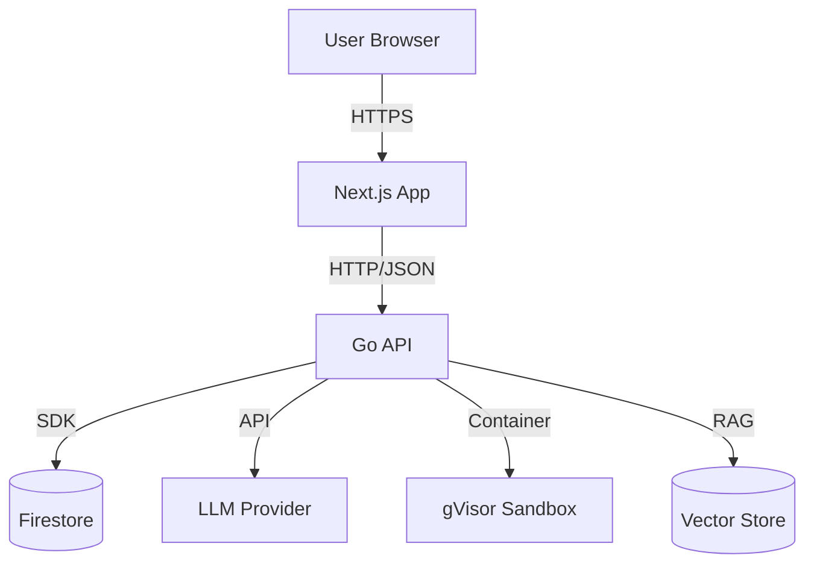

# AgentForge - Executive Summary

## Project Overview

AI-powered software development platform where specialized agents guide users through requirements, architecture, code generation, and security review. Agents collaborate with human approval gates at each phase.

**Core Purpose:** Enable both technical and non-technical users to build software through AI agent collaboration, with organizational knowledge (SME expertise) embedded into every project.

---

## Technology Stack

| Layer | Technology | Rationale |
|-------|------------|-----------|
| Backend | Go REST API | Type safety, performance, clear service boundaries |
| Database | Firestore (NoSQL) | Flexible schema, real-time updates, event sourcing support |
| AI/LLM | Claude/GPT | Tool-using agents with structured output |
| Frontend | React/Next.js | Interactive checklists, real-time updates |
| Infrastructure | GCP Cloud Run | Serverless, auto-scaling |
| Containers | gVisor (runsc) | Secure sandboxing for code execution |

---

## Key Architecture Decisions

### Four-Phase Pipeline
Fixed sequence: Requirements → Architecture → Code → Security Review. No skipping, no reordering. Automatic transitions on approval.

### Read-Only Agents
Agents gather information via tools but cannot write or modify anything. All changes flow through user approval.

### SME Knowledge Store
Organization experts encode standards, patterns, and constraints that agents follow. LLM-judge validates compliance.

### Container Sandboxing
Coding Agent can execute code in isolated containers with no network access, ephemeral storage, and resource limits.

### Private-by-Default Projects
Projects require explicit membership. Four project roles: Owner, Editor, Approver, Viewer.

---

## Core Components

| Component | Purpose |
|-----------|---------|
| Agent Framework | Execution model, tool access, prompt construction, self-critique |
| Workflow Engine | Phase transitions, escalations, change requests, multi-user locking |
| SME Knowledge Store | Guidelines, templates, examples, constraints per agent type |
| Security Layer | Permissions, sandboxing, security review agent |
| User Experience | Inbox-centric approval, visual artifacts, progressive disclosure |

---

## Agent Types

| Agent | Phase | Focus |
|-------|-------|-------|
| Requirements Agent | 1 | Gather and structure user requirements |
| Architecture Agent | 2 | Design system structure, data models, APIs |
| Coding Agent | 3 | Generate code following architecture |
| Security Agent | 4 | Review code for vulnerabilities, propose fixes |

---

## Service Architecture

---

## Design Validation

Architecture validated through systematic refinement with 16 Architecture Decision Records covering:
- Agent execution and tool access
- Workflow structure and transitions
- Permission model and project access
- Sandboxing and resource limits
- Security review workflow
- SME knowledge injection

---

## Related Documents

- [Architecture Overview](./architecture/overview.md) - System components and data flows
- [Architecture Decision Records](./decisions/index.md) - All 16 ADRs with rationale
- [Edge Cases](./edge-cases/index.md) - Failure modes and mitigations
- [Security](./security/overview.md) - Permissions, sandboxing, and review
- [Trade-offs](./trade-offs.md) - Design rationale and alternatives considered
