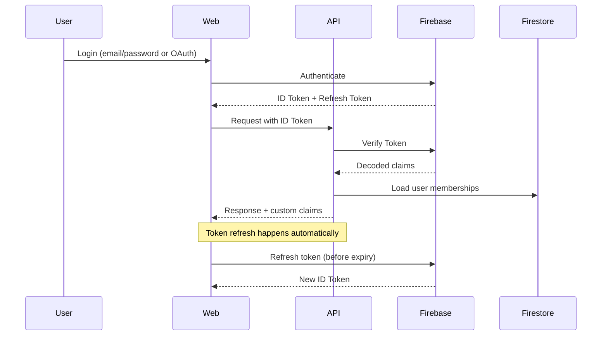
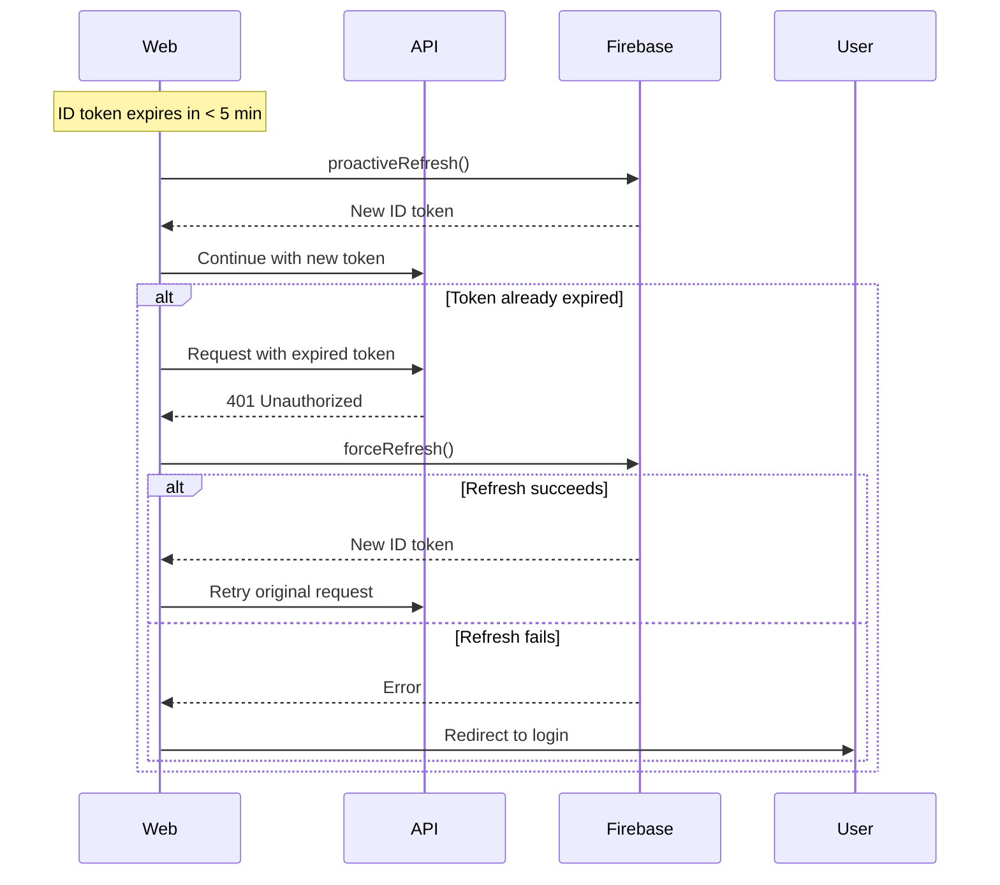

# Authentication Architecture

## Overview

AgentForge uses JWT-based authentication with refresh tokens for session management. Authentication is provided via Google Cloud Identity Platform (Firebase Auth) with custom claims for organization and role information.

---

## Authentication Flow



---

## Token Strategy

### ID Tokens (Short-lived)

| Property | Value |
|----------|-------|
| Lifetime | 1 hour |
| Storage | Memory only (not localStorage) |
| Contains | User ID, email, custom claims |
| Refresh | Automatic before expiry |

### Refresh Tokens (Long-lived)

| Property | Value |
|----------|-------|
| Lifetime | 30 days (configurable) |
| Storage | HttpOnly secure cookie |
| Rotation | New refresh token on each use |
| Revocation | On logout, password change, or admin action |

### Custom Claims

Custom claims are set on user tokens to avoid database lookups on every request:

```json
{
  "orgId": "org_abc123",
  "orgRole": "admin",
  "projectRoles": {
    "proj_1": "owner",
    "proj_2": "editor"
  }
}
```

Claims are refreshed when:
- User's org membership changes
- User's project membership changes
- User explicitly logs out and back in

---

## Multi-Factor Authentication (MFA)

### Supported Methods

| Method | Priority | Use Case |
|--------|----------|----------|
| TOTP (Authenticator App) | Primary | Default for all users |
| SMS | Fallback | Recovery option only |
| Recovery Codes | Emergency | One-time use, 10 codes generated |

### MFA Enrollment

1. User enables MFA in settings
2. Generate TOTP secret, display QR code
3. User scans with authenticator app
4. User enters code to verify
5. Generate 10 recovery codes, user saves them
6. MFA enabled on account

### MFA Enforcement

| Role | MFA Requirement |
|------|-----------------|
| Org Admin | Required |
| SME Curator | Required |
| Project Lead | Configurable (org setting) |
| Member | Configurable (org setting) |

---

## Session Management

### Session Properties

```go
type Session struct {
    ID           string    `firestore:"id"`
    UserID       string    `firestore:"userId"`
    DeviceInfo   string    `firestore:"deviceInfo"`
    IPAddress    string    `firestore:"ipAddress"`
    CreatedAt    time.Time `firestore:"createdAt"`
    LastActiveAt time.Time `firestore:"lastActiveAt"`
    ExpiresAt    time.Time `firestore:"expiresAt"`
    Revoked      bool      `firestore:"revoked"`
    RevokedAt    *time.Time `firestore:"revokedAt"`
    RevokedBy    *string   `firestore:"revokedBy"`
}
```

### Session Limits

| Setting | Default | Configurable |
|---------|---------|--------------|
| Max concurrent sessions | 5 | Yes (org level) |
| Session timeout (idle) | 24 hours | Yes (org level) |
| Absolute session limit | 30 days | No |

### Session Lifecycle

1. **Creation**: On successful login, new session created
2. **Activity**: `LastActiveAt` updated on API activity (throttled to 5 min)
3. **Expiry**: Sessions expire after idle timeout or absolute limit
4. **Revocation**: Explicit logout, password change, or admin action
5. **Cleanup**: Background job removes expired sessions daily

### Automatic Session Invalidation

Sessions are automatically invalidated on security-sensitive events:

| Event | Action | Scope |
|-------|--------|-------|
| Password change | Invalidate all sessions | All user sessions |
| MFA enabled/disabled | Invalidate all sessions | All user sessions |
| MFA method changed | Invalidate all sessions | All user sessions |
| Role/permission change | Invalidate affected sessions | Sessions using changed permissions |
| Account disabled | Invalidate all sessions | All user sessions |
| Suspicious activity detected | Invalidate suspicious session | Flagged session only |
| Security alert triggered | Invalidate all sessions | All user sessions (configurable) |

```go
type SessionInvalidator struct {
    sessionStore  SessionStore
    eventBus      EventBus
    securityLog   SecurityLogger
}

// InvalidateOnSecurityEvent handles security-sensitive events
func (si *SessionInvalidator) InvalidateOnSecurityEvent(ctx context.Context, event SecurityEvent) error {
    switch event.Type {
    case EventMFAChanged, EventPasswordChanged, EventAccountDisabled:
        // Invalidate ALL sessions for the user
        return si.invalidateAllUserSessions(ctx, event.UserID, event.Type)

    case EventRoleChanged:
        // Invalidate sessions that rely on the changed role
        return si.invalidateSessionsWithRole(ctx, event.UserID, event.OldRole)

    case EventSuspiciousActivity:
        // Invalidate only the flagged session
        return si.invalidateSingleSession(ctx, event.SessionID, event.Type)

    case EventSecurityAlert:
        // Configurable: invalidate all or just affected
        if si.config.InvalidateAllOnAlert {
            return si.invalidateAllUserSessions(ctx, event.UserID, event.Type)
        }
        return si.invalidateSingleSession(ctx, event.SessionID, event.Type)
    }
    return nil
}

func (si *SessionInvalidator) invalidateAllUserSessions(ctx context.Context, userID string, reason string) error {
    sessions, err := si.sessionStore.GetActiveSessionsForUser(ctx, userID)
    if err != nil {
        return err
    }

    for _, session := range sessions {
        session.Revoked = true
        session.RevokedAt = ptr(time.Now())
        session.RevokedBy = ptr("system:" + reason)

        if err := si.sessionStore.Update(ctx, session); err != nil {
            si.securityLog.Error("Failed to revoke session", "sessionID", session.ID, "error", err)
            continue
        }
    }

    si.securityLog.Info("All sessions invalidated",
        "userID", userID,
        "reason", reason,
        "sessionCount", len(sessions),
    )

    // Notify user of session invalidation
    return si.eventBus.Publish(ctx, &SessionsInvalidatedEvent{
        UserID:  userID,
        Reason:  reason,
        Count:   len(sessions),
    })
}
```

### Suspicious Activity Detection

| Pattern | Threshold | Action |
|---------|-----------|--------|
| Geolocation change | >500km in <1hr | Flag + prompt re-auth |
| New device + sensitive action | First login + role change | Require MFA |
| Concurrent sessions spike | >3 new sessions in 5 min | Alert + flag |
| Failed auth after success | 3 failures after valid session | Invalidate session |
| IP on threat list | Any match | Block + invalidate |

```go
func (sd *SuspiciousActivityDetector) CheckRequest(ctx context.Context, req *http.Request, session *Session) *SecurityAlert {
    checks := []SecurityCheck{
        sd.checkGeolocationAnomaly,
        sd.checkDeviceChange,
        sd.checkConcurrentSessions,
        sd.checkIPReputation,
        sd.checkTimeOfDayAnomaly,
    }

    for _, check := range checks {
        if alert := check(ctx, req, session); alert != nil {
            return alert
        }
    }
    return nil
}
```

---

## Token Refresh Flow



---

## Security Measures

### Token Security

- Tokens transmitted only over HTTPS
- ID tokens stored in memory, not localStorage (XSS protection)
- Refresh tokens in HttpOnly cookies (XSS protection)
- SameSite=Strict on cookies (partial CSRF protection)
- Token binding to device fingerprint (optional, org setting)

### CSRF Protection (Defense-in-Depth)

SameSite=Strict alone is insufficient for CSRF protection. We implement **double-submit cookie pattern** as an additional layer:

```go
// CSRF token generation - stored in both cookie and response header
func CSRFMiddleware(next http.Handler) http.Handler {
    return http.HandlerFunc(func(w http.ResponseWriter, r *http.Request) {
        // Generate token on GET requests
        if r.Method == http.MethodGet {
            token := generateCSRFToken()
            http.SetCookie(w, &http.Cookie{
                Name:     "csrf_token",
                Value:    token,
                HttpOnly: false, // Must be readable by JS
                Secure:   true,
                SameSite: http.SameSiteStrictMode,
                Path:     "/",
            })
            w.Header().Set("X-CSRF-Token", token)
        }

        // Validate on state-changing requests
        if r.Method == http.MethodPost || r.Method == http.MethodPut ||
           r.Method == http.MethodDelete || r.Method == http.MethodPatch {
            cookieToken, err := r.Cookie("csrf_token")
            if err != nil {
                http.Error(w, "CSRF token missing", http.StatusForbidden)
                return
            }

            headerToken := r.Header.Get("X-CSRF-Token")
            if !constantTimeCompare(cookieToken.Value, headerToken) {
                http.Error(w, "CSRF token mismatch", http.StatusForbidden)
                return
            }
        }

        next.ServeHTTP(w, r)
    })
}
```

**CSRF Protection Layers:**

| Layer | Mechanism | Protects Against |
|-------|-----------|------------------|
| SameSite=Strict | Cookie attribute | Basic CSRF from cross-origin |
| Double-submit cookie | Token comparison | Subdomain attacks, cookie injection |
| Origin validation | Check Origin/Referer headers | Request forgery |

**Frontend Integration:**

```typescript
// API client includes CSRF token in all state-changing requests
async function apiRequest(method: string, url: string, data?: any) {
  const csrfToken = getCookie('csrf_token');
  return fetch(url, {
    method,
    headers: {
      'Content-Type': 'application/json',
      'X-CSRF-Token': csrfToken,
    },
    credentials: 'include',
    body: data ? JSON.stringify(data) : undefined,
  });
}
```

### Brute Force Protection

| Protection | Implementation |
|------------|----------------|
| Login rate limiting | 5 attempts per 15 minutes per IP |
| Account lockout | 10 failed attempts = 30 min lockout |
| Progressive delays | 1s, 2s, 4s, 8s between attempts |
| CAPTCHA | After 3 failed attempts |

### Session Anomaly Detection

Monitor for suspicious patterns:
- Multiple concurrent sessions from different geolocations
- Session activity from blocked countries
- Unusual access patterns (time of day, request volume)

Action on anomaly: Alert user, optionally require re-authentication.

---

## API Authentication

All API requests require a valid ID token in the Authorization header:

```
Authorization: Bearer <id_token>
```

### Middleware Flow

```go
func AuthMiddleware(next http.Handler) http.Handler {
    return http.HandlerFunc(func(w http.ResponseWriter, r *http.Request) {
        // 1. Extract token from header
        token := extractBearerToken(r)
        if token == "" {
            http.Error(w, "Unauthorized", http.StatusUnauthorized)
            return
        }

        // 2. Verify with Firebase
        claims, err := firebaseAuth.VerifyIDToken(r.Context(), token)
        if err != nil {
            http.Error(w, "Invalid token", http.StatusUnauthorized)
            return
        }

        // 3. Check session not revoked
        if isSessionRevoked(claims.UID, claims.SessionID) {
            http.Error(w, "Session revoked", http.StatusUnauthorized)
            return
        }

        // 4. Add claims to context
        ctx := context.WithValue(r.Context(), "claims", claims)
        next.ServeHTTP(w, r.WithContext(ctx))
    })
}
```

---

## Related Documents

- [ADR-017: Authentication Architecture](../decisions/ADR-017-authentication-architecture.md)
- [Permissions](./permissions.md)
- [Security Overview](./overview.md)
