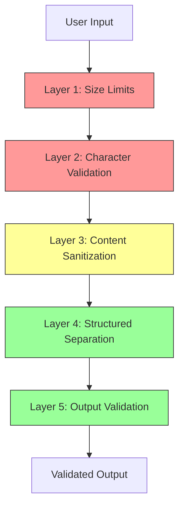

# Input Validation & Prompt Injection Defense

## Overview

AgentForge implements defense-in-depth against prompt injection and malicious input. User input is validated, sanitized, and structured before reaching LLM prompts. Multiple layers prevent untrusted content from affecting agent behavior.

---

## Threat Model

### Prompt Injection Attacks

| Attack Type | Description | Risk |
|-------------|-------------|------|
| Direct injection | User message contains instructions to override agent behavior | High |
| Indirect injection | Malicious content in retrieved documents/artifacts | Medium |
| Jailbreak attempts | Attempts to bypass safety guidelines | High |
| Data exfiltration | Trick agent into revealing sensitive data | High |

### Input Validation Attacks

| Attack Type | Description | Risk |
|-------------|-------------|------|
| Oversized payloads | Extremely long messages to exhaust resources | Medium |
| Unicode abuse | Homoglyph attacks, invisible characters | Low |
| Structured data injection | JSON/YAML in user messages to confuse parsing | Medium |

---

## Defense Layers



---

## Layer 1: Size Limits

### Request Limits

| Field | Max Length | Action on Exceed |
|-------|------------|------------------|
| User message | 32,000 chars | Reject with error |
| Project name | 100 chars | Truncate |
| Project description | 2,000 chars | Truncate |
| Artifact content | 100,000 chars | Reject with error |
| File upload | 10 MB | Reject with error |

### Rate Limiting

| Scope | Limit | Window |
|-------|-------|--------|
| Per user | 60 requests | 1 minute |
| Per project | 120 requests | 1 minute |
| Per org | 1000 requests | 1 minute |
| LLM calls per user | 20 | 1 minute |

Implementation uses token bucket algorithm with Redis:

```go
func RateLimitMiddleware(limiter *redis_rate.Limiter) func(http.Handler) http.Handler {
    return func(next http.Handler) http.Handler {
        return http.HandlerFunc(func(w http.ResponseWriter, r *http.Request) {
            userID := getUserID(r)
            key := fmt.Sprintf("ratelimit:user:%s", userID)

            res, err := limiter.Allow(r.Context(), key, redis_rate.PerMinute(60))
            if err != nil {
                http.Error(w, "Rate limit error", http.StatusInternalServerError)
                return
            }

            if res.Remaining == 0 {
                w.Header().Set("Retry-After", strconv.Itoa(int(res.RetryAfter.Seconds())))
                http.Error(w, "Rate limit exceeded", http.StatusTooManyRequests)
                return
            }

            next.ServeHTTP(w, r)
        })
    }
}
```

---

## Layer 2: Character Validation

### Allowed Character Sets

```go
var (
    // Basic text: letters, numbers, punctuation, common symbols
    allowedBasicText = regexp.MustCompile(`^[\p{L}\p{N}\p{P}\p{S}\p{Z}\n\r\t]*$`)

    // Code content: extended to include more programming characters
    allowedCodeContent = regexp.MustCompile(`^[\x20-\x7E\n\r\t]*$`)

    // Identifiers: alphanumeric + underscore/hyphen
    allowedIdentifier = regexp.MustCompile(`^[a-zA-Z][a-zA-Z0-9_-]*$`)
)

func ValidateUserMessage(msg string) error {
    // Remove invisible/control characters except whitespace
    cleaned := removeInvisibleChars(msg)

    if cleaned != msg {
        return errors.New("message contains invalid characters")
    }

    return nil
}
```

### Blocked Patterns

| Pattern | Reason |
|---------|--------|
| Zero-width characters | Invisible text hiding |
| Right-to-left override | Text direction attacks |
| Homoglyphs in identifiers | Confusion attacks |
| Control characters (except \n\r\t) | Potential exploits |

---

## Layer 3: Content Sanitization

### Message Preprocessing

```go
func SanitizeUserMessage(msg string) string {
    // 1. Normalize unicode (NFC)
    msg = norm.NFC.String(msg)

    // 2. Remove dangerous patterns
    msg = removeDangerousPatterns(msg)

    // 3. Escape structural characters if they look like injection
    msg = escapeStructuralPatterns(msg)

    return msg
}

func removeDangerousPatterns(msg string) string {
    patterns := []string{
        `<\|.*?\|>`,           // Common injection delimiters
        `\[INST\].*?\[/INST\]`, // Instruction markers
        `###\s*System:`,       // System prompt markers
        `Human:|Assistant:`,   // Role markers
    }

    for _, p := range patterns {
        re := regexp.MustCompile(p)
        msg = re.ReplaceAllString(msg, "[filtered]")
    }

    return msg
}
```

### Content Warnings

When suspicious patterns are detected but not blocked:

```go
type ContentAnalysis struct {
    IsSuspicious bool
    Warnings     []string
    Confidence   float64
}

func AnalyzeContent(msg string) ContentAnalysis {
    analysis := ContentAnalysis{}

    // Check for instruction-like patterns
    if containsInstructionPatterns(msg) {
        analysis.Warnings = append(analysis.Warnings, "contains instruction-like patterns")
        analysis.IsSuspicious = true
    }

    // Check for role confusion attempts
    if containsRolePatterns(msg) {
        analysis.Warnings = append(analysis.Warnings, "contains role-like patterns")
        analysis.IsSuspicious = true
    }

    return analysis
}
```

---

## Layer 4: Structured Separation

### Prompt Architecture

User content is structurally separated from system instructions:

```xml
<system>
[System prompt - never from user input]
</system>

<sme_knowledge>
[Retrieved guidelines - from curated SME store]
</sme_knowledge>

<user_context>
[Sanitized user message - clearly delineated]
</user_context>

<instructions>
[Agent-specific task instructions - never from user input]
</instructions>
```

### Key Principles

1. **User content in designated block only**: Never mixed with instructions
2. **Clear delimiters**: XML-style tags that users cannot close
3. **Validation on assembly**: Prompt builder verifies structure
4. **No dynamic instruction injection**: System prompts are static

### Prompt Builder

```go
func BuildAgentPrompt(task AgentTask, userMessage string, smeKnowledge []string) string {
    // User message is sanitized and placed in designated block
    sanitized := SanitizeUserMessage(userMessage)

    // Knowledge is from trusted SME store only
    knowledge := formatKnowledge(smeKnowledge)

    return fmt.Sprintf(`<system>
%s
</system>

<sme_knowledge>
%s
</sme_knowledge>

<user_context>
%s
</user_context>

<task>
%s
</task>`,
        task.SystemPrompt,
        knowledge,
        sanitized,
        task.Instructions,
    )
}
```

---

## Layer 5: Output Validation

### Agent Output Checks

Before presenting agent output to users:

```go
func ValidateAgentOutput(output AgentOutput) error {
    // 1. Check for sensitive data leakage
    if containsSensitivePatterns(output.Content) {
        return errors.New("output contains potentially sensitive data")
    }

    // 2. Validate structured output matches schema
    if output.Artifacts != nil {
        if err := validateArtifactSchema(output.Artifacts); err != nil {
            return fmt.Errorf("invalid artifact schema: %w", err)
        }
    }

    // 3. Check for excessive tool usage
    if len(output.ToolCalls) > 10 {
        return errors.New("excessive tool calls in single response")
    }

    return nil
}
```

### Sensitive Data Patterns

| Pattern | Example | Action |
|---------|---------|--------|
| API keys | `sk-ant-*`, `AKIA*` | Redact |
| Passwords | `password=`, `secret=` | Redact |
| Internal URLs | `*.internal`, `localhost` | Redact |
| PII (if enabled) | Email, phone | Warn |

---

## Layer 6: Data Layer Sanitization

Second-order injection occurs when malicious content stored in the database is later used unsafely. Even after input validation at the API layer, content must be sanitized before database writes.

### Firestore Write Sanitization

```go
type SafeFirestoreWriter struct {
    client *firestore.Client
}

func (w *SafeFirestoreWriter) Set(ctx context.Context, ref *firestore.DocumentRef, data interface{}) error {
    sanitized, err := sanitizeForStorage(data)
    if err != nil {
        return fmt.Errorf("sanitization failed: %w", err)
    }
    _, err = ref.Set(ctx, sanitized)
    return err
}

func sanitizeForStorage(data interface{}) (interface{}, error) {
    // Deep traverse and sanitize all string fields
    return deepSanitize(reflect.ValueOf(data))
}

func deepSanitize(v reflect.Value) (interface{}, error) {
    switch v.Kind() {
    case reflect.String:
        return sanitizeString(v.String()), nil
    case reflect.Map:
        result := make(map[string]interface{})
        for _, key := range v.MapKeys() {
            sanitizedValue, err := deepSanitize(v.MapIndex(key))
            if err != nil {
                return nil, err
            }
            result[key.String()] = sanitizedValue
        }
        return result, nil
    case reflect.Struct:
        // Handle struct fields recursively
        return sanitizeStruct(v)
    case reflect.Slice, reflect.Array:
        result := make([]interface{}, v.Len())
        for i := 0; i < v.Len(); i++ {
            sanitized, err := deepSanitize(v.Index(i))
            if err != nil {
                return nil, err
            }
            result[i] = sanitized
        }
        return result, nil
    default:
        return v.Interface(), nil
    }
}

func sanitizeString(s string) string {
    // Remove null bytes (Firestore limitation)
    s = strings.ReplaceAll(s, "\x00", "")

    // Normalize unicode
    s = norm.NFC.String(s)

    // Remove control characters except whitespace
    s = removeControlChars(s)

    // Limit field length (prevent storage abuse)
    if len(s) > maxFieldLength {
        s = s[:maxFieldLength]
    }

    return s
}
```

### Field-Specific Sanitization

| Field Type | Sanitization | Encoding |
|------------|--------------|----------|
| User message | Remove injection patterns | HTML entity encode for display |
| Artifact content | Preserve code formatting | No encoding (code is expected) |
| Project name | Alphanumeric + basic punctuation | Strip HTML/scripts |
| User-provided URLs | Validate URL format | Blocklist internal domains |

### Output Encoding

Content retrieved from Firestore must be properly encoded when rendered:

```go
type DisplayContent struct {
    // Raw is stored value - never render directly in HTML
    Raw string `firestore:"raw"`
}

// Safe returns HTML-safe version for rendering
func (dc *DisplayContent) Safe() template.HTML {
    return template.HTML(html.EscapeString(dc.Raw))
}

// SafeMarkdown renders markdown safely
func (dc *DisplayContent) SafeMarkdown() template.HTML {
    // Use strict markdown renderer that escapes HTML
    md := goldmark.New(
        goldmark.WithRendererOptions(
            html.WithHardWraps(),
        ),
    )
    var buf bytes.Buffer
    md.Convert([]byte(dc.Raw), &buf)
    return template.HTML(buf.String())
}
```

### Validation Before Use

When content from Firestore is used in sensitive contexts:

```go
func (s *Service) UseStoredContent(ctx context.Context, id string) error {
    doc, _ := s.store.Get(ctx, id)

    // Re-validate before use in prompts
    if containsDangerousPatterns(doc.Content) {
        securityLogger.Warn("Dangerous pattern in stored content",
            "id", id,
            "pattern", detectPattern(doc.Content),
        )
        return ErrContentFlagged
    }

    // Use content...
    return nil
}
```

---

## Monitoring & Alerting

### Injection Attempt Detection

```go
type SecurityEvent struct {
    Type      string    `json:"type"`
    UserID    string    `json:"userId"`
    ProjectID string    `json:"projectId"`
    Content   string    `json:"content"` // Truncated
    Timestamp time.Time `json:"timestamp"`
}

func LogSecurityEvent(event SecurityEvent) {
    // Log to security monitoring
    securityLogger.Info("security event",
        "type", event.Type,
        "user", event.UserID,
        "project", event.ProjectID,
    )

    // Increment metrics
    securityEventsCounter.WithLabelValues(event.Type).Inc()

    // Alert if threshold exceeded
    if isThresholdExceeded(event.UserID, event.Type) {
        alertSecurityTeam(event)
    }
}
```

### Alert Thresholds

| Event Type | Threshold | Window | Action |
|------------|-----------|--------|--------|
| Injection attempt | 5 | 1 hour | Warn user |
| Repeated injection | 10 | 1 hour | Temp block |
| Data exfiltration attempt | 1 | - | Block + alert |

---

## Related Documents

- [ADR-019: Rate Limiting Strategy](../decisions/ADR-019-rate-limiting-strategy.md)
- [Security Overview](./overview.md)
- [Threat Model](./threat-model.md)
