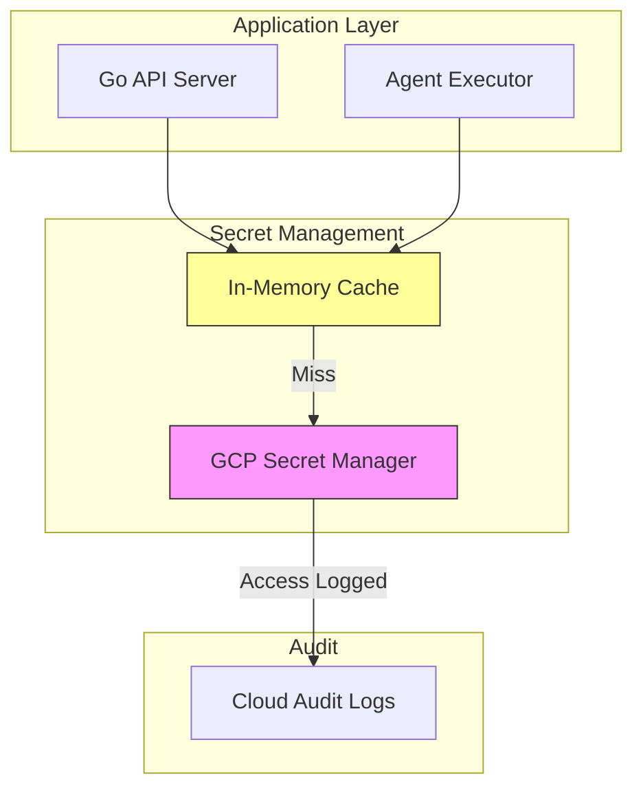

# Secrets Management

## Overview

AgentForge uses Google Cloud Secret Manager for all sensitive configuration. No secrets are stored in code, environment variables, or configuration files. All secret access is audited and rotated on schedule.

---

## Secret Categories

### Application Secrets

| Secret | Purpose | Rotation |
|--------|---------|----------|
| `anthropic-api-key` | LLM provider access | 90 days |
| `firebase-admin-key` | Firebase Admin SDK | 180 days |
| `webhook-signing-key` | Verify external webhooks | 90 days |
| `encryption-key-primary` | Data encryption at rest | 365 days |
| `encryption-key-secondary` | Encryption key rotation | 365 days |

### Per-Organization Secrets

| Secret | Purpose | Rotation |
|--------|---------|----------|
| `org/{orgId}/api-keys` | Customer API keys | On-demand |
| `org/{orgId}/integrations/*` | Third-party integrations | Varies |

---

## Architecture



---

## Access Patterns

### Secret Loading

```go
type SecretManager struct {
    client    *secretmanager.Client
    cache     *ttlcache.Cache[string, string]
    cacheTTL  time.Duration
}

func (sm *SecretManager) GetSecret(ctx context.Context, name string) (string, error) {
    // Check cache first
    if cached, ok := sm.cache.Get(name); ok {
        return cached.Value(), nil
    }

    // Load from Secret Manager
    path := fmt.Sprintf("projects/%s/secrets/%s/versions/latest", projectID, name)
    result, err := sm.client.AccessSecretVersion(ctx, &secretmanagerpb.AccessSecretVersionRequest{
        Name: path,
    })
    if err != nil {
        return "", fmt.Errorf("access secret %s: %w", name, err)
    }

    value := string(result.Payload.Data)

    // Cache with TTL
    sm.cache.Set(name, value, sm.cacheTTL)

    return value, nil
}
```

### Cache Strategy

| Setting | Value | Rationale |
|---------|-------|-----------|
| Cache TTL | 5 minutes | Balance freshness vs API calls |
| Max entries | 100 | Limit memory usage |
| Refresh | Background | No request latency on cache miss |

---

## Key Rotation

### Automatic Rotation

1. Cloud Scheduler triggers rotation function
2. New secret version created
3. Old version disabled (not destroyed)
4. Application automatically picks up new version on cache expiry

### Rotation Notification

```go
// Pub/Sub handler for secret rotation events
func handleSecretRotation(ctx context.Context, m *pubsub.Message) error {
    var event SecretRotationEvent
    if err := json.Unmarshal(m.Data, &event); err != nil {
        return err
    }

    // Clear cache for rotated secret
    secretCache.Delete(event.SecretName)

    // Log rotation
    log.Info("secret rotated",
        "secret", event.SecretName,
        "version", event.NewVersion,
    )

    return nil
}
```

### Manual Rotation

For immediate rotation (e.g., suspected compromise):

1. Admin triggers rotation via CLI/Console
2. New version created and enabled
3. Old version immediately disabled
4. All instances notified to clear cache
5. Incident logged for audit

---

## Encryption Keys

### Key Hierarchy

```
Root Key (HSM-backed, never exported)
    └── Data Encryption Key (DEK)
            └── Per-record encryption
```

### Envelope Encryption

```go
func encryptSensitiveData(ctx context.Context, plaintext []byte) ([]byte, error) {
    // 1. Generate random DEK
    dek := make([]byte, 32)
    if _, err := rand.Read(dek); err != nil {
        return nil, err
    }

    // 2. Encrypt plaintext with DEK
    ciphertext, err := aesGCMEncrypt(dek, plaintext)
    if err != nil {
        return nil, err
    }

    // 3. Wrap DEK with KMS
    wrappedDEK, err := kmsClient.Encrypt(ctx, &kmspb.EncryptRequest{
        Name:      kmsKeyPath,
        Plaintext: dek,
    })
    if err != nil {
        return nil, err
    }

    // 4. Return wrapped DEK + ciphertext
    return encodeEnvelope(wrappedDEK.Ciphertext, ciphertext), nil
}
```

---

## Access Control

### IAM Roles

| Role | Access |
|------|--------|
| `secretmanager.secretAccessor` | Read secret values |
| `secretmanager.admin` | Create/rotate/destroy secrets |
| `secretmanager.viewer` | List secrets, view metadata |

### Service Account Binding

```yaml
# Terraform example
resource "google_secret_manager_secret_iam_member" "api_access" {
  secret_id = google_secret_manager_secret.anthropic_key.id
  role      = "roles/secretmanager.secretAccessor"
  member    = "serviceAccount:${google_service_account.api.email}"
}
```

### Workload Identity

In GKE, pods authenticate to Secret Manager via Workload Identity:

```yaml
# Pod spec
serviceAccountName: agentforge-api
# Kubernetes SA annotated with GCP SA
```

---

## Audit Logging

All secret access is logged to Cloud Audit Logs:

```json
{
  "protoPayload": {
    "methodName": "google.cloud.secretmanager.v1.SecretManagerService.AccessSecretVersion",
    "resourceName": "projects/agentforge/secrets/anthropic-api-key/versions/3",
    "authenticationInfo": {
      "principalEmail": "api@agentforge.iam.gserviceaccount.com"
    }
  },
  "timestamp": "2026-01-15T10:30:00Z"
}
```

### Alerting

| Alert | Trigger | Action |
|-------|---------|--------|
| Unusual access pattern | >100 accesses/min | Page on-call |
| Unknown principal | Access from unlisted SA | Block + alert |
| Failed access | Permission denied | Log + monitor pattern |

---

## Disaster Recovery

### Secret Backup

- Secret versions are retained for 30 days after disabling
- Critical secrets replicated to secondary region
- Encrypted backup to Cloud Storage (quarterly)

### Recovery Procedure

1. If Secret Manager unavailable:
   - Failover to secondary region
   - Application uses cached values (degraded mode)
2. If secret compromised:
   - Immediate rotation
   - Disable all old versions
   - Audit access logs for exposure window

---

## Related Documents

- [ADR-018: Secrets Management](../decisions/ADR-018-secrets-management.md)
- [Security Overview](./overview.md)
