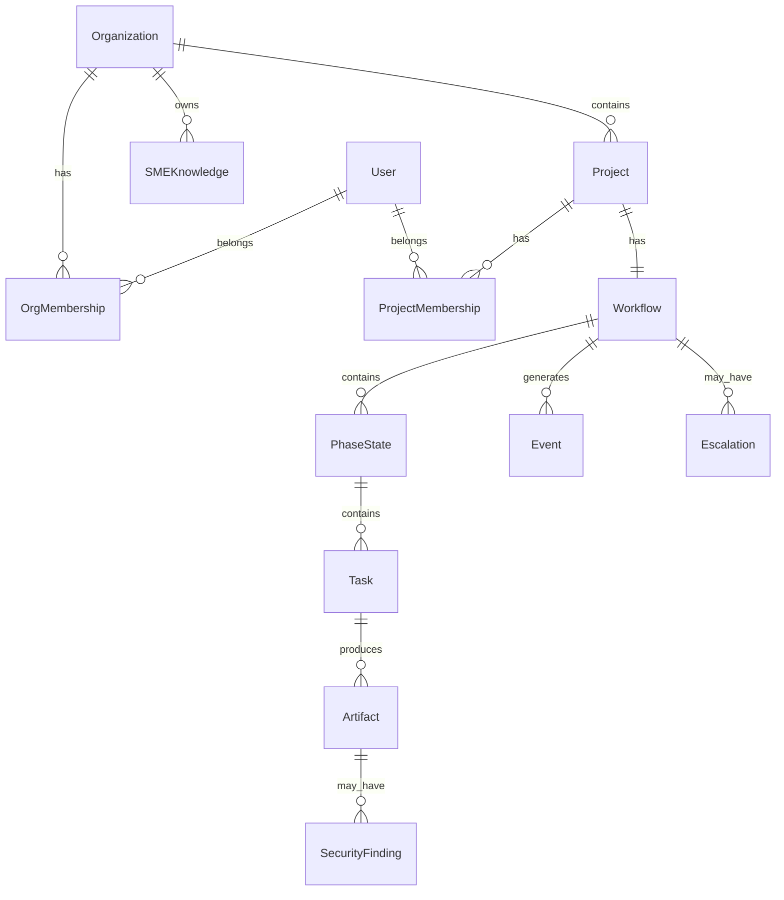

# Data Model

## Domain Entities

### Organization & Users

```go
type Organization struct {
    ID                 string    `firestore:"id"`
    Name               string    `firestore:"name"`
    MandatoryKnowledge []string  `firestore:"mandatoryKnowledge"` // IDs forced on all projects
    CreatedAt          time.Time `firestore:"createdAt"`
    UpdatedAt          time.Time `firestore:"updatedAt"`
}

type OrgMembership struct {
    ID        string    `firestore:"id"`
    OrgID     string    `firestore:"orgId"`
    UserID    string    `firestore:"userId"`
    Role      OrgRole   `firestore:"role"` // admin, sme_curator, project_lead, member
    InvitedBy string    `firestore:"invitedBy"`
    JoinedAt  time.Time `firestore:"joinedAt"`
}

type ProjectMembership struct {
    ID        string      `firestore:"id"`
    ProjectID string      `firestore:"projectId"`
    UserID    string      `firestore:"userId"`
    Role      ProjectRole `firestore:"role"` // owner, editor, approver, viewer
    AddedBy   string      `firestore:"addedBy"`
    AddedAt   time.Time   `firestore:"addedAt"`
}
```

### Workflow

```go
type Workflow struct {
    ID           string         `firestore:"id"`
    ProjectID    string         `firestore:"projectId"`
    Status       WorkflowStatus `firestore:"status"`
    CurrentPhase Phase          `firestore:"currentPhase"`
    Phases       []PhaseState   `firestore:"phases"`
    CreatedAt    time.Time      `firestore:"createdAt"`
    UpdatedAt    time.Time      `firestore:"updatedAt"`
    CompletedAt  *time.Time     `firestore:"completedAt"`
}

type PhaseState struct {
    Phase       Phase       `firestore:"phase"`
    Status      PhaseStatus `firestore:"status"`
    Tasks       []Task      `firestore:"tasks"`
    StartedAt   *time.Time  `firestore:"startedAt"`
    CompletedAt *time.Time  `firestore:"completedAt"`
}

type Task struct {
    ID          string     `firestore:"id"`
    Name        string     `firestore:"name"`
    Status      TaskStatus `firestore:"status"`
    ArtifactIDs []string   `firestore:"artifactIds"`
    LockedBy    *string    `firestore:"lockedBy"`
    LockedAt    *time.Time `firestore:"lockedAt"`
}
```

### Escalations

```go
type Escalation struct {
    ID           string           `firestore:"id"`
    WorkflowID   string           `firestore:"workflowId"`
    ArtifactID   string           `firestore:"artifactId"`
    ConstraintID string           `firestore:"constraintId"`
    Attempts     []Attempt        `firestore:"attempts"`
    Status       EscalationStatus `firestore:"status"`
    Resolution   *Resolution      `firestore:"resolution"`
    CreatedAt    time.Time        `firestore:"createdAt"`
    ResolvedAt   *time.Time       `firestore:"resolvedAt"`
}

type Resolution struct {
    Action    string    `firestore:"action"`
    UserID    string    `firestore:"userId"`
    Reason    string    `firestore:"reason"`
    Timestamp time.Time `firestore:"timestamp"`
}
```

### Events (Event Sourcing)

```go
type Event struct {
    ID         string         `firestore:"id"`
    WorkflowID string         `firestore:"workflowId"`
    Type       EventType      `firestore:"type"`
    ActorType  string         `firestore:"actorType"` // "user" or "agent"
    ActorID    string         `firestore:"actorId"`
    Data       map[string]any `firestore:"data"`
    Timestamp  time.Time      `firestore:"timestamp"`
}
```

### SME Knowledge

```go
// Nested under: /organizations/{orgId}/sme-knowledge/{agentType}/

type Guideline struct {
    ID        string    `firestore:"id"`
    Title     string    `firestore:"title"`
    Category  string    `firestore:"category"` // naming, error-handling, api-design
    Content   string    `firestore:"content"`
    Priority  string    `firestore:"priority"` // must, should, may
    CreatedBy string    `firestore:"createdBy"`
    UpdatedAt time.Time `firestore:"updatedAt"`
}

type Template struct {
    ID          string     `firestore:"id"`
    Name        string     `firestore:"name"`
    Description string     `firestore:"description"`
    Type        string     `firestore:"type"` // api-endpoint, data-model, component
    Content     string     `firestore:"content"`
    Variables   []Variable `firestore:"variables"`
}

type Example struct {
    ID          string  `firestore:"id"`
    Title       string  `firestore:"title"`
    Scenario    string  `firestore:"scenario"`
    GoodExample string  `firestore:"goodExample"`
    BadExample  *string `firestore:"badExample"`
    Explanation string  `firestore:"explanation"`
}

type Constraint struct {
    ID          string            `firestore:"id"`
    Name        string            `firestore:"name"`
    Description string            `firestore:"description"`
    Category    string            `firestore:"category"` // allowlist, blocklist, quality, security
    Rule        string            `firestore:"rule"`     // Natural language for LLM-judge
    Severity    string            `firestore:"severity"` // error, warning
    Examples    []ViolationExample `firestore:"examples"`
}
```

### Sandbox Execution

```go
type OrgSandboxSettings struct {
    OrgID           string    `firestore:"orgId"`
    DisabledTools   []string  `firestore:"disabledTools"`
    MemoryLimitMB   int       `firestore:"memoryLimitMb"`   // default 512
    CPUCores        float64   `firestore:"cpuCores"`        // default 1.0
    TimeoutSeconds  int       `firestore:"timeoutSeconds"`  // default 60
    DiskLimitMB     int       `firestore:"diskLimitMb"`     // default 100
    MaxProcesses    int       `firestore:"maxProcesses"`    // default 50
    EnabledRuntimes []string  `firestore:"enabledRuntimes"` // node, python, go
    UpdatedAt       time.Time `firestore:"updatedAt"`
    UpdatedBy       string    `firestore:"updatedBy"`
}

type SandboxExecution struct {
    ID             string    `firestore:"id"`
    ProjectID      string    `firestore:"projectId"`
    AgentTaskID    string    `firestore:"agentTaskId"`
    Runtime        string    `firestore:"runtime"`
    Command        string    `firestore:"command"`
    MemoryUsedMB   int       `firestore:"memoryUsedMb"`
    CPUTimeSeconds float64   `firestore:"cpuTimeSeconds"`
    WallTimeSeconds float64  `firestore:"wallTimeSeconds"`
    ExitCode       int       `firestore:"exitCode"`
    Status         string    `firestore:"status"` // completed, timeout, memory_exceeded, killed
    WarningIssued  bool      `firestore:"warningIssued"`
    StartedAt      time.Time `firestore:"startedAt"`
    EndedAt        time.Time `firestore:"endedAt"`
}
```

### Security Review

```go
type SecurityFinding struct {
    ID               string     `firestore:"id"`
    ProjectID        string     `firestore:"projectId"`
    ArtifactID       string     `firestore:"artifactId"`
    Category         string     `firestore:"category"`  // injection, auth, exposure, etc.
    Severity         string     `firestore:"severity"`  // critical, high, medium, low
    Location         string     `firestore:"location"`  // file:line
    Description      string     `firestore:"description"`
    ProposedPatch    string     `firestore:"proposedPatch"`
    Status           string     `firestore:"status"` // pending, accepted, user_alternative
    ResolvedBy       string     `firestore:"resolvedBy"`
    ResolvedAt       *time.Time `firestore:"resolvedAt"`
    AlternativePatch *string    `firestore:"alternativePatch"`
    CreatedAt        time.Time  `firestore:"createdAt"`
}

type SecurityReview struct {
    ID            string     `firestore:"id"`
    ProjectID     string     `firestore:"projectId"`
    WorkflowID    string     `firestore:"workflowId"`
    FindingsCount int        `firestore:"findingsCount"`
    CriticalCount int        `firestore:"criticalCount"`
    HighCount     int        `firestore:"highCount"`
    MediumCount   int        `firestore:"mediumCount"`
    LowCount      int        `firestore:"lowCount"`
    Status        string     `firestore:"status"` // in_progress, awaiting_approval, completed
    StartedAt     time.Time  `firestore:"startedAt"`
    CompletedAt   *time.Time `firestore:"completedAt"`
}
```

### Marketplace

```go
type MarketplaceEnablement struct {
    ID          string    `firestore:"id"`
    OrgID       string    `firestore:"orgId"`
    KnowledgeID string    `firestore:"knowledgeId"` // marketplace item ID
    EnabledBy   string    `firestore:"enabledBy"`
    EnabledAt   time.Time `firestore:"enabledAt"`
}
```

---

## Enumerations

```go
type OrgRole string
const (
    OrgRoleAdmin       OrgRole = "admin"
    OrgRoleSMECurator  OrgRole = "sme_curator"
    OrgRoleProjectLead OrgRole = "project_lead"
    OrgRoleMember      OrgRole = "member"
)

type ProjectRole string
const (
    ProjectRoleOwner    ProjectRole = "owner"
    ProjectRoleEditor   ProjectRole = "editor"
    ProjectRoleApprover ProjectRole = "approver"
    ProjectRoleViewer   ProjectRole = "viewer"
)

type Phase string
const (
    PhaseRequirements   Phase = "requirements"
    PhaseArchitecture   Phase = "architecture"
    PhaseCode           Phase = "code"
    PhaseSecurityReview Phase = "security_review"
)

type WorkflowStatus string
const (
    WorkflowDraft           WorkflowStatus = "draft"
    WorkflowInProgress      WorkflowStatus = "in_progress"
    WorkflowAwaitingReview  WorkflowStatus = "awaiting_review"
    WorkflowAwaitingApproval WorkflowStatus = "awaiting_approval"
    WorkflowBlocked         WorkflowStatus = "blocked"
    WorkflowCompleted       WorkflowStatus = "completed"
    WorkflowCancelled       WorkflowStatus = "cancelled"
)

type AgentState string
const (
    AgentIdle       AgentState = "idle"
    AgentPlanning   AgentState = "planning"
    AgentExecuting  AgentState = "executing"
    AgentWaiting    AgentState = "waiting"
    AgentCritiquing AgentState = "critiquing"
    AgentComplete   AgentState = "complete"
    AgentError      AgentState = "error"
)
```

---

## Entity Relationships


