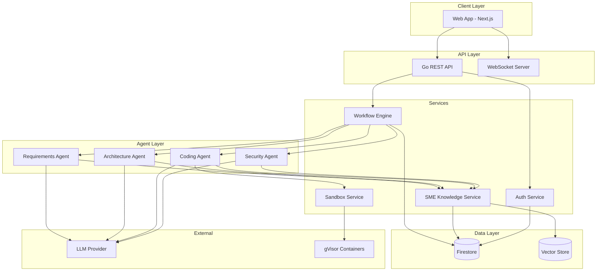
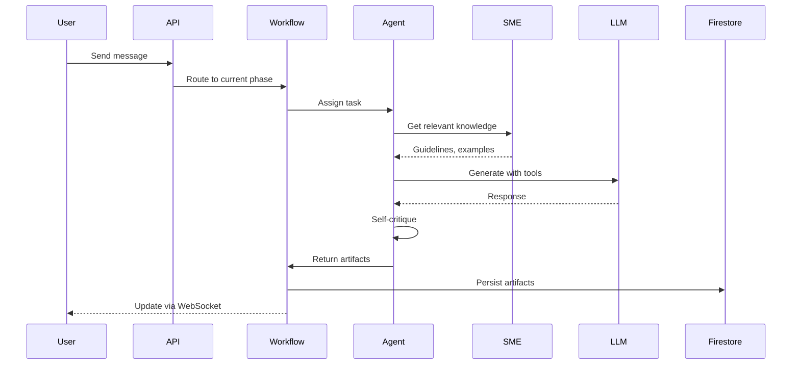
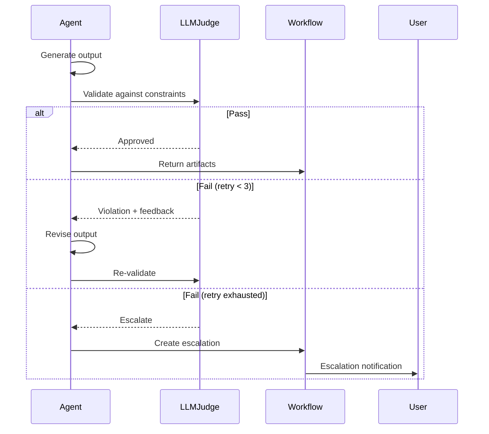
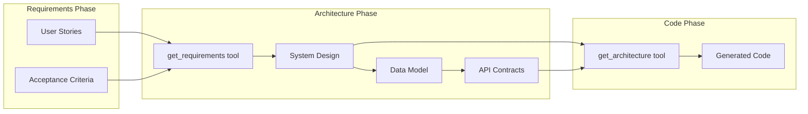

# Architecture Overview

## System Diagram

---

## Component Responsibilities

### API Layer

| Component | Responsibility |
|-----------|----------------|
| Go REST API | Request handling, authorization, business logic orchestration |
| WebSocket Server | Real-time updates for agent progress, collaboration |

### Agent Layer

| Component | Responsibility |
|-----------|----------------|
| Requirements Agent | Gather requirements through conversation, produce user stories |
| Architecture Agent | Design system structure, data models, API contracts |
| Coding Agent | Generate code following architecture, validate in sandbox |
| Security Agent | Review code for vulnerabilities, propose fixes |

### Service Layer

| Component | Responsibility |
|-----------|----------------|
| Workflow Engine | Phase transitions, escalations, change management, locks |
| SME Knowledge Service | Guidelines, templates, examples, constraints + RAG retrieval |
| Auth Service | Session management, org membership, project permissions |
| Sandbox Service | Container lifecycle, resource limits, execution capture |

### Data Layer

| Component | Responsibility |
|-----------|----------------|
| Firestore | Persistent storage for all domain objects, event sourcing |
| Vector Store | Embeddings for SME example retrieval (RAG) |

---

## Request Flow: Agent Task Execution

---

## Request Flow: Constraint Validation

---

## Data Flow: Phase Handoff

---

## Technology Choices

| Decision | Choice | Rationale |
|----------|--------|-----------|
| Backend Language | Go | Type safety, performance, good concurrency |
| Database | Firestore | Flexible schema, real-time, event sourcing support |
| Container Runtime | gVisor (runsc) | Strong isolation, syscall filtering |
| Frontend | Next.js | SSR capability, React ecosystem |
| Vector DB | Firestore + pgvector | RAG for SME examples |

---

## Related Documents

- [Data Model](./data-model.md) - All domain entities and relationships
- [API Contracts](./api-contracts.md) - REST endpoint specifications
- [Components](./components/) - Detailed component designs
