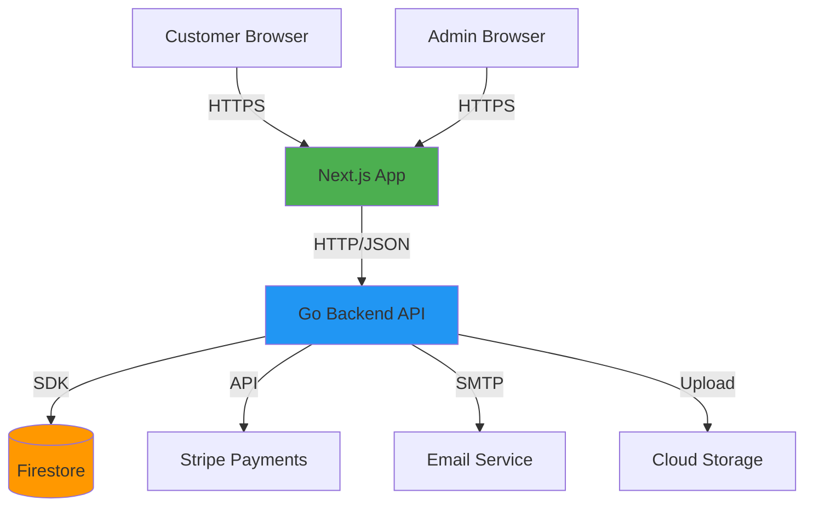

# System Architecture

**Project:** Manik Golden Honey Co
**Document:** Architecture Overview

---

## High-Level Architecture

Two main services deployed to GCP Cloud Run:



---

## Next.js Application

**Responsibilities:**
- Serve customer storefront
- Serve admin dashboard
- Handle UI/UX and user input validation
- Manage client-side state (cart in localStorage)
- Route protection via middleware

**Customer Routes:**
- `/` - Homepage
- `/products` - Product listing
- `/products/[id]` - Product detail
- `/cart` - Shopping cart
- `/checkout` - Checkout flow
- `/account` - Customer account dashboard
- `/auth/verify` - Passwordless auth verification

**Admin Routes:**
- `/admin/login` - Admin login
- `/admin/dashboard` - Overview metrics
- `/admin/products` - Product management
- `/admin/orders` - Order management
- `/admin/customers` - Customer view
- `/admin/inventory` - Inventory management

**Protection:**
- Next.js middleware protects `/admin/*` routes
- Requires valid admin JWT with role claim
- Redirects to login if unauthorized

**Rendering Strategy:**
- **SSR (Server-Side Rendering):** Product pages for SEO
- **CSR (Client-Side Rendering):** Interactive features (cart, checkout)
- **Static:** Homepage (pre-rendered at build time)

---

## Go Backend API

**Responsibilities:**
- All business logic and data operations
- Single source of truth for database access
- Payment processing via Stripe
- Email notifications
- Authentication token generation/validation
- Authorization enforcement (admin vs customer)

**API Structure:**
```
/api/auth/*          - Authentication endpoints
/api/products/*      - Product CRUD
/api/orders/*        - Order management
/api/customers/*     - Customer data
/api/admin/*         - Admin-only endpoints
/api/health          - Health check
```

**Key Principles:**
- RESTful design
- JSON request/response bodies
- Structured error responses
- Request ID tracing
- Context-aware logging

---

## Data Flow

**Customer Product Browsing:**
```
Browser → Next.js (SSR) → Go API → Firestore → Products
                                              ↓
                                    Render HTML with products
```

**Checkout Flow:**
```
Browser → Cart (localStorage) → Next.js → Go API → Validate inventory
                                                  ↓
                                          Stripe PaymentIntent
                                                  ↓
                                          Create Order in Firestore
                                                  ↓
                                          Send confirmation email
                                                  ↓
                                          Return success
```

**Admin Order Update:**
```
Admin Browser → Next.js → Go API → Verify admin JWT
                                 ↓
                          Update order status in Firestore
                                 ↓
                          Send customer notification email
```

---

## Deployment Architecture

**Services:**
- **Next.js App** - Cloud Run (auto-scaling, min 0 instances)
- **Go API** - Cloud Run (auto-scaling, min 1 instance)
- **Firestore** - Native mode (managed by GCP)
- **Cloud Storage** - Product images (public bucket with CDN)
- **Secret Manager** - Sensitive configurations

**Communication:**
- Next.js → Go API via HTTPS (internal GCP networking)
- Go API is only service that talks to Firestore
- External services (Stripe, email) accessed from Go API only

**Environment Variables:**
- `STRIPE_SECRET_KEY` - From Secret Manager
- `JWT_SECRET` - From Secret Manager
- `EMAIL_API_KEY` - From Secret Manager
- `FIRESTORE_PROJECT_ID` - GCP project ID
- `FRONTEND_URL` - For CORS configuration

---

## Scalability Considerations

**Auto-Scaling:**
- Cloud Run scales containers based on request volume
- Next.js can scale to 0 instances (cost savings)
- Go API maintains min 1 instance (faster cold starts)

**Database:**
- Firestore auto-scales read/write capacity
- Composite indexes for efficient queries
- Denormalized data where appropriate (order line items)

**Static Assets:**
- Product images served from Cloud Storage with CDN
- Next.js static assets served from Cloud Run CDN
- Browser caching headers configured

**Cost Management:**
- Pay-per-request pricing on Cloud Run
- Firestore free tier covers ~50k reads/day
- Estimated $30-50/month for MVP traffic

---

## Related Documents

- [data-model.md](./data-model.md) - Database schema details
- [deployment-security.md](./deployment-security.md) - Deployment and security details
- [repository-pattern.md](./repository-pattern.md) - Data access abstraction
