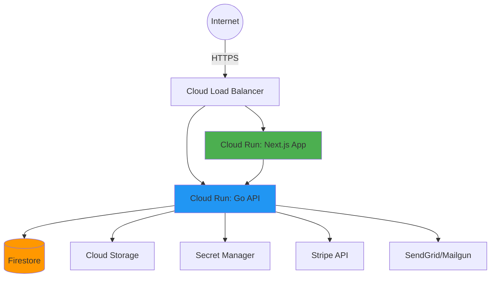

# Deployment, Security & Operations

**Project:** Manik Golden Honey Co
**Document:** Production Infrastructure, Security, Monitoring

---

## 1. Deployment Architecture (GCP)

### Services Overview



**Components:**

1. **Cloud Run: Next.js App**
   - Auto-scaling: 0 to 10 instances
   - Min instances: 0 (cost optimization)
   - Memory: 512MB per instance
   - Serves both customer and admin UI

2. **Cloud Run: Go API**
   - Auto-scaling: 1 to 20 instances
   - Min instances: 1 (avoid cold starts)
   - Memory: 256MB per instance
   - Handles all business logic

3. **Firestore (Native Mode)**
   - Automatic scaling and replication
   - Multi-region availability
   - Automatic backups enabled

4. **Cloud Storage**
   - Public bucket for product images
   - CDN enabled for fast delivery
   - Lifecycle policy: retain 90 days

5. **Secret Manager**
   - Stores sensitive credentials:
     - Stripe API keys
     - JWT signing secret
     - Email service API key
     - Database credentials (future)

---

## 2. CI/CD Pipeline (Cloud Build)

### Trigger: Push to `main` Branch

**Workflow:**

1. **GitHub → Cloud Build Trigger**
   - Webhook fires on push to `main`
   - Cloud Build starts build process

2. **Build Docker Images**
   - Next.js: `docker build -f Dockerfile.nextjs .`
   - Go API: `docker build -f Dockerfile.go .`

3. **Push to Artifact Registry**
   - Tagged with Git commit SHA
   - Example: `gcr.io/project/nextjs:abc123`

4. **Deploy to Cloud Run**
   - Rolling update (zero downtime)
   - Health checks before switching traffic
   - Environment variables from Secret Manager

5. **Run Smoke Tests**
   - Health endpoint checks
   - Basic API calls
   - Rollback if failures

**cloudbuild.yaml:**
```yaml
steps:
  # Build Next.js image
  - name: 'gcr.io/cloud-builders/docker'
    args: ['build', '-t', 'gcr.io/$PROJECT_ID/nextjs:$COMMIT_SHA', '-f', 'Dockerfile.nextjs', '.']

  # Build Go API image
  - name: 'gcr.io/cloud-builders/docker'
    args: ['build', '-t', 'gcr.io/$PROJECT_ID/go-api:$COMMIT_SHA', '-f', 'Dockerfile.go', '.']

  # Push images
  - name: 'gcr.io/cloud-builders/docker'
    args: ['push', 'gcr.io/$PROJECT_ID/nextjs:$COMMIT_SHA']
  - name: 'gcr.io/cloud-builders/docker'
    args: ['push', 'gcr.io/$PROJECT_ID/go-api:$COMMIT_SHA']

  # Deploy Next.js to Cloud Run
  - name: 'gcr.io/google.com/cloudsdktool/cloud-sdk'
    args:
      - 'gcloud'
      - 'run'
      - 'deploy'
      - 'nextjs-app'
      - '--image=gcr.io/$PROJECT_ID/nextjs:$COMMIT_SHA'
      - '--region=us-central1'
      - '--platform=managed'

  # Deploy Go API to Cloud Run
  - name: 'gcr.io/google.com/cloudsdktool/cloud-sdk'
    args:
      - 'gcloud'
      - 'run'
      - 'deploy'
      - 'go-api'
      - '--image=gcr.io/$PROJECT_ID/go-api:$COMMIT_SHA'
      - '--region=us-central1'
      - '--platform=managed'

images:
  - 'gcr.io/$PROJECT_ID/nextjs:$COMMIT_SHA'
  - 'gcr.io/$PROJECT_ID/go-api:$COMMIT_SHA'
```

---

## 3. Environments

### Development (Local)

**Setup:**
- Next.js runs on `localhost:3000`
- Go API runs on `localhost:8080`
- Firestore emulator on `localhost:8081`
- Mock Stripe with test keys

**Environment Variables:**
```bash
FIRESTORE_EMULATOR_HOST=localhost:8081
STRIPE_SECRET_KEY=sk_test_...
JWT_SECRET=local-dev-secret
EMAIL_API_KEY=test-key
```

### Staging (GCP)

**Purpose:** Test deployments before production

**Setup:**
- Separate Cloud Run services: `nextjs-staging`, `go-api-staging`
- Separate Firestore database: `staging-db`
- Stripe test mode
- Same CI/CD pipeline as production

**URL:** `https://staging.manikgoldenhoney.com`

### Production (GCP)

**Setup:**
- Production Cloud Run services
- Production Firestore database
- Stripe live mode
- Monitoring and alerting enabled

**URL:** `https://manikgoldenhoney.com`

---

## 4. Security Measures

### Authentication & Authorization

**JWT Security:**
- Signed with HS256 algorithm
- Secret stored in Secret Manager (not in code)
- HttpOnly cookies (prevents XSS attacks)
- Secure flag enabled (HTTPS only)
- SameSite=Strict (CSRF protection)
- Expiration: 48 hours

**Rate Limiting:**
- Auth endpoints: 5 attempts per email per hour
- Prevents brute-force attacks on 6-digit codes
- Implemented in Go API middleware

**Admin Authorization:**
- JWT contains role claim (`role: "admin"`)
- Middleware checks role on all `/admin/*` routes
- Go API validates role on all admin endpoints
- 403 Forbidden if role mismatch

### API Security

**CORS Configuration:**
```go
// Only allow frontend domain
router.Use(cors.New(cors.Config{
    AllowOrigins: []string{"https://manikgoldenhoney.com"},
    AllowMethods: []string{"GET", "POST", "PUT", "PATCH", "DELETE"},
    AllowHeaders: []string{"Content-Type", "Authorization"},
    AllowCredentials: true,
}))
```

**Request Validation:**
- Sanitize all inputs (strip HTML, SQL injection prevention)
- Validate email format with regex
- Validate quantity bounds (> 0, < 100)
- Validate ZIP codes, phone numbers with regex
- Reject malformed JSON payloads

**Firestore Security Rules:**
```javascript
rules_version = '2';
service cloud.firestore {
  match /databases/{database}/documents {
    // All reads/writes must go through backend API
    match /{document=**} {
      allow read, write: if false;
    }
  }
}
```
**Why:** Only backend has service account credentials, frontend cannot access Firestore directly

**Logging:**
- Never log sensitive data:
  - ❌ Credit card numbers
  - ❌ Full email addresses (mask: `t***@example.com`)
  - ❌ JWTs or auth tokens
  - ❌ Passwords (we don't use passwords, but principle applies)
- ✅ Log: request IDs, customer IDs, order IDs, error messages

### Payment Security

**Stripe Best Practices:**
- Never store card details (Stripe handles PCI compliance)
- Use Stripe Elements (card data never touches our servers)
- Verify PaymentIntent status server-side before fulfilling order
- Webhook signature validation (prevent spoofed requests)

**Webhook Security:**
```go
func VerifyStripeWebhook(payload []byte, signature string) error {
    _, err := webhook.ConstructEvent(payload, signature, stripeWebhookSecret)
    return err
}
```

### Data Privacy

**Customer Data:**
- Email used only for auth and order notifications
- No tracking/analytics for MVP
- HTTPS enforced on all connections (GCP default)
- Data residency: US region (Firestore us-central1)

**Compliance:**
- No GDPR concerns for MVP (no EU customers)
- Privacy policy: "We collect email for orders only"
- No cookies except auth JWT (essential cookie)

---

## 5. Monitoring & Operations

### Logging (Cloud Logging)

**Log Format: Structured JSON**
```json
{
  "severity": "INFO",
  "requestId": "req_abc123",
  "userId": "cust_xyz789",
  "timestamp": "2026-01-24T15:30:00Z",
  "message": "Order created successfully",
  "orderNumber": "MGH-1001"
}
```

**Log Levels:**
- **INFO**: Normal operations (order created, product updated)
- **WARN**: Recoverable errors (email send failed, will retry)
- **ERROR**: Failures (payment failed, database unavailable)

**Log Retention:** 30 days (GCP default)

### Metrics (Cloud Monitoring)

**Cloud Run Metrics (Automatic):**
- Request count
- Request latency (p50, p95, p99)
- Error rate (5xx responses)
- Instance count (auto-scaling)
- CPU and memory usage

**Custom Metrics:**
```go
// Track orders per hour
orderCounter := monitoring.NewCounter("orders_created_total")
orderCounter.Inc()

// Track low stock products
lowStockGauge := monitoring.NewGauge("products_low_stock")
lowStockGauge.Set(float64(lowStockCount))
```

**Dashboards:**
- Overview: requests/sec, error rate, latency
- Business: orders/day, revenue/day, top products
- Operations: instance count, database reads/writes, low stock alerts

### Alerts (Cloud Monitoring)

**Critical Alerts (PagerDuty/Email):**
- ✅ API error rate > 5% for 5 minutes
- ✅ Payment processing failures > 3 in 10 minutes
- ✅ Service downtime (health check fails)
- ✅ Database connection errors

**Warning Alerts (Email/Slack):**
- ⚠️ Low stock threshold reached (any product)
- ⚠️ Pending orders > 10
- ⚠️ Email send failures (>5 in 1 hour)

**Alert Channels:**
- Email: `ops@manikgoldenhoney.com`
- Slack: `#alerts` channel
- PagerDuty: For on-call rotation (future)

### Health Checks

**Endpoints:**

1. **Next.js Health Check** (`/api/health`)
   ```json
   {
     "status": "ok",
     "timestamp": "2026-01-24T15:30:00Z"
   }
   ```

2. **Go API Health Check** (`/api/health`)
   ```json
   {
     "status": "ok",
     "database": "connected",
     "stripe": "reachable",
     "timestamp": "2026-01-24T15:30:00Z"
   }
   ```

**Uptime Monitoring:**
- Check every 60 seconds
- Alert if 3 consecutive failures
- Public status page (future): `status.manikgoldenhoney.com`

---

## 6. Backups & Disaster Recovery

### Firestore Backups

**Automatic Daily Backups:**
- GCP automatically backs up Firestore daily
- Retention: 7 days of daily backups
- Point-in-time recovery available

**Weekly Exports (Extra Safety):**
```bash
# Cloud Scheduler job (runs every Sunday)
gcloud firestore export gs://manik-backups/firestore/$(date +%Y%m%d)
```
- Stored in Cloud Storage bucket
- Retention policy: 30 days

**Restore Process:**
1. Identify backup date
2. Import from Cloud Storage to staging Firestore
3. Verify data integrity
4. If good, import to production

### Application Code

**Git Repository:**
- Hosted on GitHub
- Protected branches: `main` requires PR review
- Tags for releases: `v1.0.0`, `v1.1.0`

**Rollback Strategy:**
1. Identify last known good deployment (Git commit SHA)
2. Redeploy that image from Artifact Registry:
   ```bash
   gcloud run deploy go-api --image=gcr.io/project/go-api:GOOD_SHA
   ```
3. Verify health checks pass
4. Monitor for issues

---

## 7. Cost Estimates (MVP Traffic)

**Assumptions:**
- 100 orders/month
- 1,000 product page views/day
- 10 admin sessions/day

**GCP Costs:**

| Service | Usage | Cost/Month |
|---------|-------|------------|
| Cloud Run (Next.js) | ~50k requests | $5 |
| Cloud Run (Go API) | ~75k requests | $8 |
| Firestore | ~100k reads, 5k writes | $7 |
| Cloud Storage | 10GB images + CDN | $3 |
| Cloud Build | 30 builds/month | $2 |
| Secret Manager | 5 secrets | $1 |
| Cloud Logging | 5GB logs | $3 |
| **Total GCP** | | **~$30/month** |

**Third-Party Costs:**
- Stripe: 2.9% + $0.30 per transaction (~$50-100/month depending on volume)
- SendGrid/Mailgun: Free tier (12k emails/month)
- Domain: $12/year (Google Domains)

**Total Estimated: $50-75/month for MVP**

---

## 8. Production Readiness Checklist

**Before Launch:**

### Infrastructure
- [ ] DNS configured (manikgoldenhoney.com → Cloud Run)
- [ ] SSL certificate provisioned (automatic with Cloud Run)
- [ ] Firestore indexes created (see data-model.md)
- [ ] Cloud Storage bucket public + CDN enabled
- [ ] Secret Manager populated with production secrets
- [ ] CI/CD pipeline tested end-to-end

### Security
- [ ] JWT secret rotated (not using dev secret)
- [ ] Stripe live mode API keys configured
- [ ] Admin users created in `admins` collection
- [ ] CORS limited to production domain only
- [ ] Firestore security rules deployed (backend-only access)
- [ ] Rate limiting enabled on auth endpoints

### Monitoring
- [ ] Cloud Monitoring alerts configured
- [ ] Alert notification channels tested
- [ ] Uptime checks enabled
- [ ] Log-based metrics created
- [ ] Dashboard created for key metrics

### Testing
- [ ] E2E tests pass in staging environment
- [ ] Payment flow tested with Stripe live test mode
- [ ] Email notifications arriving correctly
- [ ] Mobile responsive design verified
- [ ] Admin dashboard fully functional

### Documentation
- [ ] API documentation (endpoints, auth)
- [ ] Runbook for common ops tasks (restart service, check logs)
- [ ] On-call rotation defined (if applicable)
- [ ] Incident response plan

---

## Related Documents

- [architecture.md](./architecture.md) - System architecture details
- [error-handling.md](./error-handling.md) - Error scenarios and recovery
- [testing.md](./testing.md) - Testing strategy and coverage
