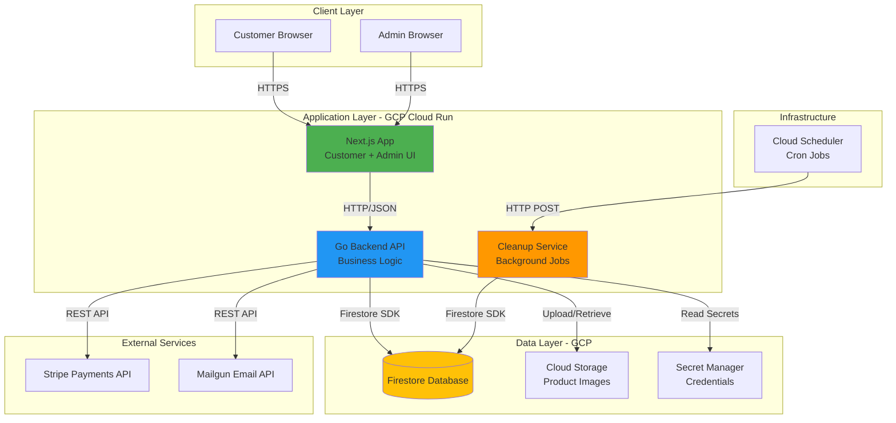
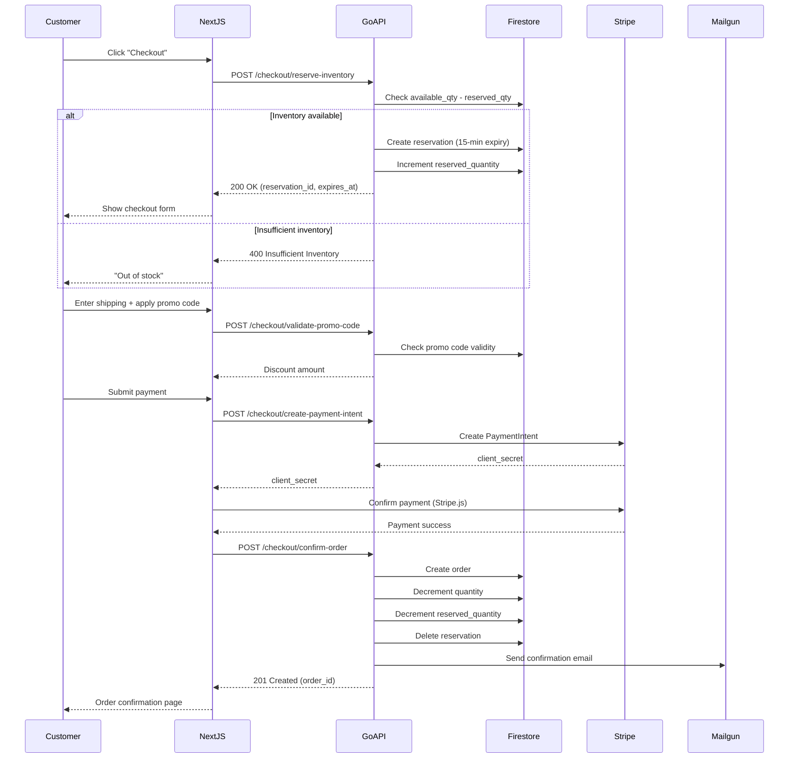
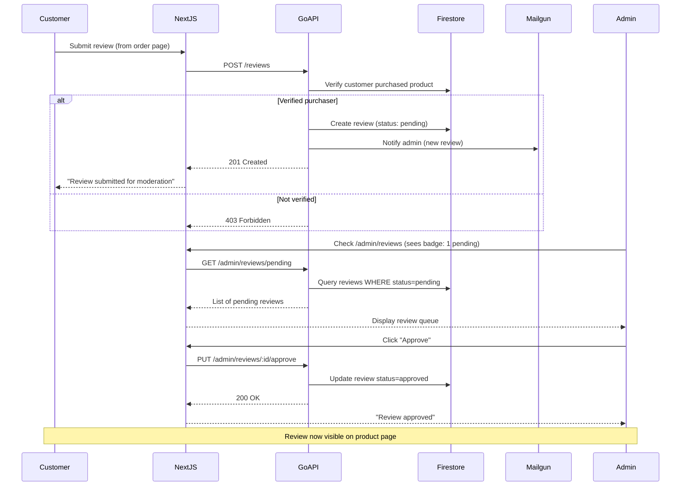
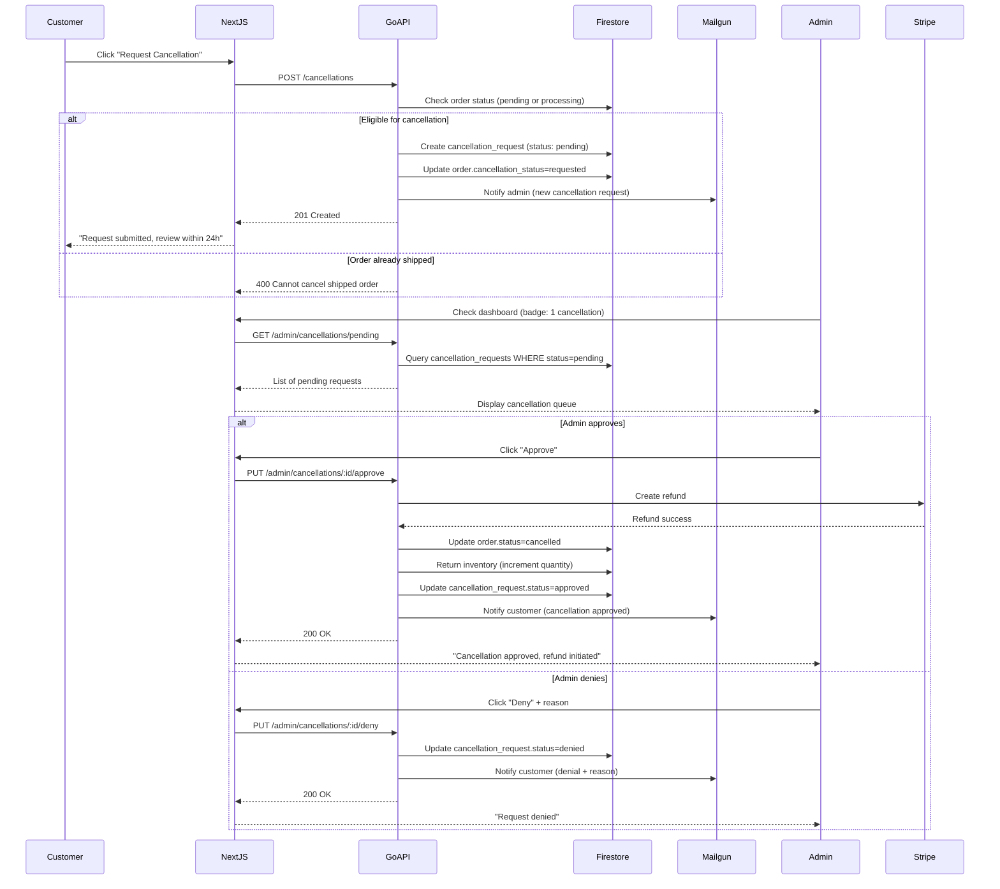
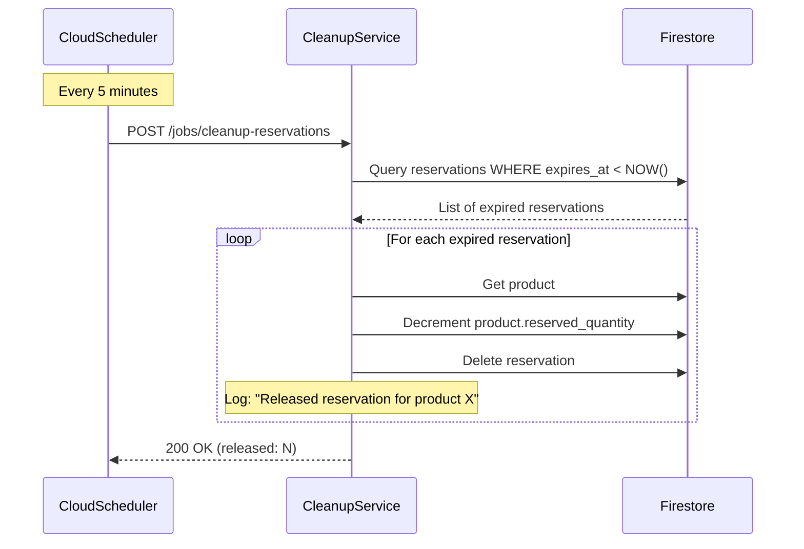

# Detailed System Architecture - Stage 4

**Project:** Manik Golden Honey Co
**Stage:** 4 - Refine L1 (Detailed Design)
**Date:** 2026-01-24

---

## High-Level System Architecture



---

## Component Responsibilities

### Next.js Application (Frontend)
**Port:** 3000 (internal), 443 (external HTTPS)
**Deployment:** Cloud Run (auto-scaling, min 0 instances)

**Responsibilities:**
- Render customer storefront (SSR for SEO)
- Render admin dashboard (CSR for interactive UI)
- Client-side validation (forms, cart)
- Route protection (middleware for admin routes)
- State management (cart in localStorage, admin session in memory)

**Routes:**
- **Customer:**
  - `/` - Homepage (static)
  - `/products` - Product listing (SSR)
  - `/products/[id]` - Product detail (SSR)
  - `/cart` - Shopping cart (CSR)
  - `/checkout` - Checkout flow (CSR)
  - `/account` - Customer dashboard (CSR, protected)
  - `/auth/verify` - Email code verification (CSR)
- **Admin:**
  - `/admin/login` - Admin login (CSR)
  - `/admin/dashboard` - Metrics overview (CSR, protected)
  - `/admin/products` - Product CRUD (CSR, protected)
  - `/admin/orders` - Order management (CSR, protected)
  - `/admin/reviews` - Review moderation (CSR, protected)
  - `/admin/cancellations` - Cancellation requests (CSR, protected)
  - `/admin/promo-codes` - Discount codes (CSR, protected)
  - `/admin/customers` - Customer list (CSR, protected)
  - `/admin/inventory` - Inventory dashboard (CSR, protected)

---

### Go Backend API
**Port:** 8080 (internal), 443 (external HTTPS)
**Deployment:** Cloud Run (auto-scaling, min 1 instance)

**Responsibilities:**
- All business logic and data operations
- Authentication (customer passwordless, admin email/password)
- Authorization (role-based access control)
- Payment processing (Stripe integration)
- Email notifications (Mailgun integration)
- Inventory management (reservations, updates)
- Review moderation logic
- Cancellation workflow

**API Structure:**
```
/api/health                     - Health check
/api/auth/
  POST   /send-code             - Send verification code (customer)
  POST   /verify-code           - Verify code, return JWT (customer)
  POST   /admin/login           - Admin login
  POST   /admin/logout          - Admin logout

/api/products/
  GET    /                      - List all active products
  GET    /:id                   - Get product detail
  POST   /                      - Create product (admin only)
  PUT    /:id                   - Update product (admin only)
  DELETE /:id                   - Delete product (admin only)

/api/orders/
  GET    /                      - List customer orders (customer or admin)
  GET    /:id                   - Get order detail
  POST   /                      - Create order (after payment)
  PUT    /:id/status            - Update order status (admin only)

/api/checkout/
  POST   /reserve-inventory     - Reserve inventory for checkout
  POST   /release-inventory     - Release reservation (abandoned checkout)
  POST   /validate-promo-code   - Validate discount code
  POST   /create-payment-intent - Create Stripe PaymentIntent
  POST   /confirm-order         - Confirm order after payment

/api/reviews/
  GET    /product/:id           - Get approved reviews for product
  POST   /                      - Submit review (verified purchaser)
  PUT    /:id                   - Edit review (author only)
  DELETE /:id                   - Delete review (author only)

/api/admin/reviews/
  GET    /pending               - List pending reviews
  PUT    /:id/approve           - Approve review
  PUT    /:id/reject            - Reject review
  DELETE /:id                   - Delete approved review

/api/cancellations/
  POST   /                      - Request order cancellation (customer)

/api/admin/cancellations/
  GET    /pending               - List pending cancellation requests
  PUT    /:id/approve           - Approve cancellation (triggers refund)
  PUT    /:id/deny              - Deny cancellation

/api/admin/promo-codes/
  GET    /                      - List all promo codes
  POST   /                      - Create promo code
  PUT    /:id                   - Update promo code
  DELETE /:id                   - Delete promo code (soft delete)
  PUT    /:id/deactivate        - Deactivate promo code

/api/admin/notification-counts  - Get pending counts (reviews, cancellations, etc.)
```

---

### Cleanup Service (Background Jobs)
**Port:** 8080 (internal), no external access
**Deployment:** Cloud Run (triggered by Cloud Scheduler)

**Responsibilities:**
- Release expired inventory reservations (every 5 min)
- Clean up old session data (future)
- Send email digests (future)

**Endpoints:**
```
POST /jobs/cleanup-reservations  - Clean expired inventory reservations
```

**Authentication:** Service account token (Cloud Scheduler)

---

## Data Flow Diagrams

### 1. Customer Checkout Flow



---

### 2. Review Moderation Flow



---

### 3. Cancellation Request Flow



---

### 4. Background Reservation Cleanup



---

## Technology Stack Details

### Frontend (Next.js)
- **Framework**: Next.js 14 (App Router)
- **Language**: TypeScript
- **UI Library**: React 18
- **Styling**: Tailwind CSS
- **Forms**: React Hook Form + Zod validation
- **HTTP Client**: Fetch API (native)
- **State**: React Context + localStorage (cart)
- **Auth**: JWT in httpOnly cookies

### Backend (Go API)
- **Language**: Go 1.21+
- **Framework**: net/http (stdlib) + Chi router
- **Database**: Firestore Go SDK
- **Payments**: Stripe Go SDK
- **Email**: Mailgun Go SDK
- **Auth**: golang-jwt/jwt
- **Logging**: Cloud Logging (structured JSON)
- **Testing**: Go testing package + testify

### Infrastructure (GCP)
- **Compute**: Cloud Run (managed containers)
- **Database**: Firestore (native mode)
- **Storage**: Cloud Storage (public bucket with CDN)
- **Secrets**: Secret Manager
- **Scheduling**: Cloud Scheduler
- **Monitoring**: Cloud Monitoring + Cloud Logging
- **CI/CD**: Cloud Build

---

## Next Steps

Stage 4 will continue with:
1. ✅ Detailed architecture diagrams (completed above)
2. Progressive Deepening L1 for major components (next)
3. Database schema detailed specification
4. API contract specifications
5. Basic error scenarios

---

**Last Updated:** 2026-01-24
**Stage:** L1 (Refine L1)
