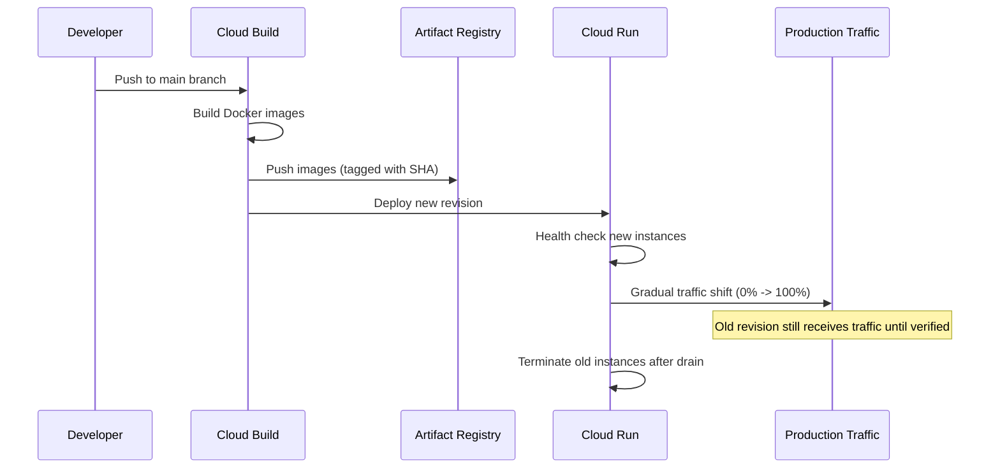
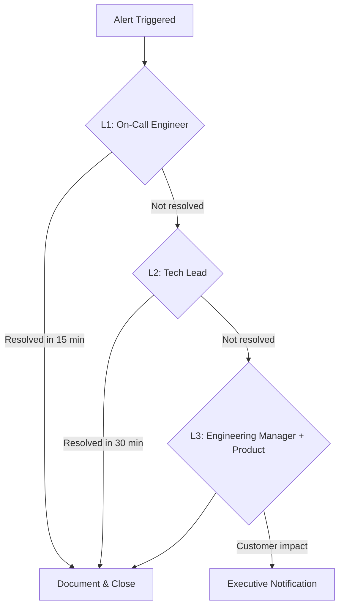

# Operational Runbooks

**Project:** Manik Golden Honey Co
**Document:** Deployment, Recovery, Monitoring, and On-Call Procedures
**Last Updated:** 2026-01-25

---

## Table of Contents

1. [Deployment Procedure](#1-deployment-procedure)
2. [Rollback Procedure](#2-rollback-procedure)
3. [Disaster Recovery Plan](#3-disaster-recovery-plan)
4. [Monitoring Dashboard Layout](#4-monitoring-dashboard-layout)
5. [On-Call Playbook](#5-on-call-playbook)
6. [Capacity Planning](#6-capacity-planning)

---

## 1. Deployment Procedure

### 1.1 Zero-Downtime Deployment Strategy

**Strategy: Rolling Update with Traffic Gradual Shift**

Cloud Run provides native zero-downtime deployments through revision-based traffic management.



**Key Principles:**
- New revision must pass startup probe before receiving traffic
- Old revision continues serving during deployment
- Automatic rollback if new revision fails health checks
- Connection draining ensures in-flight requests complete

---

### 1.2 Pre-Deployment Checklist

**Automated (CI/CD Pipeline):**

```bash
# 1. Run all unit tests
go test ./... -v -cover

# 2. Run integration tests
go test ./... -tags=integration -v

# 3. Run linting
golangci-lint run

# 4. Run security scan
trivy image --exit-code 1 --severity HIGH,CRITICAL

# 5. Check for secrets in code
gitleaks detect --source . --verbose

# 6. Validate Firestore indexes (dry-run)
gcloud firestore indexes list --project=$PROJECT_ID
```

**Manual Pre-Flight (for significant releases):**

| Check | Responsibility | Command/Action |
|-------|---------------|----------------|
| Database migrations tested in staging | Developer | Deploy to staging, verify data |
| Stripe API version compatibility | Developer | Check Stripe dashboard for deprecations |
| Secret Manager secrets current | DevOps | `gcloud secrets versions list STRIPE_SECRET_KEY` |
| Feature flags configured | Developer | Review launch flags in config |
| Rollback plan documented | On-call | Confirm last known good SHA |
| Stakeholder notification | Product | Slack #releases channel |

---

### 1.3 Deployment Steps

**Automated Pipeline (cloudbuild.yaml):**

```yaml
steps:
  # Step 1: Run tests
  - name: 'golang:1.21'
    entrypoint: 'go'
    args: ['test', './...', '-v', '-cover']
    dir: 'api'

  # Step 2: Build Go API image
  - name: 'gcr.io/cloud-builders/docker'
    args:
      - 'build'
      - '-t'
      - 'gcr.io/$PROJECT_ID/go-api:$COMMIT_SHA'
      - '-t'
      - 'gcr.io/$PROJECT_ID/go-api:latest'
      - '-f'
      - 'api/Dockerfile'
      - '.'

  # Step 3: Build Next.js image
  - name: 'gcr.io/cloud-builders/docker'
    args:
      - 'build'
      - '-t'
      - 'gcr.io/$PROJECT_ID/nextjs-app:$COMMIT_SHA'
      - '-t'
      - 'gcr.io/$PROJECT_ID/nextjs-app:latest'
      - '-f'
      - 'web/Dockerfile'
      - '.'

  # Step 4: Push images to Artifact Registry
  - name: 'gcr.io/cloud-builders/docker'
    args: ['push', '--all-tags', 'gcr.io/$PROJECT_ID/go-api']
  - name: 'gcr.io/cloud-builders/docker'
    args: ['push', '--all-tags', 'gcr.io/$PROJECT_ID/nextjs-app']

  # Step 5: Deploy Go API to Cloud Run
  - name: 'gcr.io/google.com/cloudsdktool/cloud-sdk'
    entrypoint: 'gcloud'
    args:
      - 'run'
      - 'deploy'
      - 'go-api'
      - '--image=gcr.io/$PROJECT_ID/go-api:$COMMIT_SHA'
      - '--region=us-central1'
      - '--platform=managed'
      - '--min-instances=1'
      - '--max-instances=20'
      - '--memory=256Mi'
      - '--timeout=300s'
      - '--set-secrets=STRIPE_SECRET_KEY=STRIPE_SECRET_KEY:latest,JWT_SECRET=JWT_SECRET:latest'

  # Step 6: Deploy Next.js to Cloud Run
  - name: 'gcr.io/google.com/cloudsdktool/cloud-sdk'
    entrypoint: 'gcloud'
    args:
      - 'run'
      - 'deploy'
      - 'nextjs-app'
      - '--image=gcr.io/$PROJECT_ID/nextjs-app:$COMMIT_SHA'
      - '--region=us-central1'
      - '--platform=managed'
      - '--min-instances=0'
      - '--max-instances=10'
      - '--memory=512Mi'
      - '--timeout=300s'

  # Step 7: Run smoke tests
  - name: 'gcr.io/cloud-builders/curl'
    entrypoint: 'bash'
    args:
      - '-c'
      - |
        # Wait for deployment to stabilize
        sleep 30

        # Test API health
        API_URL=$(gcloud run services describe go-api --region=us-central1 --format='value(status.url)')
        curl -f "$API_URL/api/health" || exit 1

        # Test frontend health
        WEB_URL=$(gcloud run services describe nextjs-app --region=us-central1 --format='value(status.url)')
        curl -f "$WEB_URL/api/health" || exit 1

        echo "Smoke tests passed"

images:
  - 'gcr.io/$PROJECT_ID/go-api:$COMMIT_SHA'
  - 'gcr.io/$PROJECT_ID/nextjs-app:$COMMIT_SHA'

options:
  logging: CLOUD_LOGGING_ONLY
```

**Manual Deployment (Emergency/Override):**

```bash
# Set variables
export PROJECT_ID="manik-honey-prod"
export REGION="us-central1"
export COMMIT_SHA="abc123def456"

# Deploy specific version of Go API
gcloud run deploy go-api \
  --image=gcr.io/$PROJECT_ID/go-api:$COMMIT_SHA \
  --region=$REGION \
  --platform=managed

# Deploy specific version of Next.js
gcloud run deploy nextjs-app \
  --image=gcr.io/$PROJECT_ID/nextjs-app:$COMMIT_SHA \
  --region=$REGION \
  --platform=managed

# Verify deployment
gcloud run revisions list --service=go-api --region=$REGION
gcloud run revisions list --service=nextjs-app --region=$REGION
```

---

### 1.4 Post-Deployment Verification

**Automated Smoke Tests:**

```bash
#!/bin/bash
# post-deploy-verify.sh

API_URL="https://api.manikgoldenhoney.com"
WEB_URL="https://manikgoldenhoney.com"

echo "=== Post-Deployment Verification ==="

# 1. Health checks
echo "Checking API health..."
curl -sf "$API_URL/api/health" | jq .
[ $? -ne 0 ] && echo "FAIL: API health check" && exit 1

echo "Checking Web health..."
curl -sf "$WEB_URL/api/health" | jq .
[ $? -ne 0 ] && echo "FAIL: Web health check" && exit 1

# 2. Critical endpoints
echo "Testing product listing..."
curl -sf "$API_URL/api/products" | jq '.products | length'
[ $? -ne 0 ] && echo "FAIL: Product listing" && exit 1

echo "Testing Stripe connectivity..."
curl -sf "$API_URL/api/health/stripe" | jq .
[ $? -ne 0 ] && echo "WARN: Stripe health check failed"

# 3. Database connectivity
echo "Testing Firestore connectivity..."
curl -sf "$API_URL/api/health/database" | jq .
[ $? -ne 0 ] && echo "FAIL: Database connectivity" && exit 1

echo "=== All checks passed ==="
```

**Monitoring Dashboard Check (5 minutes post-deploy):**

| Metric | Expected | Alert If |
|--------|----------|----------|
| Error rate | < 1% | > 5% |
| P95 latency | < 500ms | > 2s |
| Active instances | >= 1 (API) | 0 |
| Request count | Baseline +/- 20% | -50% |
| 5xx responses | 0 | Any |

---

### 1.5 Rollout Strategy

**Default: Immediate (All Traffic to New Revision)**

For most deployments, Cloud Run's built-in rolling update is sufficient:
- New instances spin up, pass health check
- Traffic shifts automatically
- Old instances drain and terminate

**Canary Deployment (High-Risk Changes):**

```bash
# Deploy new revision without routing traffic
gcloud run deploy go-api \
  --image=gcr.io/$PROJECT_ID/go-api:$NEW_SHA \
  --region=$REGION \
  --no-traffic

# Route 10% traffic to new revision
gcloud run services update-traffic go-api \
  --to-revisions=go-api-$NEW_SHA=10 \
  --region=$REGION

# Monitor for 15 minutes, then increase
# If errors: rollback immediately
# If stable: increase to 50%
gcloud run services update-traffic go-api \
  --to-revisions=go-api-$NEW_SHA=50 \
  --region=$REGION

# Final: route 100% traffic
gcloud run services update-traffic go-api \
  --to-latest \
  --region=$REGION
```

**When to Use Canary:**
- Database schema changes
- Major feature launches
- Stripe API integration changes
- Authentication/authorization changes

---

## 2. Rollback Procedure

### 2.1 When to Rollback

**Immediate Rollback Triggers (< 2 minutes):**

| Trigger | Detection Method | Decision Maker |
|---------|------------------|----------------|
| 5xx error rate > 10% | Cloud Monitoring alert | On-call engineer |
| API health check failing | Uptime check alert | On-call engineer |
| Payment failures > 5 in 5 minutes | Stripe webhook monitoring | On-call engineer |
| Complete service outage | Customer reports + monitoring | Any engineer |

**Evaluated Rollback Triggers (5-15 minutes):**

| Trigger | Detection Method | Decision Maker |
|---------|------------------|----------------|
| 5xx error rate 5-10% | Cloud Monitoring | On-call + tech lead |
| P95 latency > 5s sustained | Cloud Monitoring | On-call + tech lead |
| Order creation failures > 10% | Business metrics | On-call + product |
| Unexpected error patterns | Log analysis | On-call engineer |

**Decision Framework:**

```
IF immediate_trigger THEN
  → Execute emergency rollback
  → Notify team post-rollback
ELSE IF evaluated_trigger THEN
  → Alert on-call + tech lead
  → Assess impact (orders affected, revenue impact)
  → Decision within 15 minutes
  → Document decision rationale
END
```

---

### 2.2 Emergency Rollback Steps (< 5 Minutes)

**Option A: Route Traffic to Previous Revision (Fastest)**

```bash
# Time: ~30 seconds

# 1. List recent revisions
gcloud run revisions list --service=go-api --region=us-central1 --limit=5

# 2. Route 100% traffic to last known good revision
gcloud run services update-traffic go-api \
  --to-revisions=go-api-PREVIOUS_SHA=100 \
  --region=us-central1

# 3. Verify
curl -sf https://api.manikgoldenhoney.com/api/health
```

**Option B: Redeploy Known Good Image (If Revision Deleted)**

```bash
# Time: ~2-3 minutes

# 1. Find last known good image
gcloud container images list-tags gcr.io/$PROJECT_ID/go-api --limit=10

# 2. Deploy that image
gcloud run deploy go-api \
  --image=gcr.io/$PROJECT_ID/go-api:KNOWN_GOOD_SHA \
  --region=us-central1 \
  --platform=managed

# 3. Verify deployment
gcloud run revisions list --service=go-api --region=us-central1
```

**Option C: Rollback Both Services (Full Stack Rollback)**

```bash
#!/bin/bash
# emergency-rollback.sh

export PROJECT_ID="manik-honey-prod"
export REGION="us-central1"
export API_GOOD_SHA="abc123"
export WEB_GOOD_SHA="def456"

echo "=== EMERGENCY ROLLBACK INITIATED ==="
echo "Time: $(date)"

# Rollback API
gcloud run deploy go-api \
  --image=gcr.io/$PROJECT_ID/go-api:$API_GOOD_SHA \
  --region=$REGION

# Rollback Web
gcloud run deploy nextjs-app \
  --image=gcr.io/$PROJECT_ID/nextjs-app:$WEB_GOOD_SHA \
  --region=$REGION

# Verify
echo "Verifying rollback..."
curl -sf https://api.manikgoldenhoney.com/api/health || echo "API FAILED"
curl -sf https://manikgoldenhoney.com/api/health || echo "WEB FAILED"

echo "=== ROLLBACK COMPLETE ==="
echo "Time: $(date)"
```

---

### 2.3 Data Rollback Considerations

**If Schema Changed:**

| Scenario | Action | Risk Level |
|----------|--------|------------|
| New field added (nullable) | No action needed | Low |
| New field added (required) | Backfill before rollback | Medium |
| Field renamed | Data migration required | High |
| Field deleted | Data may be lost | Critical |
| New collection added | No action needed | Low |
| Collection deleted | Point-in-time restore required | Critical |

**Firestore Data Rollback Procedure:**

```bash
# 1. Identify the backup closest to pre-change state
gsutil ls -l gs://manik-backups/firestore/

# 2. Import to a temporary database for verification
gcloud firestore import gs://manik-backups/firestore/20260124 \
  --database=temp-verify

# 3. Verify data integrity
# (manual verification in Firebase console)

# 4. If verified, import to production
# WARNING: This overwrites existing data
gcloud firestore import gs://manik-backups/firestore/20260124 \
  --database=production

# 5. Clear any cached data
# (API restart handles this automatically)
```

**Schema Rollback Decision Tree:**

```
IF schema_change = backward_compatible THEN
  → Rollback code only
  → Data continues working
ELSE IF data_loss = recoverable THEN
  → Rollback code
  → Run data migration script (reverse)
  → Verify in staging first
ELSE IF data_loss = critical THEN
  → STOP: Do not rollback automatically
  → Assess impact with tech lead
  → Consider point-in-time restore
  → May require manual data recovery
END
```

---

### 2.4 Communication During Rollback

**Immediate (During Rollback):**

```
Slack #incidents:
"[INCIDENT] Rollback in progress for go-api
Trigger: <error rate/latency/etc>
Action: Rolling back to revision <SHA>
ETA: 5 minutes
On-call: @username"
```

**Post-Rollback (Within 15 Minutes):**

```
Slack #incidents:
"[RESOLVED] Rollback complete for go-api
Duration: <X minutes>
Impact: <estimated orders affected>
Root cause: Under investigation
Postmortem: Will be scheduled"
```

**Stakeholder Notification (If Customer-Facing Impact):**

| Audience | Channel | Timing |
|----------|---------|--------|
| Engineering team | Slack #incidents | Immediate |
| Product/Support | Slack #support | Within 5 minutes |
| Customers (if outage > 15 min) | Status page | Within 20 minutes |

---

## 3. Disaster Recovery Plan

### 3.1 Backup Strategy

**Firestore Automatic Backups:**

| Backup Type | Frequency | Retention | Location |
|-------------|-----------|-----------|----------|
| Point-in-time recovery | Continuous | 7 days | GCP managed |
| Daily export | Every 24h at 2 AM UTC | 30 days | gs://manik-backups/firestore/ |
| Weekly export | Sundays at 3 AM UTC | 90 days | gs://manik-backups/firestore-weekly/ |

**Cloud Scheduler Job for Daily Exports:**

```yaml
# scheduler-firestore-backup.yaml
name: firestore-daily-backup
schedule: "0 2 * * *"  # 2 AM UTC daily
timeZone: "UTC"
httpTarget:
  uri: https://firestore.googleapis.com/v1/projects/manik-honey-prod/databases/(default):exportDocuments
  httpMethod: POST
  body: |
    {
      "outputUriPrefix": "gs://manik-backups/firestore/daily-$(date +%Y%m%d)"
    }
  oauthToken:
    serviceAccountEmail: backup-scheduler@manik-honey-prod.iam.gserviceaccount.com
```

**Setup Commands:**

```bash
# Create backup bucket
gsutil mb -l us-central1 gs://manik-backups/

# Set lifecycle policy (auto-delete after retention)
cat > lifecycle.json << 'EOF'
{
  "lifecycle": {
    "rule": [
      {
        "action": {"type": "Delete"},
        "condition": {"age": 30, "matchesPrefix": ["firestore/daily-"]}
      },
      {
        "action": {"type": "Delete"},
        "condition": {"age": 90, "matchesPrefix": ["firestore-weekly/"]}
      }
    ]
  }
}
EOF
gsutil lifecycle set lifecycle.json gs://manik-backups/

# Enable point-in-time recovery
gcloud firestore databases update --database=(default) \
  --enable-pitr
```

**Cloud Storage Backups (Product Images):**

| Content | Strategy | Retention |
|---------|----------|-----------|
| Product images | Object versioning enabled | 3 versions |
| CDN cache | Automatic via Cloud CDN | 24 hours |

```bash
# Enable versioning on image bucket
gsutil versioning set on gs://manik-product-images/
```

---

### 3.2 Restore Procedures

**Firestore Point-in-Time Recovery (Within 7 Days):**

```bash
# 1. Identify restore timestamp (RFC 3339 format)
RESTORE_TIME="2026-01-24T15:00:00Z"

# 2. Create new database from point-in-time
gcloud firestore databases restore \
  --source-database=(default) \
  --destination-database=restored-$(date +%Y%m%d) \
  --snapshot-time=$RESTORE_TIME

# 3. Verify restored data
# (Use Firebase console or admin scripts)

# 4. If verified, swap databases
# Option A: Update application config to use restored database
# Option B: Export from restored, import to production
```

**Firestore Export Recovery (Older Than 7 Days):**

```bash
# 1. List available exports
gsutil ls -l gs://manik-backups/firestore/

# 2. Import to staging database first
gcloud firestore import gs://manik-backups/firestore/20260120 \
  --database=staging

# 3. Verify data integrity
# (Manual verification required)

# 4. If verified, import to production
# WARNING: This is destructive - overwrites existing data
gcloud firestore import gs://manik-backups/firestore/20260120 \
  --database=(default)
```

**Application Code Recovery:**

```bash
# Code is always recoverable from Git
# 1. Check out last known good commit
git checkout $KNOWN_GOOD_SHA

# 2. Build and deploy
gcloud builds submit --config=cloudbuild.yaml
```

---

### 3.3 Recovery Objectives

**RTO (Recovery Time Objective): 1 Hour**

| Scenario | Target RTO | Procedure |
|----------|------------|-----------|
| Single service failure | 5 minutes | Rollback to previous revision |
| Full application failure | 15 minutes | Redeploy from Artifact Registry |
| Database corruption (recent) | 30 minutes | Point-in-time recovery |
| Database corruption (older) | 1 hour | Export recovery + verification |
| Complete infrastructure loss | 4 hours | Full rebuild from backups |

**RPO (Recovery Point Objective): 1 Hour**

| Data Type | RPO | Backup Mechanism |
|-----------|-----|------------------|
| Orders | 0 (real-time) | Firestore replication |
| Customer data | 0 (real-time) | Firestore replication |
| Product catalog | 1 hour | Daily backup + PITR |
| Reviews | 1 hour | Daily backup + PITR |
| Product images | 24 hours | Object versioning |

**RPO Justification:**
- Orders and customer data: Zero data loss acceptable (real-time replication)
- Product catalog: 1-hour loss acceptable (can be re-entered by admin)
- Reviews: 1-hour loss acceptable (customers can re-submit)
- Images: 24-hour loss acceptable (can be re-uploaded)

---

### 3.4 DR Testing Schedule

**Monthly: Backup Verification**

```bash
#!/bin/bash
# dr-test-monthly.sh - Run on 1st of each month

echo "=== Monthly DR Test: Backup Verification ==="

# 1. Verify Firestore exports exist
echo "Checking Firestore exports..."
LATEST_BACKUP=$(gsutil ls gs://manik-backups/firestore/ | tail -1)
if [ -z "$LATEST_BACKUP" ]; then
  echo "FAIL: No Firestore backups found"
  exit 1
fi
echo "Latest backup: $LATEST_BACKUP"

# 2. Verify backup is recent (within 48 hours)
BACKUP_DATE=$(echo $LATEST_BACKUP | grep -oP '\d{8}')
CURRENT_DATE=$(date +%Y%m%d)
DAYS_OLD=$(( ($CURRENT_DATE - $BACKUP_DATE) ))
if [ $DAYS_OLD -gt 2 ]; then
  echo "FAIL: Backup is $DAYS_OLD days old"
  exit 1
fi

# 3. Verify Cloud Run images exist
echo "Checking Container images..."
gcloud container images list-tags gcr.io/$PROJECT_ID/go-api --limit=1
gcloud container images list-tags gcr.io/$PROJECT_ID/nextjs-app --limit=1

echo "=== Monthly DR Test: PASSED ==="
```

**Quarterly: Full Restore Test**

| Step | Action | Verification |
|------|--------|--------------|
| 1 | Import Firestore export to test database | Data appears correctly |
| 2 | Deploy application to staging pointing to test DB | Application loads |
| 3 | Execute critical path tests | Orders can be created |
| 4 | Verify data integrity | Record counts match |
| 5 | Document results | Update DR runbook if needed |

**Annual: Full Infrastructure Rebuild**

- Create new GCP project
- Rebuild all infrastructure from Terraform
- Restore data from backups
- Verify full functionality
- Document any gaps or improvements

---

## 4. Monitoring Dashboard Layout

### 4.1 Dashboard Tool: Google Cloud Monitoring

**Dashboard URL:** `https://console.cloud.google.com/monitoring/dashboards/builder/manik-operations`

**Layout: 4 Sections**

```
+---------------------------+---------------------------+
|     SYSTEM HEALTH         |    BUSINESS METRICS       |
|  (Real-time, 5-min view)  |   (Hourly, 24h view)      |
+---------------------------+---------------------------+
|     ERROR ANALYSIS        |    INFRASTRUCTURE         |
|  (Last 1 hour, detailed)  |   (Resource utilization)  |
+---------------------------+---------------------------+
```

---

### 4.2 System Health Panel

**Metrics:**

| Metric | Source | Chart Type | Alert Threshold |
|--------|--------|------------|-----------------|
| Request Rate | Cloud Run | Line graph | N/A (informational) |
| Error Rate (5xx) | Cloud Run | Line + threshold | > 5% for 5 min |
| P50 Latency | Cloud Run | Line graph | N/A |
| P95 Latency | Cloud Run | Line graph | > 2s for 5 min |
| P99 Latency | Cloud Run | Line graph | > 5s for 5 min |
| Health Check Status | Uptime Check | Status indicator | Any failure |

**Cloud Monitoring Query (Error Rate):**

```
fetch cloud_run_revision
| metric 'run.googleapis.com/request_count'
| filter resource.service_name == 'go-api'
| group_by [response_code_class]
| every 1m
| ratio
| filter response_code_class == '5xx'
```

---

### 4.3 Business Metrics Panel

**Metrics:**

| Metric | Source | Chart Type | Alert Threshold |
|--------|--------|------------|-----------------|
| Orders/Hour | Custom metric | Bar chart | < 50% of baseline |
| Revenue/Hour | Custom metric | Line graph | N/A |
| Cart Abandonment Rate | Custom metric | Gauge | > 80% |
| Average Order Value | Custom metric | Number | N/A |
| Active Sessions | Custom metric | Line graph | N/A |
| Payment Success Rate | Stripe + custom | Gauge | < 95% |

**Custom Metric Definition (Orders/Hour):**

```go
// In Go API - emit custom metric on order creation
import "cloud.google.com/go/monitoring/apiv3/v2"

func recordOrderMetric(orderTotal float64) {
    // Create time series
    ts := &monitoringpb.TimeSeries{
        Metric: &metricpb.Metric{
            Type: "custom.googleapis.com/orders/created",
            Labels: map[string]string{
                "environment": "production",
            },
        },
        Points: []*monitoringpb.Point{{
            Interval: &monitoringpb.TimeInterval{
                EndTime: timestamppb.Now(),
            },
            Value: &monitoringpb.TypedValue{
                Value: &monitoringpb.TypedValue_DoubleValue{
                    DoubleValue: orderTotal,
                },
            },
        }},
    }
    // Send to Cloud Monitoring
    client.CreateTimeSeries(ctx, &monitoringpb.CreateTimeSeriesRequest{
        Name:       "projects/manik-honey-prod",
        TimeSeries: []*monitoringpb.TimeSeries{ts},
    })
}
```

---

### 4.4 Error Analysis Panel

**Metrics:**

| Metric | Source | Chart Type | Purpose |
|--------|--------|------------|---------|
| Error Count by Type | Cloud Logging | Stacked bar | Identify error patterns |
| Top 5 Error Messages | Cloud Logging | Table | Quick diagnosis |
| Webhook Failures | Custom metric | Counter | Stripe integration health |
| Payment Failures | Stripe + logs | Counter | Revenue protection |
| Database Errors | Cloud Logging | Counter | Firestore health |

**Log-Based Metric (Payment Failures):**

```yaml
# Create in Cloud Logging > Logs-based metrics
name: payment_failures
filter: |
  resource.type="cloud_run_revision"
  resource.labels.service_name="go-api"
  jsonPayload.error=~"payment|stripe"
  severity>=ERROR
metricDescriptor:
  metricKind: DELTA
  valueType: INT64
```

---

### 4.5 Infrastructure Panel

**Metrics:**

| Metric | Source | Chart Type | Alert Threshold |
|--------|--------|------------|-----------------|
| Cloud Run Instances (API) | Cloud Run | Area graph | 0 instances |
| Cloud Run Instances (Web) | Cloud Run | Area graph | N/A (can scale to 0) |
| CPU Utilization | Cloud Run | Line graph | > 80% sustained |
| Memory Utilization | Cloud Run | Line graph | > 90% |
| Firestore Read Ops | Firestore | Line graph | > 10K/min |
| Firestore Write Ops | Firestore | Line graph | > 1K/min |
| Cloud Storage Egress | Cloud Storage | Line graph | Cost awareness |

---

### 4.6 Alert Thresholds Summary

**Critical Alerts (Page On-Call Immediately):**

| Alert | Condition | Duration | Action |
|-------|-----------|----------|--------|
| API Down | Health check fails | 2 consecutive | Page on-call |
| Error Rate Critical | > 10% 5xx | 3 minutes | Page on-call |
| Payment Failures Spike | > 5 failures | 5 minutes | Page on-call |
| Database Connection Failed | Connection errors | 1 minute | Page on-call |

**Warning Alerts (Notify Slack, No Page):**

| Alert | Condition | Duration | Action |
|-------|-----------|----------|--------|
| Error Rate Elevated | 5-10% 5xx | 5 minutes | Slack #alerts |
| Latency Elevated | P95 > 2s | 10 minutes | Slack #alerts |
| Low Order Volume | < 50% baseline | 1 hour | Slack #alerts |
| Webhook Retry Rate High | > 10% retries | 30 minutes | Slack #alerts |

**Informational Alerts (Email/Slack Daily Digest):**

| Alert | Condition | Frequency | Action |
|-------|-----------|-----------|--------|
| Low Stock | Any product < 10 units | Daily | Email admin |
| Pending Reviews | > 20 awaiting moderation | Daily | Email admin |
| Cleanup Job Status | Job ran successfully | Daily | Digest |

---

## 5. On-Call Playbook

### 5.1 Common Incidents and Resolution

#### Incident: Stripe Webhook Failures

**Symptoms:**
- Orders not being created after payment
- `stripe_webhook_failures` metric elevated
- Customer complaints: "Payment charged but no order"

**Diagnosis:**

```bash
# 1. Check webhook logs
gcloud logging read 'resource.type="cloud_run_revision"
  AND resource.labels.service_name="go-api"
  AND jsonPayload.endpoint="/webhooks/stripe"' \
  --limit=50 --format=json

# 2. Check Stripe Dashboard
# Navigate to: Developers > Webhooks > Recent events
# Look for failed delivery attempts

# 3. Verify webhook endpoint is reachable
curl -X POST https://api.manikgoldenhoney.com/webhooks/stripe \
  -H "Content-Type: application/json" \
  -d '{"test": true}'
# Should return 400 (signature invalid) not 500 or timeout
```

**Resolution Steps:**

| Cause | Resolution |
|-------|------------|
| Webhook secret mismatch | Update secret in Secret Manager, redeploy |
| Endpoint timeout | Check Cloud Run logs, scale up if needed |
| Signature verification failing | Check Stripe webhook secret version |
| Order creation error | Check Firestore connectivity, review error logs |

**Manual Order Recovery:**

```bash
# If webhooks failed but payment succeeded:
# 1. Get payment intent ID from Stripe Dashboard
# 2. Create order manually via admin endpoint

curl -X POST https://api.manikgoldenhoney.com/admin/orders/recover \
  -H "Authorization: Bearer $ADMIN_JWT" \
  -H "Content-Type: application/json" \
  -d '{
    "payment_intent_id": "pi_xxx",
    "force_create": true
  }'
```

---

#### Incident: High Error Rate

**Symptoms:**
- 5xx error rate > 5%
- Cloud Monitoring alert triggered
- Customer-facing errors

**Diagnosis:**

```bash
# 1. Identify error types
gcloud logging read 'resource.type="cloud_run_revision"
  AND resource.labels.service_name="go-api"
  AND severity>=ERROR' \
  --limit=100 \
  --format='table(timestamp,jsonPayload.error,jsonPayload.request_id)'

# 2. Check for recent deployments
gcloud run revisions list --service=go-api --region=us-central1 --limit=5

# 3. Check external dependencies
curl -sf https://api.stripe.com/healthcheck
curl -sf https://api.mailgun.net/v3/domains
```

**Resolution by Cause:**

| Error Pattern | Likely Cause | Resolution |
|---------------|--------------|------------|
| "connection refused" | Firestore down | Check GCP status, wait or failover |
| "context deadline exceeded" | Timeout | Increase timeout, optimize query |
| "permission denied" | IAM issue | Check service account permissions |
| "invalid signature" | Secret mismatch | Rotate secrets, verify configuration |
| New error after deploy | Code bug | Rollback to previous revision |

**Immediate Mitigation:**

```bash
# If error rate > 10%, rollback immediately
gcloud run services update-traffic go-api \
  --to-revisions=go-api-PREVIOUS_REVISION=100 \
  --region=us-central1
```

---

#### Incident: Database Contention

**Symptoms:**
- Transaction conflicts in logs
- Elevated latency on inventory operations
- `transaction_conflict_rate` metric > 5%

**Diagnosis:**

```bash
# 1. Check transaction logs
gcloud logging read 'jsonPayload.message=~"transaction|conflict|contention"' \
  --limit=50

# 2. Identify hot documents
# Look for repeated document paths in conflict errors

# 3. Check concurrent request volume
gcloud monitoring metrics list | grep request_count
```

**Resolution:**

| Cause | Resolution |
|-------|------------|
| Popular product with high demand | Increase retry count, add exponential backoff |
| Cleanup job overlapping with checkout | Adjust cleanup job schedule |
| Multiple admin updates simultaneously | Add admin operation queuing |
| Burst of orders (flash sale) | Pre-warm inventory, increase transaction timeout |

**Immediate Mitigation:**

```go
// Increase retry attempts for high-contention scenarios
func withHighContentionRetry(ctx context.Context, fn func() error) error {
    return retry.Do(fn,
        retry.Attempts(5),              // Up from 3
        retry.Delay(200*time.Millisecond),
        retry.MaxDelay(2*time.Second),
        retry.DelayType(retry.BackOffDelay),
    )
}
```

---

#### Incident: Payment Failures Spike

**Symptoms:**
- Payment success rate < 95%
- `payment_failures` metric elevated
- Customer complaints

**Diagnosis:**

```bash
# 1. Check payment failure logs
gcloud logging read 'jsonPayload.message=~"payment|stripe" AND severity>=ERROR' \
  --limit=50

# 2. Check Stripe Dashboard for decline reasons
# Navigate to: Payments > Failed payments

# 3. Verify Stripe API status
curl https://status.stripe.com/api/v1/status | jq .
```

**Resolution by Decline Reason:**

| Stripe Decline | Cause | Resolution |
|----------------|-------|------------|
| card_declined | Customer card issue | No action (normal) |
| insufficient_funds | Customer funds | No action (normal) |
| processing_error | Stripe issue | Check Stripe status |
| api_error | Our integration | Check API logs, fix bug |
| rate_limit | Too many requests | Implement backoff |
| authentication_required | 3DS required | Ensure 3DS flow works |

**If Stripe API is Degraded:**

```bash
# 1. Check Stripe status page
# 2. If degraded, add banner to checkout page
# 3. Monitor for recovery
# 4. No rollback (not our issue)
```

---

#### Incident: Inventory Sync Issues

**Symptoms:**
- Negative inventory in database
- Overselling detected
- Reservation/cleanup mismatch

**Diagnosis:**

```bash
# 1. Check for negative inventory
gcloud firestore documents list \
  --database=(default) \
  --collection=products \
  --filter='inventory < 0'

# 2. Check cleanup job logs
gcloud logging read 'jsonPayload.job="inventory_cleanup"' \
  --limit=50

# 3. Check reservation counts
gcloud firestore documents count \
  --database=(default) \
  --collection=reservations
```

**Resolution:**

| Cause | Resolution |
|-------|------------|
| Cleanup job not running | Check Cloud Scheduler, restart job |
| Race condition in checkout | Review transaction isolation |
| Manual admin update error | Correct inventory via admin dashboard |
| Orphaned reservations | Run manual cleanup |

**Manual Cleanup Command:**

```bash
# Trigger immediate cleanup job
curl -X POST https://api.manikgoldenhoney.com/admin/jobs/cleanup-reservations \
  -H "Authorization: Bearer $ADMIN_JWT"

# Reconcile inventory
curl -X POST https://api.manikgoldenhoney.com/admin/inventory/reconcile \
  -H "Authorization: Bearer $ADMIN_JWT"
```

---

### 5.2 Escalation Matrix



| Level | Role | Contacted When | Response Time |
|-------|------|----------------|---------------|
| L1 | On-Call Engineer | Any alert | 5 minutes |
| L2 | Tech Lead | L1 cannot resolve in 15 min | 10 minutes |
| L3 | Engineering Manager | L2 cannot resolve in 30 min | 15 minutes |
| Exec | CEO/CTO | Customer-facing outage > 1 hour | 30 minutes |

**Contact Methods:**

| Level | Primary | Backup |
|-------|---------|--------|
| L1 | PagerDuty | Slack #on-call |
| L2 | Phone call | Slack DM |
| L3 | Phone call | SMS |
| Exec | Phone call | Email |

---

### 5.3 On-Call Rotation Expectations

**Rotation Schedule:**
- Weekly rotation (Monday 9 AM to Monday 9 AM)
- Two engineers per rotation (primary + secondary)
- Handoff meeting at rotation change

**Response Time Requirements:**

| Severity | Acknowledge | Respond | Resolve Target |
|----------|-------------|---------|----------------|
| Critical | 5 min | 15 min | 1 hour |
| Warning | 15 min | 1 hour | 4 hours |
| Informational | Next business day | - | - |

**On-Call Engineer Responsibilities:**

1. **Acknowledge alerts** within SLA
2. **Triage and diagnose** using runbooks
3. **Resolve or escalate** per escalation matrix
4. **Document all incidents** in incident tracker
5. **Handoff active incidents** at rotation change

**What On-Call Does NOT Do:**
- Feature development during on-call week
- Non-urgent code reviews
- Meetings during peak hours (unless critical)

**On-Call Toolkit:**

```bash
# Bookmark these in your browser
# Cloud Console: https://console.cloud.google.com/run?project=manik-honey-prod
# Monitoring: https://console.cloud.google.com/monitoring/dashboards/builder/manik-operations
# Logs: https://console.cloud.google.com/logs/query?project=manik-honey-prod
# Stripe: https://dashboard.stripe.com/webhooks
# PagerDuty: https://manik.pagerduty.com

# Have these commands ready
alias mglogs='gcloud logging read --project=manik-honey-prod --limit=100'
alias mgdeploy='gcloud run revisions list --service=go-api --region=us-central1'
alias mgrollback='gcloud run services update-traffic go-api --to-revisions'
```

---

## 6. Capacity Planning

### 6.1 Growth Projections

**Order Volume Projections:**

| Timeframe | Orders/Month | Orders/Day | Peak Orders/Hour |
|-----------|--------------|------------|------------------|
| MVP (Month 1-3) | 100 | 3-4 | 2 |
| Growth (Month 6) | 500 | 17 | 5 |
| Scale (Month 12) | 2,000 | 67 | 20 |
| Mature (Month 24) | 10,000 | 333 | 100 |

**Traffic Projections:**

| Timeframe | Page Views/Day | API Requests/Day | Concurrent Users |
|-----------|----------------|------------------|------------------|
| MVP | 1,000 | 5,000 | 5-10 |
| Growth | 5,000 | 25,000 | 20-50 |
| Scale | 20,000 | 100,000 | 50-200 |
| Mature | 100,000 | 500,000 | 200-1,000 |

---

### 6.2 Scaling Triggers

**Cloud Run Auto-Scaling:**

| Metric | Trigger | Action |
|--------|---------|--------|
| CPU > 80% | Automatic | Scale out new instance |
| Requests/instance > 80 | Automatic | Scale out new instance |
| Concurrent requests > 100 | Automatic | Scale out new instance |
| Memory > 90% | Alert | Increase memory allocation |

**Manual Scaling Triggers:**

| Scenario | Trigger | Action |
|----------|---------|--------|
| Planned promotion | Expected 10x traffic | Pre-scale min instances |
| Sustained high load | CPU > 70% for 1 hour | Increase min instances |
| Firestore throttling | 429 errors | Request quota increase |

**Pre-Scaling for Events:**

```bash
# Before a flash sale or marketing campaign
# Scale API to minimum 5 instances
gcloud run services update go-api \
  --min-instances=5 \
  --max-instances=50 \
  --region=us-central1

# After event, return to normal
gcloud run services update go-api \
  --min-instances=1 \
  --max-instances=20 \
  --region=us-central1
```

---

### 6.3 Cost Projections

**MVP Phase (100 orders/month):**

| Service | Usage | Monthly Cost |
|---------|-------|--------------|
| Cloud Run (API) | 50K requests, min 1 instance | $15 |
| Cloud Run (Web) | 30K requests, min 0 | $8 |
| Firestore | 100K reads, 10K writes | $5 |
| Cloud Storage | 10GB + CDN | $3 |
| Cloud Scheduler | 5 jobs | $1 |
| Secret Manager | 5 secrets | $1 |
| Cloud Logging | 5GB | $3 |
| **Total GCP** | | **~$36/month** |
| Stripe | 2.9% + $0.30/txn | ~$50/month |
| Domain | Annual | $1/month |
| **Total** | | **~$90/month** |

**Growth Phase (500 orders/month):**

| Service | Usage | Monthly Cost |
|---------|-------|--------------|
| Cloud Run (API) | 250K requests | $40 |
| Cloud Run (Web) | 150K requests | $25 |
| Firestore | 500K reads, 50K writes | $20 |
| Cloud Storage | 50GB + CDN | $10 |
| Cloud Scheduler | 5 jobs | $1 |
| Secret Manager | 5 secrets | $1 |
| Cloud Logging | 20GB | $10 |
| **Total GCP** | | **~$110/month** |
| Stripe | 2.9% + $0.30/txn | ~$250/month |
| **Total** | | **~$360/month** |

**Scale Phase (2,000 orders/month):**

| Service | Usage | Monthly Cost |
|---------|-------|--------------|
| Cloud Run (API) | 1M requests | $100 |
| Cloud Run (Web) | 600K requests | $60 |
| Firestore | 2M reads, 200K writes | $80 |
| Cloud Storage | 100GB + CDN | $25 |
| Cloud Monitoring | Enhanced | $50 |
| **Total GCP** | | **~$320/month** |
| Stripe | 2.9% + $0.30/txn | ~$1,000/month |
| **Total** | | **~$1,400/month** |

---

### 6.4 Infrastructure Upgrades by Tier

**Tier 1: MVP (0-500 orders/month)**

Current configuration is sufficient:
- Cloud Run: 256MB API, 512MB Web
- Firestore: Default quotas
- No additional infrastructure needed

**Tier 2: Growth (500-2,000 orders/month)**

| Upgrade | Trigger | Action |
|---------|---------|--------|
| Increase API memory | P95 latency > 1s | 256MB -> 512MB |
| Add Cloud CDN | Image load time > 2s | Enable CDN on Storage |
| Add Redis cache | DB reads > 1M/month | Cloud Memorystore (1GB) |
| Add staging environment | Weekly releases | Separate GCP project |

**Cost Impact:** +$100-200/month

**Tier 3: Scale (2,000-10,000 orders/month)**

| Upgrade | Trigger | Action |
|---------|---------|--------|
| Increase API memory | P95 latency > 500ms | 512MB -> 1GB |
| Add Cloud Armor | Security concern | WAF rules |
| Firestore multi-region | Availability requirement | Enable replication |
| Add load testing | Pre-release validation | Cloud Build integration |
| Dedicated support | SLA requirement | GCP support plan |

**Cost Impact:** +$500-1,000/month

**Tier 4: Mature (10,000+ orders/month)**

| Upgrade | Trigger | Action |
|---------|---------|--------|
| Multi-region deployment | Latency requirements | Deploy to us-east1 |
| Dedicated VPC | Security compliance | Private networking |
| Cloud SQL (if needed) | Reporting requirements | Analytics database |
| Dataflow | Real-time analytics | Stream processing |
| BigQuery | Business intelligence | Data warehouse |

**Cost Impact:** +$2,000-5,000/month

---

### 6.5 Capacity Planning Checklist

**Monthly Review:**

- [ ] Review Cloud Run metrics (CPU, memory, instances)
- [ ] Review Firestore quotas (reads, writes, storage)
- [ ] Review error rates and latency trends
- [ ] Compare actual vs projected growth
- [ ] Update projections if needed

**Quarterly Review:**

- [ ] Cost analysis (actual vs budget)
- [ ] Performance baseline update
- [ ] Capacity vs demand forecast
- [ ] Infrastructure upgrade planning
- [ ] DR test execution

**Annual Review:**

- [ ] Full architecture review
- [ ] Multi-year capacity planning
- [ ] Technology upgrades (runtime versions, etc.)
- [ ] Vendor contract renewals
- [ ] Compliance and security audit

---

## Appendix: Quick Reference

### Emergency Commands

```bash
# View service status
gcloud run services describe go-api --region=us-central1

# View recent logs
gcloud logging read 'resource.type="cloud_run_revision"' --limit=50

# List revisions (for rollback)
gcloud run revisions list --service=go-api --region=us-central1

# Emergency rollback
gcloud run services update-traffic go-api \
  --to-revisions=REVISION_NAME=100 \
  --region=us-central1

# Check Firestore status
gcloud firestore operations list

# Trigger backup
gcloud firestore export gs://manik-backups/firestore/emergency-$(date +%Y%m%d%H%M)
```

### Key URLs

| Resource | URL |
|----------|-----|
| Production | https://manikgoldenhoney.com |
| API | https://api.manikgoldenhoney.com |
| Cloud Console | https://console.cloud.google.com/run?project=manik-honey-prod |
| Monitoring | https://console.cloud.google.com/monitoring |
| Stripe Dashboard | https://dashboard.stripe.com |
| PagerDuty | https://manik.pagerduty.com |

### Contact Information

| Role | Contact |
|------|---------|
| On-Call Primary | Check PagerDuty rotation |
| On-Call Secondary | Check PagerDuty rotation |
| Tech Lead | [name]@manikgoldenhoney.com |
| Engineering Manager | [name]@manikgoldenhoney.com |
| GCP Support | https://cloud.google.com/support |
| Stripe Support | https://support.stripe.com |

---

**Document Version:** 1.0
**Last Updated:** 2026-01-25
**Owner:** Engineering Team
**Review Schedule:** Quarterly
