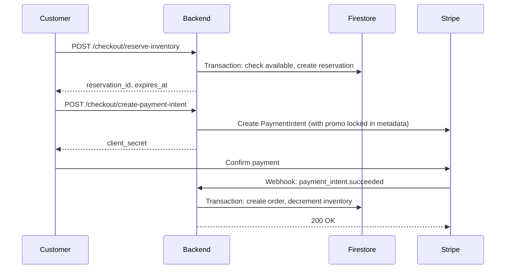

# Component: Checkout Flow

## Overview

The checkout flow is the critical revenue path: inventory reservation → payment → order creation. Uses pessimistic locking (ADR-001) and dual-path order creation (ADR-007) to ensure zero overselling and 100% payment-to-order conversion.

**Key responsibilities:**
- Reserve inventory for 15 minutes during checkout
- Validate and lock discount codes at payment intent creation
- Process payments via Stripe
- Create orders idempotently (webhook primary, frontend fallback)

## Design

### Critical Sequence
```
1. Reserve inventory → 2. Apply promo code → 3. Create PaymentIntent → 4. Confirm payment → 5. Create order
```

### Data Flow


### Dual-Path Order Creation
Both webhook and frontend call same `createOrderFromPayment()` function:
1. Query orders by `stripe_payment_intent_id`
2. If found → return existing (idempotent)
3. If not → create order in transaction

**Guarantee:** Exactly one order per PaymentIntent, regardless of timing.

## Implementation Details

### Timeout Configuration
| Operation | Timeout | On Timeout |
|-----------|---------|------------|
| Reserve inventory | 10s | Auto-retry 3x |
| Create PaymentIntent | 30s | Show retry button |
| Confirm order | 10s | Webhook will retry |

### Reservation Status Lifecycle
```
active → completing (payment started)
       → completed (order created)
       → expired (cleanup released)
```
**"completing" prevents cleanup during payment.**

## Edge Cases

**Reservation expires during checkout:**
- Customer on page >15 min → reservation expires
- Backend returns 400 "Reservation expired"
- Frontend redirects to cart with auto-re-reserve attempt

**Promo code expires during checkout:**
- 5-minute grace period after expiration
- Within grace: honored, logged
- Beyond grace: error, offer to remove code

**Payment succeeds, order creation fails:**
- Webhook retries for up to 3 days
- Alert triggers for manual review
- 100% of payments eventually create orders

## Failure Modes

**Firestore outage:**
- Orders fail to create
- Webhook retries automatically
- Manual order creation as last resort

**Stripe timeout:**
- PaymentIntent creation timeout
- Customer sees "Payment system slow"
- Manual retry button available

## Performance Targets

| Metric | Target |
|--------|--------|
| Reservation creation P95 | <200ms |
| PaymentIntent creation P95 | <500ms |
| Order creation P95 | <1000ms |
| Payment-to-order conversion | 99.9% |
