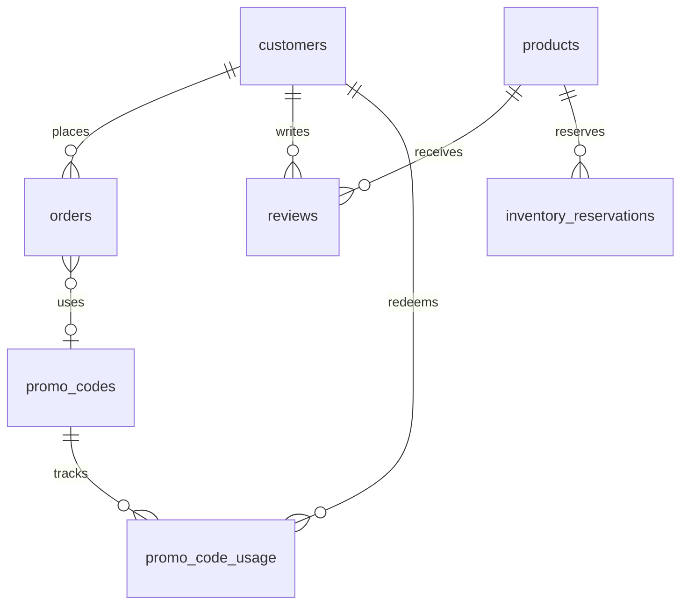

# Data Model

**Database:** Firestore (NoSQL)
**Naming:** Collections (lowercase plural), fields (snake_case)

## Collections Overview

| Collection | Purpose | Key Fields |
|------------|---------|------------|
| products | Product catalog | name, price, quantity, reserved_quantity |
| customers | Customer accounts | email, order_count, total_spent |
| orders | Order history | customer_id, line_items, status, total |
| reviews | Product reviews | product_id, customer_id, rating, status |
| inventory_reservations | Checkout locks | product_id, quantity, expires_at |
| promo_codes | Discount codes | code, discount_percentage, active |
| promo_code_usage | Redemption tracking | code, customer_id, order_id |
| cancellation_requests | Order cancellations | order_id, status |
| verification_codes | Auth codes | email, code, expires_at |
| admins | Admin accounts | email, password_hash |

## Core Schemas

### products
```typescript
{
  id: string,
  name: string,                  // "Wildflower Honey 12oz"
  description: string,
  price: number,                 // Cents (1500 = $15.00)
  quantity: number,              // Physical inventory
  reserved_quantity: number,     // Active reservations sum
  image_url: string,
  active: boolean,               // Soft delete flag
  created_at: timestamp,
  updated_at: timestamp
}
```
**Computed:** `available = quantity - reserved_quantity`
**Indexes:** `(active, created_at DESC)`, `(quantity ASC)`

### orders
```typescript
{
  id: string,
  order_number: string,          // "MGH-1001"
  customer_id: string,
  line_items: [{
    product_id: string,
    product_name: string,        // Snapshot
    quantity: number,
    price_per_unit: number,      // Snapshot (cents)
    total: number
  }],
  subtotal: number,
  discount_code: string | null,
  discount_amount: number,
  total: number,
  shipping_address: { name, street, city, state, zip, country },
  status: string,                // pending → confirmed → shipped → delivered
  cancellation_status: string,   // none | requested | approved | denied
  stripe_payment_intent_id: string,
  payment_status: string,
  created_at: timestamp,
  updated_at: timestamp
}
```
**Indexes:** `(customer_id, created_at DESC)`, `(status, created_at DESC)`

### reviews
```typescript
{
  id: string,
  product_id: string,
  customer_id: string,
  order_id: string,              // Proof of purchase
  rating: number,                // 1-5
  text: string,                  // 10-1000 chars
  status: string,                // pending | approved | rejected
  edit_count: number,
  next_edit_allowed_at: timestamp | null,
  created_at: timestamp,
  moderated_at: timestamp | null,
  moderated_by: string | null
}
```
**Constraint:** One review per (customer_id, product_id)
**Indexes:** `(product_id, status, created_at DESC)`, `(status, created_at DESC)`

### inventory_reservations
```typescript
{
  id: string,
  product_id: string,
  quantity: number,
  session_id: string,
  status: string,                // active | completing | completed | expired
  expires_at: timestamp,         // created_at + 15 min
  created_at: timestamp
}
```
**Lifecycle:** Created at checkout → Deleted on order or expiration
**Indexes:** `(expires_at ASC)`, `(session_id ASC)`

### promo_codes
```typescript
{
  id: string,
  code: string,                  // Unique, uppercase
  discount_percentage: number,   // 1-100
  min_order_value: number | null,
  max_redemptions: number | null,
  one_time_per_customer: boolean,
  used_count: number,            // Denormalized
  active: boolean,
  expires_at: timestamp | null,
  created_at: timestamp
}
```
**Indexes:** `(code ASC)` unique

## Entity Relationships



## Denormalization Strategy

| What | Where | Why |
|------|-------|-----|
| Product name/price | orders.line_items | Historical accuracy |
| Order count, total spent | customers | Avoid aggregation queries |
| Used count | promo_codes | Fast validation |

## Data Size (Year 1 Estimate)

| Collection | Documents | Size |
|------------|-----------|------|
| products | 20 | 20KB |
| customers | 500 | 250KB |
| orders | 2,000 | 6MB |
| reviews | 600 | 600KB |
| **Total** | | ~7MB |

Firestore free tier: 1GB storage, 50K reads/day → MVP fits comfortably.
