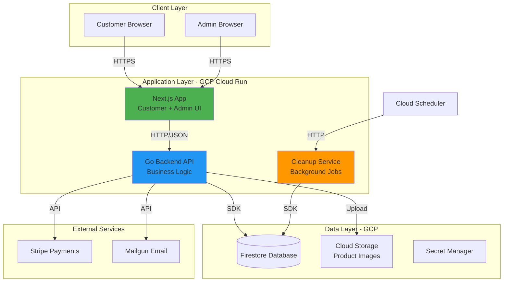

# Architecture Overview

**Project:** Manik Golden Honey Co
**Type:** E-commerce platform for honey products with admin management

## System Architecture

Two-tier cloud-native architecture: Next.js frontend + Go backend API, deployed on GCP Cloud Run with Firestore database.

## Technology Stack

| Layer | Technology | Purpose |
|-------|------------|---------|
| Frontend | Next.js 14, TypeScript, Tailwind CSS | Customer storefront + admin dashboard |
| Backend | Go 1.21+, Chi router | Business logic, API |
| Database | Firestore (NoSQL) | Data persistence |
| Payments | Stripe | Payment processing |
| Email | Mailgun | Transactional emails |
| Infrastructure | GCP Cloud Run | Serverless containers |
| Storage | Cloud Storage | Product images |
| Scheduling | Cloud Scheduler | Background jobs |

## Core Components

### Next.js Application
- Customer storefront (SSR for SEO)
- Admin dashboard (CSR for interactivity)
- Route protection via middleware
- Cart state in localStorage

**Routes:**
- Customer: `/`, `/products`, `/cart`, `/checkout`, `/account`
- Admin: `/admin/dashboard`, `/admin/products`, `/admin/orders`, `/admin/reviews`

### Go Backend API
- All business logic and data operations
- Authentication (customer passwordless, admin password)
- Payment processing via Stripe
- Email notifications via Mailgun

**API Structure:**
- `/api/auth/*` - Authentication
- `/api/products/*` - Product CRUD
- `/api/checkout/*` - Reservation, payment, order confirmation
- `/api/orders/*` - Order management
- `/api/reviews/*` - Review submission and moderation
- `/api/cancellations/*` - Cancellation workflow
- `/api/admin/*` - Admin-only endpoints

### Cleanup Service
- Releases expired inventory reservations (every 5 min via Cloud Scheduler)
- Service account authentication

## Key Design Decisions

| Decision | Choice | Rationale | ADR |
|----------|--------|-----------|-----|
| Inventory locking | Pessimistic (15-min reservation) | Prevents overselling | [ADR-001](../decisions/ADR-001-pessimistic-inventory-locking.md) |
| Order creation | Dual-path (webhook + frontend) | Reliability | [ADR-007](../decisions/ADR-007-idempotent-order-creation.md) |
| Transactions | Firestore with 3-retry | Consistency | [ADR-008](../decisions/ADR-008-firestore-transaction-strategy.md) |
| Promo codes | Lock at PaymentIntent | Price accuracy | [ADR-012](../decisions/ADR-012-discount-code-lock-in.md) |
| Reviews | Admin moderation required | Quality control | [ADR-011](../decisions/ADR-011-review-moderation-workflow.md) |
| Background jobs | Multi-layer mitigation | Reliability | [ADR-009](../decisions/ADR-009-multi-layered-job-failure-mitigation.md) |

## Scalability & Cost

**Auto-Scaling:**
- Next.js: Scales to 0 (cost savings)
- Go API: Min 1 instance (fast response)
- Firestore: Auto-scales

**Cost Estimate:** $30-50/month for MVP traffic

## Security

- Customer auth: Passwordless (email verification codes)
- Admin auth: Email/password with JWT
- Webhook verification: Stripe signature validation
- Rate limiting on all public endpoints
- Secrets in GCP Secret Manager

## Related Documents

- [Data Model](./data-model.md) - Database schema
- [API Contracts](./api-contracts.md) - API specifications
- [Components](./components/) - Detailed component designs
- [Decisions](../decisions/index.md) - All ADRs
