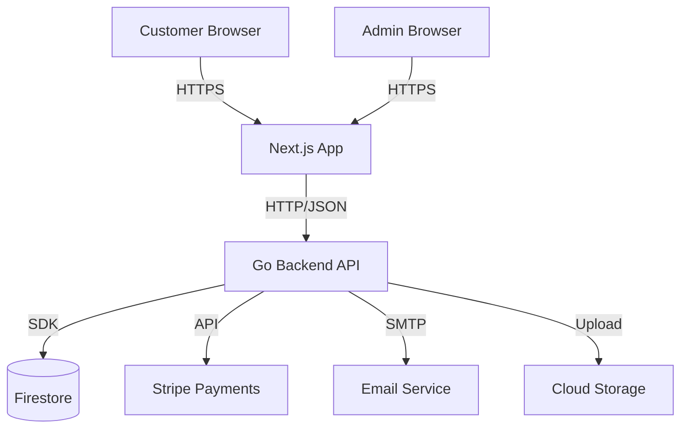

# Manik Golden Honey Co - Executive Summary

## Project Overview

Integrated e-commerce and management platform for a honey business. A unified system enabling online sales with admin management for inventory, orders, and customers.

**Core Purpose:** Provide a complete solution for selling honey products online with:
- Customer storefront for browsing and purchasing
- Admin dashboard for business operations
- Automated inventory and order management
- Secure payment processing

---

## Technology Stack

| Layer | Technology | Rationale |
|-------|------------|-----------|
| Frontend | Next.js (React) | SSR for SEO, unified app for customer + admin |
| Backend | Go REST API | Single source of truth, all business logic |
| Database | Firestore (NoSQL) | Cloud-native, auto-scaling, GCP integration |
| Infrastructure | GCP Cloud Run | Serverless auto-scaling, cost-efficient |
| Payments | Stripe | Industry standard, PCI compliance handled |
| Email | SendGrid/Mailgun | Transactional notifications |

---

## Key Architecture Decisions

### Unified Next.js Application
Single deployment serves both customer storefront and admin dashboard. Shared components, simpler deployment, consistent UX patterns.

### Passwordless Authentication
Email-based 6-digit codes for customer authentication. No passwords to manage, better UX, secure by default.

### Repository Pattern
Database abstraction layer enables future migration from Firestore to PostgreSQL without business logic changes.

### Pessimistic Inventory Locking
10-minute reservation system prevents overselling. Prioritizes data integrity over conversion optimization. Uses distributed counter sharding for high-concurrency scenarios.

### Serverless Architecture
Cloud Run containers scale to zero during quiet periods, auto-scale for traffic spikes. Estimated $30-50/month for MVP traffic.

### Disaster Recovery
Firestore multi-region configuration with read-only fallback mode during write outages. Webhook replay capability via Stripe (3-day retention) enables order recovery.

---

## MVP Scope

**Included:**
- Single product category (honey products)
- Customer accounts with passwordless auth
- Product browsing with SSR for SEO
- Shopping cart (localStorage-based)
- Checkout with Stripe payments
- Order tracking and history
- Admin product/inventory/order management
- Email notifications for orders

**Excluded (Future):**
- Multiple product categories
- Customer reviews/ratings
- Loyalty programs
- Advanced analytics
- Multi-language support
- Mobile applications

---

## Service Architecture

**Service Boundaries:**
- ProductService: Product CRUD, inventory queries
- ReservationService: Reserve, release, cleanup
- OrderService: Create, update status, cancellation
- PaymentService: Stripe integration
- EmailService: Transactional emails
- AuthService: Session management, JWT

---

## Design Validation

Architecture finalization verified 38 checkpoints across:
- 12 Architecture Decision Records (ADRs) with measurable success criteria
- 8 critical red flags (failure modes, complexity, separation of concerns)
- 6 quality red flags (DRY, logging, monitoring, testing coverage)
- 8 security red flags (auth, input validation, rate limiting, XSS/CSRF)

All checkpoints passed. Design stable across L1/L2/L3 refinement with no fundamental changes required.

---

## Related Documents

- [Architecture Overview](./architecture/overview.md) - System components and data flows
- [Architecture Decision Records](./decisions/index.md) - All 12 ADRs with rationale
- [Edge Cases](./edge-cases/index.md) - Failure modes and mitigations
- [Security](./security/overview.md) - Auth, validation, and protection strategies
- [Operations](./operations/overview.md) - Deployment, monitoring, and maintenance
