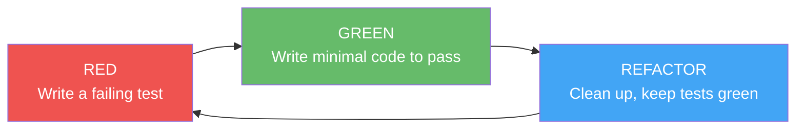

# Test-Driven Development (TDD) Conventions

How we write tests in this codebase.

## The Cycle

Every code change follows red-green-refactor:



1. **Red** — Write a test that describes the behavior you want. Run it. It should fail.
2. **Green** — Write the simplest code that makes the test pass. Nothing more.
3. **Refactor** — Clean up duplication, improve naming, extract helpers. Tests must stay green.

## What to Test at Each Layer

| Layer | What to test | How | Speed |
|-------|-------------|-----|-------|
| **Models** | Data transformations, computed fields, nil/null handling | Direct instantiation | Fast |
| **Validation** | Input rules, boundary values, error messages | Table-driven / parameterized tests | Fast |
| **Services** | Business logic, error paths, edge cases | Mock repository interfaces | Fast |
| **Repositories** | Database queries, transaction behavior | Test database or emulator | Medium |
| **Handlers/Controllers** | HTTP status codes, request parsing, auth | Test client + mocked services | Medium |

Adapt layer names to your framework — the principle is the same: test pure logic fast, test I/O boundaries with real (or emulated) infrastructure.

## Mocking Strategy

**Primary seam:** Repositories (or data access layer) defined as interfaces.

**Rules:**
- Mock implementations live in test files, not exported
- Keep mocks simple — struct fields or return values, not complex behavior
- Shared mocks for a package go in a dedicated test helper file
- Prefer standard language test constructs over mocking frameworks
- Do NOT mock infrastructure clients (database drivers, HTTP clients) — test those against emulators or test servers

## Test File Conventions

Test files live next to the source they test:

```
src/
├── models/
│   ├── product.ext
│   └── product_test.ext
├── services/
│   ├── mocks_test.ext          # shared mock structs for this package
│   ├── order_service.ext
│   └── order_service_test.ext
├── repositories/
│   ├── product_repo.ext
│   └── product_repo_test.ext   # integration tests
└── handlers/
    ├── product_handler.ext
    └── product_handler_test.ext
```

- Co-locate tests with source: `foo.ext` → `foo_test.ext`
- Use your language's standard test naming conventions
- Separate unit tests from integration tests via naming, tags, or directories

## Test Priority

Where to add tests first, ordered by risk:

1. **Core business logic** — Services that handle money, state transitions, or critical workflows
2. **Business rules** — Validation, rate limits, authorization decisions
3. **Auth** — Token generation, permission checks, session management
4. **API layer** — Request parsing, error response format, middleware
5. **Data access** — Repository queries (integration tests)

Start with the highest-risk code paths. If something handles money or user data, test it first.

## Running Tests

```bash
# Customize these commands for your project:

# All unit tests
# <your test command here>

# Specific package/module
# <your scoped test command here>

# With coverage
# <your coverage command here>

# Integration tests
# <your integration test command here>
```
